# EPGDeck

[Mirakurun](https://github.com/Chinachu/Mirakurun) を使用した録画管理ソフトです（[EPGStation](https://github.com/l3tnun/EPGStation) からフォークして開発されています）  
**Hono + Drizzle ORM** の高速バックエンドと、**Svelte 5 Runes + Tailwind CSS v4** のモダンで軽量な Web インターフェイス（PC / iOS / Android / PWA 完全対応）を備えています。

## スクリーンショット

誤操作を防止する「**リードオンリー（閲覧専用）モード**」と、保護・削除・管理が行える「**管理者モード**」をワンクリックで切り替え可能です。

<table>
  <tr>
    <td width="50%" align="center">
      <b>管理者モード（録画保護・削除・一括操作）</b><br>
      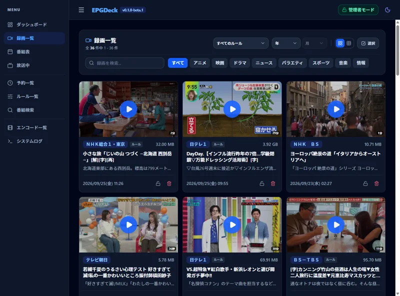
    </td>
    <td width="50%" align="center">
      <b>リードオンリーモード（誤操作防止・安全な視聴）</b><br>
      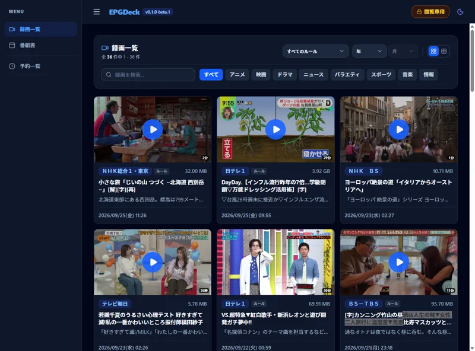
    </td>
  </tr>
</table>

<details>
  <summary><b>その他の画面スクリーンショット一覧（クリックで展開）</b></summary>
  <br>

  <h3>🛡️ リードオンリー（閲覧専用）モード</h3>
  <p>家族共有や公共端末での誤操作（誤削除・予約変更）を防ぐセキュアな表示モードです。</p>
  <table>
    <tr>
      <td width="50%" align="center">
        <b>番組表（リードオンリー）</b><br>
        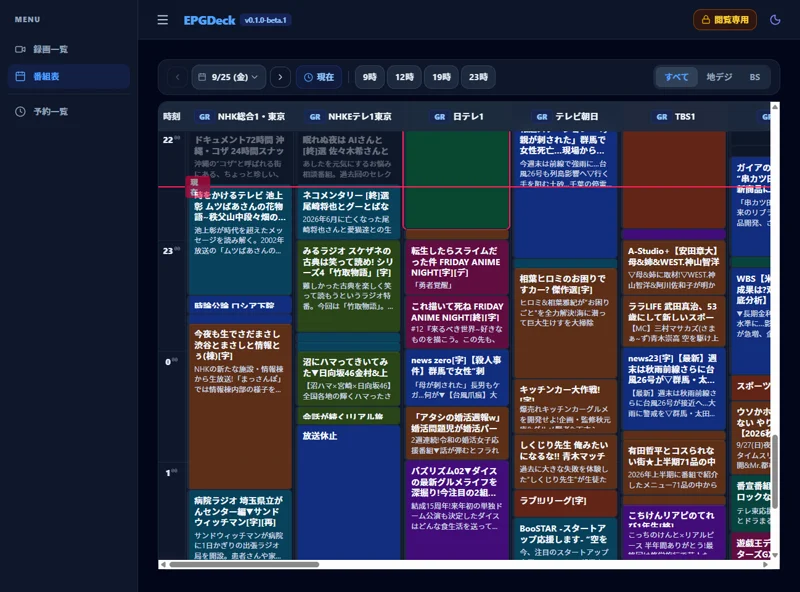
      </td>
      <td width="50%" align="center">
        <b>予約一覧（リードオンリー）</b><br>
        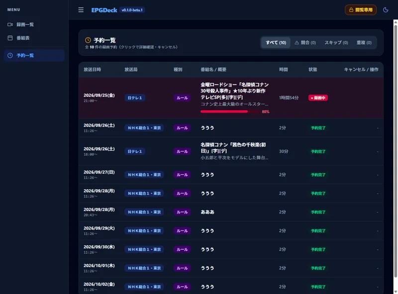
      </td>
    </tr>
    <tr>
      <td colspan="2" align="center">
        <b>録画一覧（リスト表示 / リードオンリー）</b><br>
        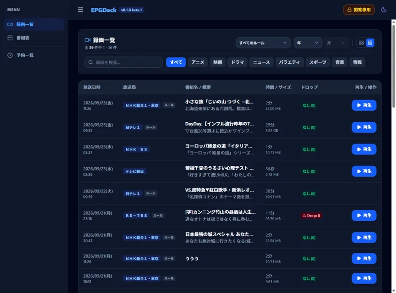
      </td>
    </tr>
  </table>

  <h3>⚙️ 管理者モード</h3>
  <p>ダッシュボード、番組検索、ルール作成、エンコード、システムログなどフル機能を操作できます。</p>
  <table>
    <tr>
      <td width="50%" align="center">
        <b>ダッシュボード</b><br>
        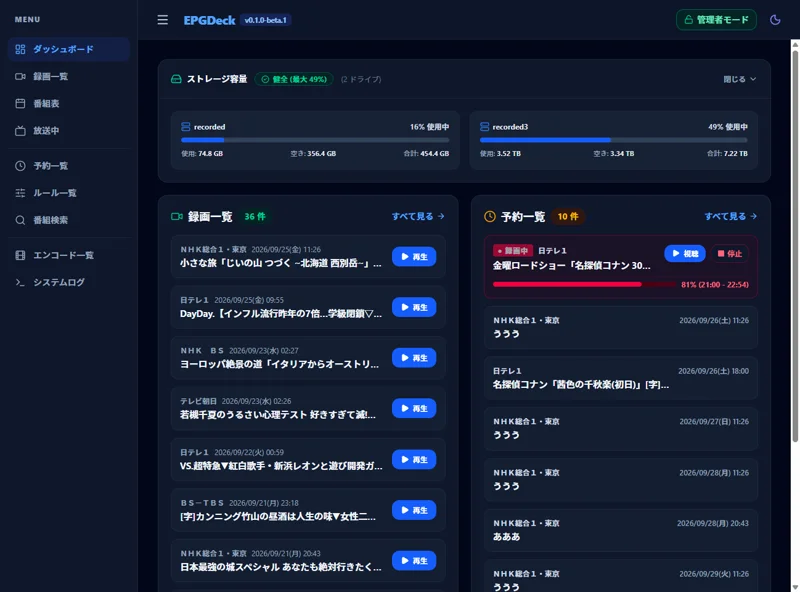
      </td>
      <td width="50%" align="center">
        <b>番組表（ライトテーマ / 管理者モード）</b><br>
        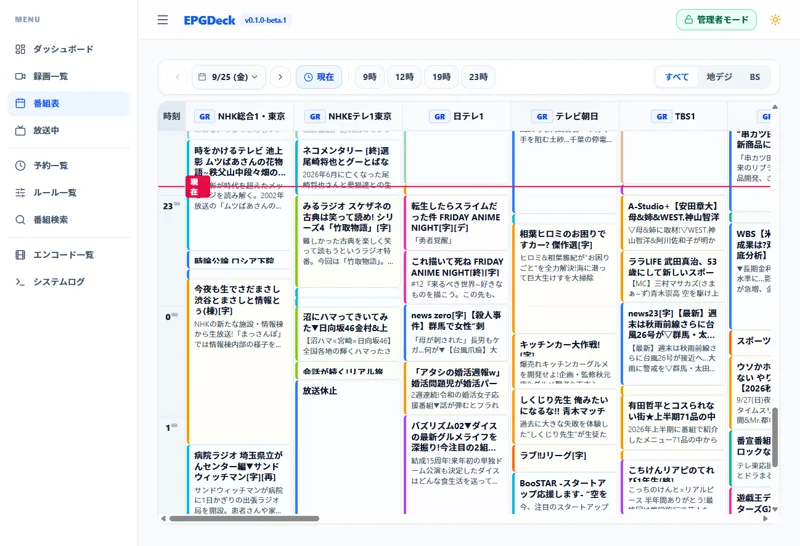
      </td>
    </tr>
    <tr>
      <td width="50%" align="center">
        <b>録画詳細・プレイヤー</b><br>
        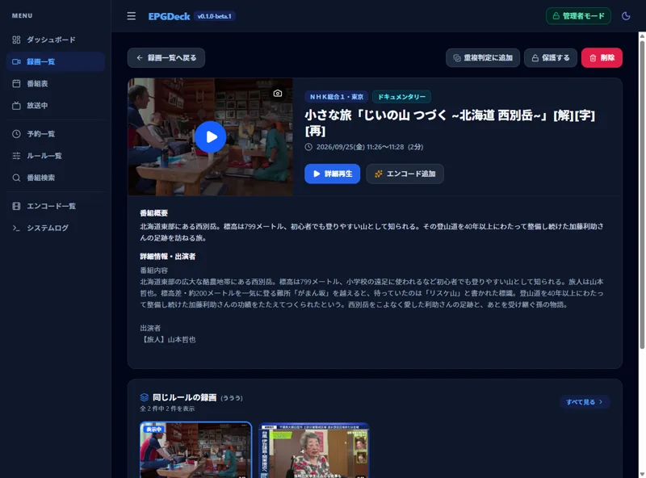
      </td>
      <td width="50%" align="center">
        <b>放送中（全局の現在・次番組俯瞰＆即時視聴）</b><br>
        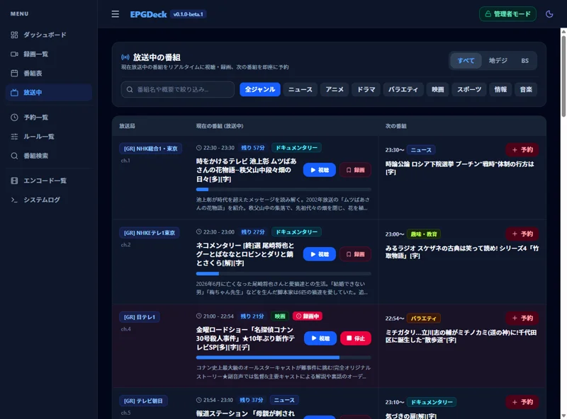
      </td>
    </tr>
    <tr>
      <td width="50%" align="center">
        <b>予約一覧（重複調停・録画中3択操作）</b><br>
        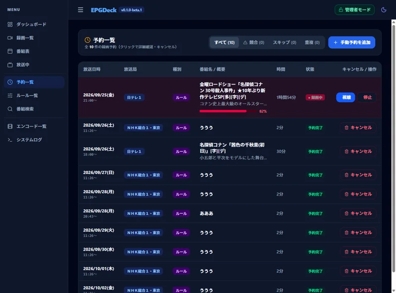
      </td>
      <td width="50%" align="center">
        <b>ルール管理</b><br>
        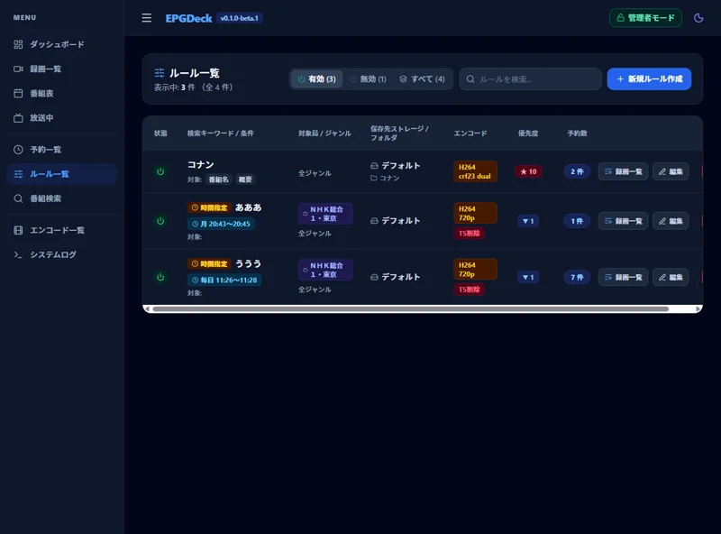
      </td>
    </tr>
    <tr>
      <td width="50%" align="center">
        <b>ルール作成・編集</b><br>
        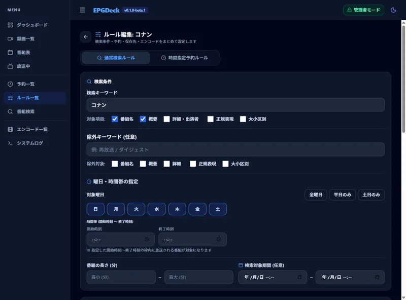
      </td>
      <td width="50%" align="center">
        <b>番組検索</b><br>
        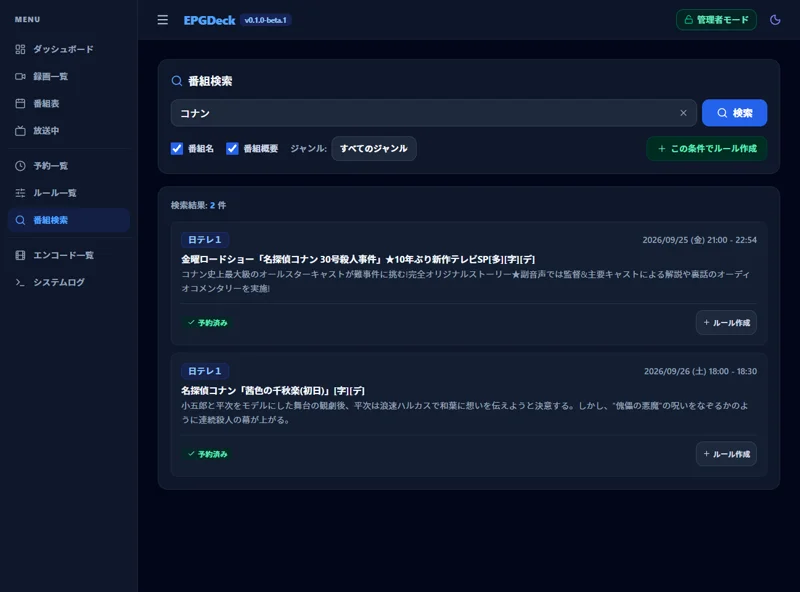
      </td>
    </tr>
    <tr>
      <td width="50%" align="center">
        <b>録画詳細（関連録画・メタ情報）</b><br>
        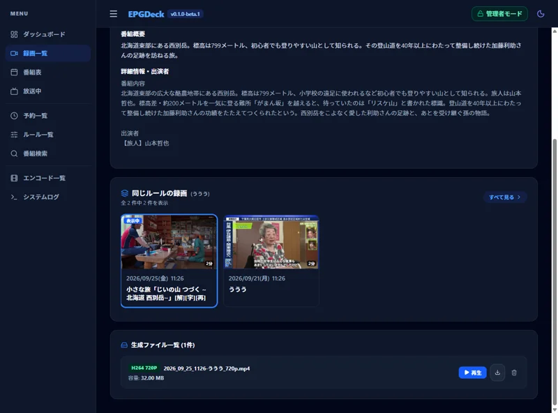
      </td>
      <td width="50%" align="center">
        <b>エンコード一覧・進捗</b><br>
        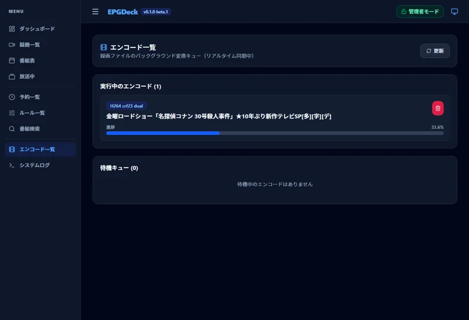
      </td>
    </tr>
    <tr>
      <td colspan="2" align="center">
        <b>リアルタイムシステムログ追尾</b><br>
        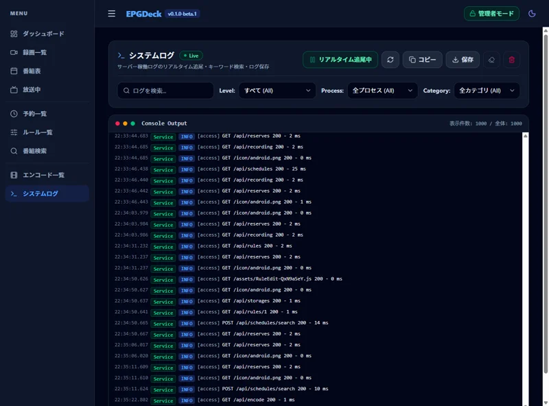
      </td>
    </tr>
  </table>
</details>

---

## 特徴 ＆ 主な機能

### 📺 放送番組の視聴・録画・アーカイブ管理

-   **超高速・省メモリな Web インターフェイス (Svelte 5 + Tailwind CSS v4)**
    -   **ダッシュボード (`/`)**: 録画中・最新録画・直近予約を 2 カラムで一望。ストレージ容量も統合表示。
    -   **放送中 (`/onair`)**: 全局の現在番組と次番組を表形式で俯瞰。ワンクリック予約・視聴・即時録画に対応。
    -   **番組表 (`/guide`)**: 全放送波横並びのコンパクトグリッド、朝4時起点境界、ARIB準拠の日付ナビ、現在時刻ジャンプ。
    -   **録画一覧 (`/recorded`)**: **15,000件超の録画アーカイブ対応**（年月ジャンプ、ジャンルピル、カード/テーブル切替、保護トグル、複数選択一括削除、ルール別絞り込み）。
    -   **予約一覧 (`/reserves`)**: 予約取消・スキップ/復活、**録画中番組の3択操作（完了/中断/破棄）**。
    -   **ルール管理 (`/rule`)**: 実予約数バッジ、キーワード絞り込み、EPGStation 完全互換の作成・編集（`/rule/edit`）。
    -   **エンコード (`/encode`)**: 実行中・待機中ジョブの進捗表示とワンタップキャンセル。
    -   **システムログ (`/logs`)**: Web 画面上でのリアルタイムログ追尾（`tail -f` 相当）、レベル・キーワード検索。
    -   **統合動画プレイヤー**: 直角デザイン、[aribb24.js][] による ARIB 字幕/文字スーパー表示、[mpegts.js][] 低遅延ライブ視聴、HLS シーク最適化、タッチ操作保護。
    -   **運用安全 & 大規模アーカイブ最適化**: 誤操作を防ぐ**リードオンリーモード**、サムネイル階層化（シャーディング）、ドロップ0件ログ自動削除。

-   **高性能・高機能なエンコードエンジン (`config/enc_helper.js`)**
    -   **二重音声（Dual-mono）自動分離**: ニュースやバイリンガル放送（主音声/副音声）の自動判定とステレオ分離。
    -   **地デジ 1440x1080 アスペクト比補正**: 16:9 ディスプレイで歪まない `setdar=16/9` 自動適用。
    -   **元ファイル保護安全機構**: エンコード後の動画長検証（`verifyDuration`）により、異常終了や 0 バイト出力時に元 TS の誤削除を防止。
    -   **リアルタイム進捗計算**: Web UI へのエンコード進捗（% / fps / 残り時間）リアルタイム通知。
    -   **ハードウェア支援プリセット**: VAAPI (Intel/AMD), Intel QSV, NVIDIA NVENC テンプレートを同梱。

-   **REST API & リアルタイム通信**
    -   [WebAPI Document](docs/dev/api.md) (Hono REST API / Swagger UI)
    -   Socket.IO による録画状態・予約更新・エンコード進捗の全クライアント自動同期。

[aribb24.js]: https://github.com/monyone/aribb24.js
[mpegts.js]: https://github.com/xqq/mpegts.js

---

## 動作環境

-   Linux / macOS
-   [Node.js](http://nodejs.org/) : `^22.3.0 ~ v26.x`（本番環境は Mirakurun 互換性のため **`v24.x`** 推奨。リポジトリ内に `.mise.toml` を同梱しており、[mise](https://mise.jdx.dev/) を用いた `v26.x` 開発環境でのビルド・検証にも完全対応しています）
-   [Mirakurun](https://github.com/Chinachu/Mirakurun) : ^3.8.0 or [mirakc](https://github.com/mirakc/mirakc) : ^3.1.10

-   いずれかのデータベース
    -   [SQLite3](https://www.sqlite.org/)（設定不要、Drizzle ORM で自動管理）[標準]
    -   [MySQL](https://www.mysql.com/jp/) ([MariaDB](https://mariadb.org/))【推奨】※文字コードは utf8mb4
-   [FFmpeg](http://ffmpeg.org/)（Web 視聴や標準エンコードは通常の FFmpeg で動作。MP4 内に字幕を埋め込む場合のみ `--enable-libaribb24` 対応ビルドが必要）

---

## データベース ＆ 設定互換性ポリシー

### データベース (SQLite / MySQL)
EPGDeck は **EPGStation 最新版 (v2.10.0) との完全なデータベース互換性** を保証しています。
* **新規インストール**: 初回起動時に EPGStation v2.10.0 互換の全テーブル・カラム・インデックスが自動生成されます。
* **既存データ移行**: 既存の EPGStation の SQLite（`data/database.db`）や MySQL をそのまま指定して起動するだけで、録画・予約・ルールを 100% 保持したまま移行できます。

### 設定ファイル (`config/config.yml`)
EPGDeck では、システム構成に合わせて設定ファイルを機能別（`server`, `database`, `log`, `epg`, `recording`, `encode`, `hooks`, `urlscheme`, `streaming`, `kodi`）にカテゴリ分けした構造を採用しています。
* EPGStation 形式の `config.yml` とは設定キーの階層構造が異なります。
* セットアップ時は、同梱されている `config/config.yml.template` を `config/config.yml` にコピーして設定を行ってください。
* 設定の詳細は **[設定ファイル詳細マニュアル](docs/manual/configuration.md)** を参照してください。

---

## リポジトリ構成

```
.
├── client/              # フロントエンド（Svelte 5 + Vite + Tailwind CSS v4）
│   └── src/
│       ├── lib/         # 共通コンポーネント、状態管理ストア、ユーティリティ
│       └── routes/      # 各画面ルート（ダッシュボード、番組表、録画一覧、ログ等）
├── config/              # 設定ファイルテンプレート、エンコード支援スクリプト
├── docs/                # 利用者向けマニュアル（manual/）および開発者ガイド（dev/）
├── src/                 # バックエンド（Node.js + Hono + Drizzle ORM）
│   ├── db/              # Drizzle ORM スキーマ定義（SQLite / MySQL）
│   └── model/           # ドメインモデル、録画・配信制御、Hono API ルート
└── test/                # 自動テストスイート
    ├── e2e/             # Playwright E2E テスト
    └── unit/            # Vitest 単体テスト
```

## ドキュメント

詳細なマニュアルおよび開発者向けガイドは **[docs/](docs/README.md)** を参照してください。

- **[Linux / macOS 用セットアップマニュアル](docs/manual/setup.md)**
- **[設定ファイル詳細マニュアル](docs/manual/configuration.md)**
- **[ロギングシステム仕様 & リアルタイムビューア](docs/manual/logging.md)**
- **[エンコードシステム仕様書 & 設定マニュアル](docs/manual/encoding.md)**
- **[リバースプロキシ設定ガイド (Nginx)](docs/manual/reverse-proxy.md)**
- **[開発環境スタートガイド](docs/dev/getting-started.md)**
- **[トラブルシューティング / FAQ](docs/manual/troubleshooting.md)**

---

## インストール & アップデート方法

### アップデート

```bash
git pull
npm run all-install
npm run build
```

---

## 動作確認

-   ブラウザから `http://<IPaddress>:<Port>/` にアクセスする
-   curl や wget で API を確認

    ```bash
    curl -o - http://<IPaddress>:<Port>/api/version
    ```

### ログの確認

EPGDeck は log4js 統合ロギングを採用しており、Web UI の **`/logs`（システムログ画面）** からリアルタイムにログを確認できます。
ファイルログは設定に応じて `logs/epgdeck.log` に集約出力されます。詳細は **[ロギングシステム仕様](docs/manual/logging.md)** を参照してください。

---

## クライアント向け設定

### URL Scheme

EPGDeck 上の動画再生を OS 上の外部アプリケーション（VLC、IINA、PotPlayer 等）で行うことができます。

-   [config.yml 内の設定 (iOS, Android, macOS, Windows)](docs/manual/configuration.md#urlscheme)
-   [macOS 用の URL Scheme 設定方法](docs/manual/client-integration/mac-url-scheme.md)
-   [Windows 用の URL Scheme 設定方法](docs/manual/client-integration/windows-url-scheme.md)

---

## データベースのバックアップとレストア

データベースに含まれる予約情報・録画済み番組情報・録画履歴・自動録画ルールをバックアップ / レストア可能です。

### バックアップ

```bash
npm run backup FILENAME
```

### レストア

```bash
npm run restore FILENAME
```

### サムネイル階層化マイグレーション
EPGStation から移行したフラットなサムネイル画像を `00/`〜`99/` のサブディレクトリ階層へ一括再配置・DB更新します。

```bash
npm run migrate-thumbnails [-- --dry-run]
```

---

## Tips

### RAM ディスク（`/dev/shm`）の活用による SSD 寿命保護
HLS ストリーミング配信やトランスコード時の一時ファイルを RAM ディスク上に配置することで、SSD への書き込み負荷（TBW 消耗）をゼロに抑え、快適な応答性を実現できます。詳細は **[RAM ディスク活用ガイド](docs/manual/ramdisk.md)** を参照してください。

### Kodi との連携

[Kodi](https://kodi.tv/) との連携に対応しています。詳細は [Kodi 連携ガイド](docs/manual/client-integration/kodi.md) を参照してください。

---

## Contributing

[CONTRIBUTING.md](.github/CONTRIBUTING.md)

## Licence

[MIT Licence](LICENSE)

