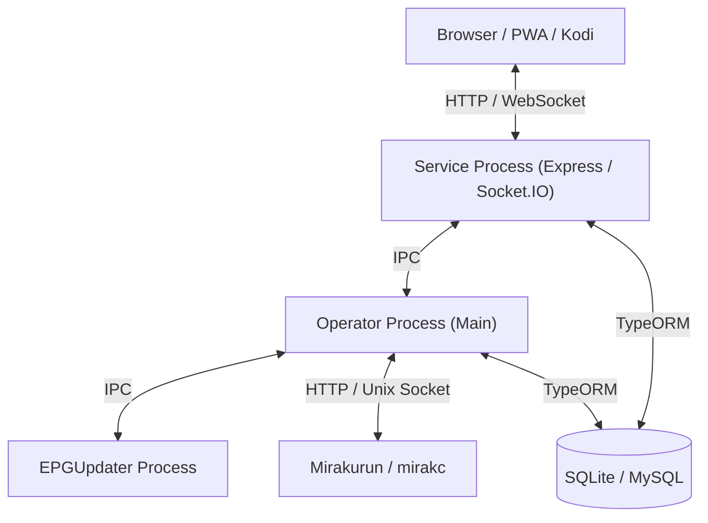

# システムアーキテクチャ解説

本ドキュメントでは、EPGDeck の全体構成、プロセス分離モデル、バックエンド設計パターン、およびフロントエンド構造について解説します。

---

## 1. 全体概要

EPGDeck は、**Node.js / Express** ベースのバックエンドと、**Vue.js** ベースの SPA フロントエンドで構成されています。

---

## 2. プロセス分離モデル

安定性と負荷分散のため、EPGDeck は役割ごとに独立した Node.js プロセスに分離して動作します（`src/index.ts` で起動・管理）。

| プロセス | 役割 | 主な責務 |
|---|---|---|
| **Operator** (メインプロセス) | 録画・チューナー管理 | 録画予約の競合解決、Mirakurun からのストリーム受信・録画ファイル書き込み、エンコードキューの管理 |
| **EPGUpdater** (子プロセス) | 番組表更新 | Mirakurun から定期的に EPG データを取得し、DB（Programs / Services テーブル）を更新 |
| **ServiceExecutor** (子プロセス) | Web サーバー | Express による REST API、Swagger UI、Socket.IO によるリアルタイム通知、静的ファイル配信 |

---

## 3. バックエンド設計パターン

### DI (依存性注入) コンテナ: InversifyJS
バックエンドの各モジュール（Model, Service, DB Operator 等）は `inversify` による IoC コンテナで疎結合に管理されています。
- 定義: `src/model/ModelContainer.ts`
- 各クラスは `@injectable()` で修飾され、インターフェース名（文字列シンボル）でインジェクションされます。

### REST API: Hono
API のルーティングは、高速・軽量な Web 標準準拠フレームワーク **Hono** を採用しています。
- ルートハンドラー: `src/model/service/hono/routes/**/*.ts`
- アプリケーション定義: `src/model/service/hono/createHonoApp.ts`
- Swagger UI / OpenAPI ドキュメント: `@hono/swagger-ui` により `/api-docs` および `/api/docs` で提供
- 各エンドポイントは DI コンテナから各種 `*ApiModel` を呼び出し、型安全かつ低レイテンシでレスポンスを返却します。

### ORM: Drizzle ORM
データベースアクセスには **Drizzle ORM**（および `@libsql/client` / `mysql2`）を採用し、軽量・高速かつ型安全なクエリ実行を行っています。
- Schema 定義: `src/db/schema/**/*.ts` (SQLite / MySQL)
- DTO 定義: `src/db/entities/**/*.ts`
- **EPGStation (v2.10.0) 互換性**: データベーステーブル・カラム構造は EPGStation v2.10.0 と 100% 同一であり、既存の `database.db` / MySQL からの直接移行および新規初期化に完全対応しています。

---

## 4. フロントエンド設計
 
- **ビルドツール**: **Vite 6** (`@sveltejs/vite-plugin-svelte`)
  - Webpack / Vue CLI を完全撤廃し、Node.js 22 〜 Node.js 26 (LTS) でのネイティブ超高速ビルドおよび HMR (Hot Module Replacement) に対応。
- **フレームワーク**: **Svelte 5** (Runes `$state`, `$derived`, `$props`, `$effect` 準拠)
  - 仮想 DOM レスによる圧倒的な実行速度と省メモリ性能。
  - バンドルサイズ・CSS サイズを大幅に削減（CSS: 約 96% 削減、JS: 約 76% 削減）。
- **スタイル / UI システム**: **Tailwind CSS v4** + `@tailwindcss/vite`
  - デザインシステムを `space-y-5` (20px)、`p-4 sm:p-5`、`rounded-2xl` のデザイントークンで全画面統一。
  - ダークモードとライトモードの完全対応（高輝度アクセントジャンルカラー採用）。
- **ルーター**: Svelte 5 ネイティブ Reactive Router (`client/src/lib/router.svelte.ts`)
  - HTML5 History モード完全連動、クエリパラメータ・URL 状態のリアクティブ管理。
- **メディア再生**:
  - `aribb24.js`: 地デジ・BS の字幕 / 文字スーパーのブラウザ描画
  - `mpegts.js`: MPEG-2 TS の低遅延 HTTP ライブストリーミング
  - `hls.js`: HLS によるライブ・録画再生・トランスコード配信
  - 映像鑑賞に最適なシャープな四角（直角デザイン / `rounded-none`）プレイヤーを採用。

---

## 5. テスト・CI 基盤

- **テストフレームワーク**: **Vitest**
  - Node.js 環境での高速な単体テスト（設定パース、API ユーティリティ、バージョン整合性など）を実行可能。
- **継続的インテグレーション (CI)**: GitHub Actions
  - PR / Push 時に `npm test` および型チェック・Lint・全ビルドを自動実行して品質を担保。
