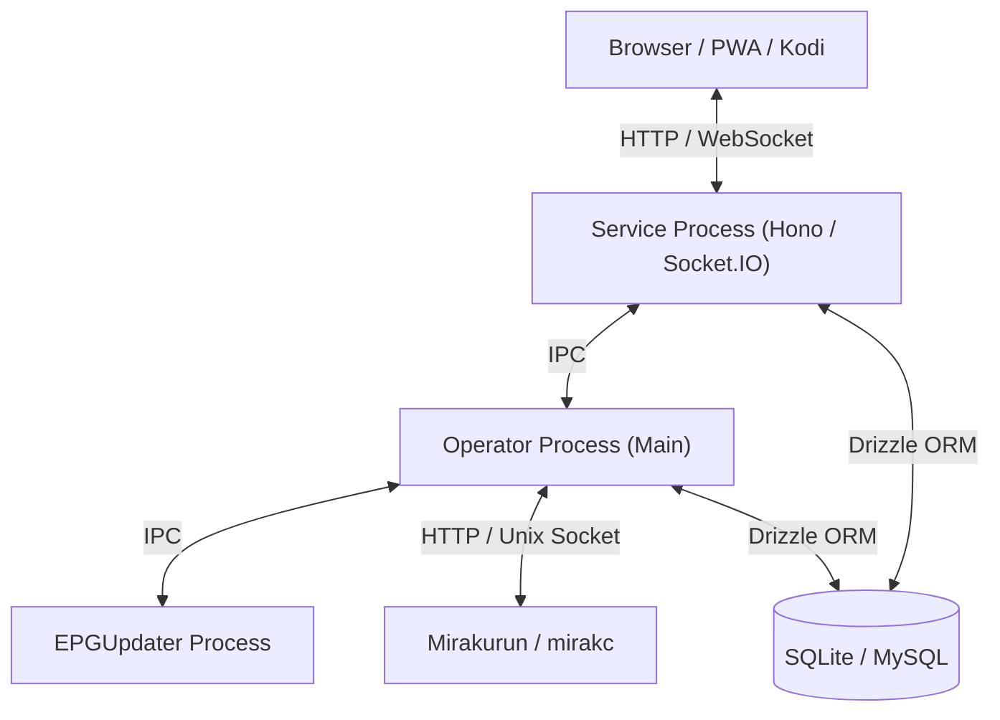

# システムアーキテクチャ解説

本ドキュメントでは、EPGDeck の全体構成、プロセス分離モデル、バックエンド設計パターン、およびフロントエンド構造について解説します。

---

## 1. 全体概要

EPGDeck は、**Node.js / Hono** ベースのバックエンドと、**Svelte 5** ベースの SPA フロントエンドで構成されています。

---

## 2. プロセス分離モデル

安定性と負荷分散のため、EPGDeck は役割ごとに独立した Node.js プロセスに分離して動作します（`src/index.ts` で起動・管理）。

| プロセス | 役割 | 主な責務 |
|---|---|---|
| **Operator** (メインプロセス) | 録画・チューナー管理 | 録画予約の競合解決・重複排除（詳細は [録画予約アルゴリズム仕様書](reservation-algorithm.md) 参照）、Mirakurun からのストリーム受信・録画ファイル書き込み、エンコードキューの管理 |
| **EPGUpdater** (子プロセス) | 番組表更新 | Mirakurun から定期的に EPG データを取得し、DB（Programs / Services テーブル）を更新 |
| **ServiceExecutor** (子プロセス) | Web サーバー | Hono による REST API、Swagger UI、Socket.IO によるリアルタイム通知、静的ファイル配信 |

---

## 3. バックエンド設計パターン

### DI (依存性注入) コンテナ: InversifyJS
バックエンドの各モジュール（Model, Service, DB Operator 等）は `inversify` による IoC コンテナで疎結合に管理されています。
- 定義: `src/model/ModelContainer.ts`
- 各クラスは `@injectable()` で修飾され、インターフェース名（文字列シンボル）でインジェクションされます。

### REST API: Hono
API のルーティングは、高速・軽量な Web 標準準拠フレームワーク **Hono** を採用しています。
- ルートハンドラー: `src/model/service/hono/routes/**/*.ts`
- アプリケーション定義: `src/model/service/hono/createHonoApp.ts`
- Swagger UI / OpenAPI ドキュメント: `@hono/swagger-ui` により `/api-docs` および `/api/docs` で提供
- 各エンドポイントは DI コンテナから各種 `*ApiModel` を呼び出し、型安全かつ低レイテンシでレスポンスを返却します。
- **予約・競合エラーハンドリングの適正化**:
  - `POST /api/reserves` において、二重予約やチューナー競合時に 500 ではなく適切な HTTP ステータス（`409 Conflict`、`404 Not Found`、`400 Bad Request`）と日本語メッセージを返却し、画面側（Snackbar）で失敗理由を明確にフィードバックします。
- **録画中番組のライフサイクル制御 (途中完了 / 中断 / 取り消し)**:
  - `POST /api/recording/:reserveId/finish`: 録画ストリームを EOF 切断し、実時間確定・サムネイル・エンコード・録画履歴（`RecordedHistory`）登録・予約消化の通常完了シーケンスを実行。
  - `POST /api/recording/:reserveId/stop`: ファイルは保存・エンコードするが未完了扱い（履歴未登録）とし、再放送時などに重複録画の判定対象（録画済み扱い）にならないよう維持。
  - `POST /api/recording/:reserveId/discard` (または `DELETE /api/recording/:reserveId`): 録画ストリーム停止後に書きかけの TS ファイルや DB レコードを物理削除し、予約を安全にクリーンアップ。
- **大容量動画アップロードのストリーム処理**:
  - `POST /api/videos/upload` では、マルチパートリクエストをメモリ上にバッファリングせず、`file.stream()` を用いて直接ディスクへパイプ書き込みすることで、大容量 TS / MP4 ファイルアップロード時のメモリ枯渇（OOM）を防止しています。

### ORM: Drizzle ORM & DrizzleHelper
データベースアクセスには **Drizzle ORM**（および `@libsql/client` / `mysql2`）を採用し、軽量・高速かつ型安全なクエリ実行を行っています。
- Schema 定義: `src/db/schema/**/*.ts` (SQLite / MySQL)
- DTO 定義: `src/db/entities/**/*.ts`
- **EPGStation (v2.10.0) 互換性**: データベーステーブル・カラム構造は EPGStation v2.10.0 と 100% 同一であり、既存の `database.db` / MySQL からの直接移行および新規初期化に完全対応しています。
- **方言別クエリの集約 (`DrizzleHelper`)**:
  - 方言（SQLite / MySQL）によって構文が異なるバルク UPSERT（`ON CONFLICT DO UPDATE` vs `ON DUPLICATE KEY UPDATE`）やタグ関連付け処理を `src/model/db/DrizzleHelper.ts` に集約し、DAO 層の重複コードを排除しています。
- **マルチプロセス接続最適化 (SQLite)**:
  - 3プロセス（Operator / Service / EPGUpdater）が同時に SQLite を読み書きする構成に対応するため、接続オプションで `timeout: 10000`（`PRAGMA busy_timeout = 10000;`）を設定し、`PRAGMA journal_mode = WAL;` および `PRAGMA synchronous = NORMAL;` を自動適用しています。
  - EPG 更新のトランザクションと予約登録・参照クエリが同一ミリ秒で衝突しても `SQLITE_BUSY: database is locked` にならず、最大10秒間自動リトライ待機して安全に並行処理されます。

### Node.js 標準 API への移行と依存パッケージの最小化
長年の運用によるレガシー依存や C++ ネイティブアドオンを排除し、モダン Node.js（Node 22+）の組み込み API へ積極的に移行しています。
- `diskusage-ng`（C++ネイティブアドオン） $\rightarrow$ `fs.promises.statfs`（node-gyp ビルド不要化）
- `lodash` $\rightarrow$ 組み込み `structuredClone`
- `mkdirp` $\rightarrow$ `fs.promises.mkdir({ recursive: true })`
- `axios` $\rightarrow$ グローバル `fetch` + `new URL`
- `minimist` $\rightarrow$ `node:util.parseArgs`
- `url-join` $\rightarrow$ 自作の堅牢な `StrUtil.urlJoin`
- `eventsource` $\rightarrow$ Node.js 22.3+ グローバル `EventSource`

---

## 4. フロントエンド設計

- **ビルドツール**: **Vite 8** (`@sveltejs/vite-plugin-svelte`)
  - Rolldown エンジンによる高速バンドル（ビルド時間約 2.6 秒）および HMR (Hot Module Replacement) に対応。
  - ルートレベルの動的インポート（Lazy Loading）により、初回アクセス時の JS 転送量を最小化。
- **フレームワーク**: **Svelte 5** (Runes `$state`, `$derived`, `$props`, `$effect` 準拠)
  - 仮想 DOM レスによる高速な描画と省メモリ設計、軽量なバンドル構成。
- **スタイル / UI システム**: **Tailwind CSS v4** + `@tailwindcss/vite`
  - デザインシステムを `space-y-5` (20px)、`p-4 sm:p-5`、`rounded-2xl` のデザイントークンで全画面統一。
  - ダークモードとライトモードの完全対応（高輝度アクセントジャンルカラー採用）。
- **ルーター**: Svelte 5 ネイティブ Reactive Router (`client/src/lib/router.svelte.ts`)
  - HTML5 History モード完全連動、クエリパラメータ・URL 状態のリアクティブ管理。
- **巨大コンポーネントの関心事分離**:
  - `VideoPlayer.svelte` から再生シークバー・音量・倍速・全画面等を `VideoControls.svelte` に分離。
  - ARIB 字幕・文字スーパーのライフサイクル管理を `SubtitleManager.ts` に独立化。
- **UI ベースの非同期ダイアログ (`confirmDialog`)**:
  - ブラウザネイティブの `window.confirm()` を排除し、Svelte 5 `$state` を用いた非同期 Promise ベースの共通モーダル（`ConfirmModal.svelte`）を導入。ダークモードやキーボード操作（ESC/Enter）に対応。
- **HTTP / API クライアント**:
  - `axios` を完全排除し、ブラウザ標準 `fetch` をベースとした軽量な HTTP クライアント（`client/src/lib/httpClient.ts`）を採用。

---

## 5. テスト・品質保証基盤

テスト戦略、スタンドアロン E2E サーバー、MySQL 実機結合テスト、GitHub Actions CI パイプラインの詳細については、以下の専門ドキュメントをご参照ください。

👉 **[テスト & CI/CD アーキテクチャ仕様書](testing.md)**
- Vitest による高速単体テスト基盤（SQLite インメモリ）
- MariaDB 10.11 / MySQL 8.0 実機結合テスト（Docker ポート 13306）
- Playwright E2E テスト（スタンドアロンサーバー・先行シードパイプライン）
- GitHub Actions 1 ジョブ統合による 2 分台オールグリーン CI 最適化
