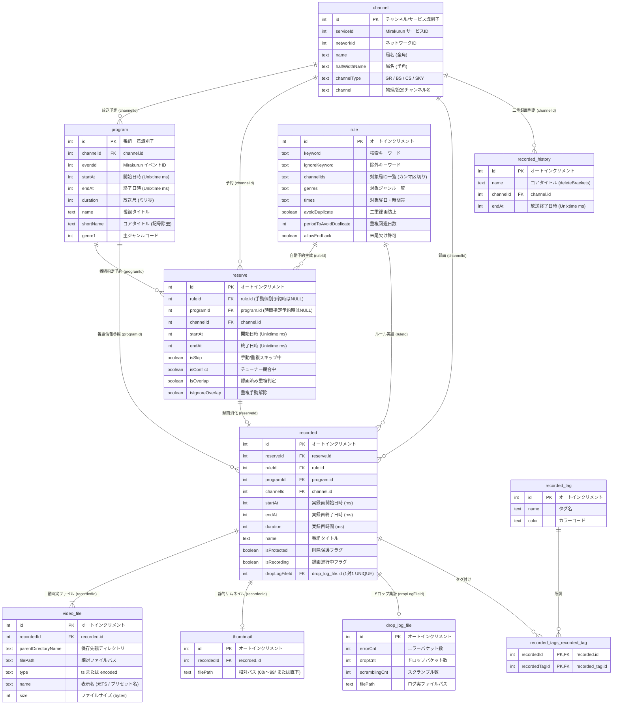

# データベース & スキーマ運用ガイド

本ドキュメントでは、EPGDeck のデータベース構成、Drizzle ORM によるスキーマ定義、DTO/Entity 構造、および EPGStation (v2.10.0) 完全互換ポリシーについて解説します。

## 目次

1. [サポートするデータベース](#1-サポートするデータベース)
2. [データベース全体 ER 図 (Entity-Relationship Diagram)](#2-データベース全体-er-図-entity-relationship-diagram)
3. [テーブル定義詳細 (Schema Reference)](#3-テーブル定義詳細-schema-reference)
   - [3.1 チャンネルマスター (channel)](#31-チャンネルマスター-channel)
   - [3.2 番組表データ (program)](#32-番組表データ-program)
   - [3.3 自動録画ルール (rule)](#33-自動録画ルール-rule)
   - [3.4 録画予約 (reserve)](#34-録画予約-reserve)
   - [3.5 録画アーカイブメタデータ (recorded)](#35-録画アーカイブメタデータ-recorded)
   - [3.6 録画動画ファイル (video_file)](#36-録画動画ファイル-video_file)
   - [3.7 サムネイル画像 (thumbnail)](#37-サムネイル画像-thumbnail)
   - [3.8 ドロップ・エラー集計ログ (drop_log_file)](#38-ドロップエラー集計ログ-drop_log_file)
   - [3.9 録画履歴 (recorded_history)](#39-録画履歴-recorded_history)
   - [3.10 タグマスター & 中間テーブル (recorded_tag, recorded_tags_recorded_tag)](#310-タグマスター--中間テーブル-recorded_tag-recorded_tags_recorded_tag)
4. [EPGStation 完全互換ポリシー](#4-epgstation-完全互換ポリシー)
5. [スキーマ変更手順](#5-スキーマ変更手順)
6. [破壊的変更に関するガイドライン](#6-破壊的変更に関するガイドライン)

---

## 1. サポートするデータベース

EPGDeck は以下の 2 種類のデータベースエンジンをサポートしています。

- **SQLite3** (デフォルト): `@libsql/client` を使用し、ローカルファイル（`data/database.db`）で手軽に動作します。
- **MySQL / MariaDB** (推奨): `mysql2` を使用し、大規模運用や高速な検索に適しています。必ず文字コードを `utf8mb4` に設定してください。

---

## 2. データベース全体 ER 図 (Entity-Relationship Diagram)

EPGDeck の各エンティティ間の論理リレーション（外部キー参照関係）の全体像です。

---

## 3. テーブル定義詳細 (Schema Reference)

### 3.1 チャンネルマスター (`channel`)
Mirakurun / mirakc から取得した放送局およびサービス情報を保持します。

| カラム名 | 型 (SQLite / MySQL) | NULL | デフォルト | 説明 |
| :--- | :--- | :---: | :---: | :--- |
| `id` | `INTEGER` / `BIGINT` | NO | (PK) | チャンネルID (Mirakurun 側の一意ID) |
| `serviceId` | `INTEGER` / `INT` | NO | - | サービスID (ARIB SID) |
| `networkId` | `INTEGER` / `INT` | NO | - | ネットワークID (ARIB NID) |
| `name` | `TEXT` / `VARCHAR(255)` | NO | - | 放送局名（全角表記） |
| `halfWidthName`| `TEXT` / `VARCHAR(255)` | NO | - | 放送局名（半角英数置換表記） |
| `remoteControlKeyId` | `INTEGER` / `INT` | YES | NULL | リモコンキーID（地デジ 1〜12 等） |
| `hasLogoData` | `INTEGER` / `BOOLEAN` | NO | `false` | 局ロゴデータの有無 |
| `channelTypeId` | `INTEGER` / `INT` | NO | - | 放送波種別ID |
| `channelType` | `TEXT` / `VARCHAR(255)` | NO | - | 放送波識別名 (`GR`, `BS`, `CS`, `SKY`) |
| `channel` | `TEXT` / `VARCHAR(255)` | NO | - | 物理チャンネル名 (例: `27`, `BS15_0`) |
| `type` | `INTEGER` / `INT` | YES | NULL | サービスタイプ (テレビ: 1, ラジオ: 2 等) |

---

### 3.2 番組表データ (`program`)
Mirakurun から定期取得した最新の放映予定番組データです。

| カラム名 | 型 (SQLite / MySQL) | NULL | デフォルト | 説明 |
| :--- | :--- | :---: | :---: | :--- |
| `id` | `INTEGER` / `BIGINT` | NO | (PK) | 番組ID (Mirakurun 一意ID) |
| `updateTime` | `INTEGER` / `BIGINT` | NO | - | レコード更新時刻 (Unixtime ms) |
| `channelId` | `INTEGER` / `BIGINT` | NO | (FK) | 放送局ID (`channel.id` 参照) |
| `eventId` | `INTEGER` / `INT` | NO | - | イベントID (ARIB EID) |
| `serviceId` | `INTEGER` / `INT` | NO | - | サービスID (ARIB SID) |
| `networkId` | `INTEGER` / `INT` | NO | - | ネットワークID (ARIB NID) |
| `startAt` | `INTEGER` / `BIGINT` | NO | - | 放送開始日時 (Unixtime ms) |
| `endAt` | `INTEGER` / `BIGINT` | NO | - | 放送終了日時 (Unixtime ms) |
| `startHour` | `INTEGER` / `INT` | NO | - | 開始時 (0〜23) |
| `week` | `INTEGER` / `INT` | NO | - | 曜日 (0:日〜6:土) |
| `duration` | `INTEGER` / `INT` | NO | - | 予定放送枠時間 (ミリ秒) |
| `isFree` | `INTEGER` / `BOOLEAN` | NO | - | 無料放送フラグ |
| `name` | `TEXT` / `VARCHAR(255)` | NO | - | 番組タイトル（全角） |
| `halfWidthName`| `TEXT` / `VARCHAR(255)` | NO | - | 番組タイトル（半角英数置換） |
| `shortName` | `TEXT` / `VARCHAR(255)` | NO | - | コアタイトル（記号・角括弧除去後） |
| `description` | `TEXT` / `TEXT` | YES | NULL | 番組概要 |
| `halfWidthDescription` | `TEXT` / `TEXT` | YES | NULL | 番組概要（半角置換） |
| `extended` | `TEXT` / `TEXT` | YES | NULL | 番組詳細・出演者情報 |
| `halfWidthExtended` | `TEXT` / `TEXT` | YES | NULL | 番組詳細（半角置換） |
| `rawExtended` | `TEXT` / `TEXT` | YES | NULL | ARIB 構造化詳細テキスト |
| `rawHalfWidthExtended` | `TEXT` / `TEXT` | YES | NULL | ARIB 構造化詳細（半角置換） |
| `genre1`〜`genre3` | `INTEGER` / `INT` | YES | NULL | ARIB 大ジャンルコード (0〜15) |
| `subGenre1`〜`subGenre3` | `INTEGER` / `INT` | YES | NULL | ARIB 中ジャンルコード (0〜15) |
| `videoType` | `TEXT` / `VARCHAR(255)` | YES | NULL | 映像形式 (例: `mpeg2`, `h.264`) |
| `videoResolution` | `TEXT` / `VARCHAR(255)` | YES | NULL | 映像解像度 (例: `1080i`, `720p`) |
| `audioSamplingRate` | `INTEGER` / `INT` | YES | NULL | 音声サンプリングレート |

- **主要インデックス**:
  - `idx_program_channel_time`: `(channelId, startAt, endAt)`
  - `idx_program_time`: `(startAt, endAt)`

---

### 3.3 自動録画ルール (`rule`)
番組表から条件に合致する番組を自動検索・予約するための定義です。

| カラム名 | 型 (SQLite / MySQL) | NULL | デフォルト | 説明 |
| :--- | :--- | :---: | :---: | :--- |
| `id` | `INTEGER` / `INT` | NO | (PK, AI) | ルールID |
| `updateCnt` | `INTEGER` / `INT` | NO | `0` | ルール更新カウンター (リビジョン) |
| `isTimeSpecification` | `INTEGER` / `BOOLEAN` | NO | `false` | 時刻指定予約ルールか否か |
| `keyword` | `TEXT` / `VARCHAR(255)` | YES | NULL | 検索キーワード |
| `ignoreKeyword` | `TEXT` / `VARCHAR(255)` | YES | NULL | 除外キーワード |
| `keyCS` / `ignoreKeyCS` | `INTEGER` / `BOOLEAN` | NO | `false` | 大小文字区別フラグ |
| `keyRegExp` / `ignoreKeyRegExp` | `INTEGER` / `BOOLEAN` | NO | `false` | 正規表現検索フラグ |
| `name` / `description` / `extended` | `INTEGER` / `BOOLEAN` | NO | `false` | キーワード検索対象（タイトル/概要/詳細） |
| `GR` / `BS` / `CS` / `SKY` | `INTEGER` / `BOOLEAN` | NO | `false` | 対象放送波フィルター |
| `channelIds` | `TEXT` / `TEXT` | YES | NULL | 対象チャンネルID配列（JSON/カンマ区切り） |
| `genres` | `TEXT` / `TEXT` | YES | NULL | 対象ジャンル・サブジャンル配列 |
| `times` | `TEXT` / `TEXT` | YES | NULL | 対象曜日および時間帯範囲 |
| `durationMin` / `durationMax` | `INTEGER` / `INT` | YES | NULL | 番組尺の最小・最大長 (秒) |
| `enable` | `INTEGER` / `BOOLEAN` | NO | `false` | ルール有効/無効フラグ |
| `avoidDuplicate` | `INTEGER` / `BOOLEAN` | NO | `false` | **二重録画防止フラグ** |
| `periodToAvoidDuplicate` | `INTEGER` / `INT` | YES | NULL | 二重録画防止の対象日数 (未指定/0で無期限) |
| `allowEndLack` | `INTEGER` / `BOOLEAN` | NO | `false` | チューナー競合時の末尾欠け許可 |
| `parentDirectoryName` | `TEXT` / `VARCHAR(255)` | YES | NULL | TS録画保存先親ディレクトリ名 |
| `directory` | `TEXT` / `VARCHAR(255)` | YES | NULL | TS録画保存先サブディレクトリ |
| `recordedFormat` | `TEXT` / `VARCHAR(255)` | YES | NULL | 録画ファイル名フォーマットマクロ |
| `mode1`〜`mode3` | `TEXT` / `VARCHAR(255)` | YES | NULL | 自動エンコードプリセット名 (最大3系統) |
| `parentDirectoryName1`〜`3` | `TEXT` / `VARCHAR(255)` | YES | NULL | エンコード保存先親ディレクトリ |
| `directory1`〜`3` | `TEXT` / `VARCHAR(255)` | YES | NULL | エンコード保存先サブディレクトリ |
| `isDeleteOriginalAfterEncode` | `INTEGER` / `BOOLEAN` | NO | `false` | 全エンコード完了後に元 TS を削除するか |

---

### 3.4 録画予約 (`reserve`)
番組指定予約または時間指定予約の実行予定情報です。

| カラム名 | 型 (SQLite / MySQL) | NULL | デフォルト | 説明 |
| :--- | :--- | :---: | :---: | :--- |
| `id` | `INTEGER` / `INT` | NO | (PK, AI) | 予約ID |
| `ruleId` | `INTEGER` / `INT` | YES | (FK) | 紐づくルールID（手動予約時は NULL） |
| `programId` | `INTEGER` / `BIGINT` | YES | (FK) | 紐づく番組ID（時間指定時は NULL） |
| `channelId` | `INTEGER` / `BIGINT` | NO | (FK) | 放送局ID (`channel.id` 参照) |
| `startAt` | `INTEGER` / `BIGINT` | NO | - | 録画開始予定日時 (Unixtime ms) |
| `endAt` | `INTEGER` / `BIGINT` | NO | - | 録画終了予定日時 (Unixtime ms) |
| `isSkip` | `INTEGER` / `BOOLEAN` | NO | `false` | スキップ中フラグ（手動または重複） |
| `isConflict` | `INTEGER` / `BOOLEAN` | NO | `false` | **チューナー競合中フラグ** |
| `isOverlap` | `INTEGER` / `BOOLEAN` | NO | `false` | **録画済み重複判定フラグ** |
| `isIgnoreOverlap` | `INTEGER` / `BOOLEAN` | NO | `false` | 重複手動解除（強制録画）フラグ |
| `isTimeSpecified` | `INTEGER` / `BOOLEAN` | NO | `false` | 時間指定予約フラグ |
| `isEventRelay` | `INTEGER` / `BOOLEAN` | NO | `false` | イベントリレー追従予約フラグ |
| `allowEndLack` | `INTEGER` / `BOOLEAN` | NO | `false` | 末尾欠け許可フラグ |
| `name` | `TEXT` / `VARCHAR(255)` | YES | NULL | 番組タイトル |
| `description` | `TEXT` / `TEXT` | YES | NULL | 番組概要 |
| `parentDirectoryName` / `directory` | `TEXT` / `VARCHAR(255)` | YES | NULL | TS録画保存先 |
| `encodeMode1`〜`3` | `TEXT` / `VARCHAR(255)` | YES | NULL | 自動エンコード設定 |

- **主要インデックス**:
  - `idx_reserve_start_end`: `(startAt, endAt)`
  - `idx_reserve_rule`: `(ruleId)`
  - `idx_reserve_channel_start`: `(channelId, startAt)`

---

### 3.5 録画アーカイブメタデータ (`recorded`)
録画完了または録画進行中の番組の親レコードです。

| カラム名 | 型 (SQLite / MySQL) | NULL | デフォルト | 説明 |
| :--- | :--- | :---: | :---: | :--- |
| `id` | `INTEGER` / `INT` | NO | (PK, AI) | 録画ID |
| `reserveId` | `INTEGER` / `INT` | YES | (FK) | 予約ID（物理削除後は NULL） |
| `ruleId` | `INTEGER` / `INT` | YES | (FK) | ルールID（手動録画時は NULL） |
| `programId` | `INTEGER` / `BIGINT` | YES | (FK) | 番組ID |
| `channelId` | `INTEGER` / `BIGINT` | NO | (FK) | 放送局ID (`channel.id` 参照) |
| `isProtected` | `INTEGER` / `BOOLEAN` | NO | `false` | **削除保護フラグ** |
| `isRecording` | `INTEGER` / `BOOLEAN` | NO | - | **録画進行中フラグ** (進行中: `true`, 完了: `false`) |
| `startAt` | `INTEGER` / `BIGINT` | NO | - | 実録画開始日時 (Unixtime ms) |
| `endAt` | `INTEGER` / `BIGINT` | NO | - | 実録画終了日時 (Unixtime ms) |
| `duration` | `INTEGER` / `INT` | NO | - | **実録画時間**（実測ミリ秒） |
| `name` | `TEXT` / `VARCHAR(255)` | NO | - | 番組タイトル |
| `description` | `TEXT` / `TEXT` | YES | NULL | 番組概要 |
| `extended` | `TEXT` / `TEXT` | YES | NULL | 番組詳細 |
| `genre1`〜`genre3` | `INTEGER` / `INT` | YES | NULL | ジャンルコード |
| `dropLogFileId` | `INTEGER` / `INT` | YES | (FK, UNIQUE) | ドロップ集計レコードID (`drop_log_file.id` 参照) |

- **主要インデックス**:
  - `idx_recorded_channel_start`: `(channelId, startAt)`
  - `idx_recorded_start_end`: `(startAt, endAt)`
  - `idx_recorded_rule`: `(ruleId)`

---

### 3.6 録画動画ファイル (`video_file`)
録画番組に紐づく実際の動画ファイル（元 TS、およびエンコード済み MP4 等）を管理します（1対多関係）。

| カラム名 | 型 (SQLite / MySQL) | NULL | デフォルト | 説明 |
| :--- | :--- | :---: | :---: | :--- |
| `id` | `INTEGER` / `INT` | NO | (PK, AI) | ファイルID |
| `recordedId` | `INTEGER` / `INT` | NO | (FK) | 録画ID (`recorded.id` 参照) |
| `parentDirectoryName` | `TEXT` / `VARCHAR(255)` | NO | - | 保存先親ディレクトリ名 (`config.yml` 参照) |
| `filePath` | `TEXT` / `VARCHAR(255)` | NO | - | 親ディレクトリからの相対ファイルパス |
| `type` | `TEXT` / `VARCHAR(255)` | NO | - | ファイル種別 (`ts` または `encoded`) |
| `name` | `TEXT` / `VARCHAR(255)` | NO | - | UI 表示名（元ファイル時は `'TS'`, エンコード時はプリセット名） |
| `size` | `INTEGER` / `BIGINT` | NO | `0` | ファイルサイズ (バイト数) |

---

### 3.7 サムネイル画像 (`thumbnail`)
録画一覧や番組詳細で使用する静的サムネイル画像を管理します。

| カラム名 | 型 (SQLite / MySQL) | NULL | デフォルト | 説明 |
| :--- | :--- | :---: | :---: | :--- |
| `id` | `INTEGER` / `INT` | NO | (PK, AI) | サムネイルID |
| `recordedId` | `INTEGER` / `INT` | NO | (FK) | 録画ID (`recorded.id` 参照) |
| `filePath` | `TEXT` / `VARCHAR(255)` | NO | - | サムネイル相対パス（シャーディング: `00/`〜`99/`、既存: 直下） |

---

### 3.8 ドロップ・エラー集計ログ (`drop_log_file`)
録画中に TS パケットから検知されたドロップ、エラー、スクランブル数を管理します。

| カラム名 | 型 (SQLite / MySQL) | NULL | デフォルト | 説明 |
| :--- | :--- | :---: | :---: | :--- |
| `id` | `INTEGER` / `INT` | NO | (PK, AI) | ログID |
| `errorCnt` | `INTEGER` / `INT` | NO | - | パケット破損・不正数 |
| `dropCnt` | `INTEGER` / `INT` | NO | - | 連続性不一致・ドロップ数 |
| `scramblingCnt` | `INTEGER` / `INT` | NO | - | 暗号化解除漏れ数 |
| `filePath` | `TEXT` / `VARCHAR(255)` | NO | - | 詳細ログ実ファイルのパス（0件削除時は仮想パス） |

---

### 3.9 録画履歴 (`recorded_history`)
ルールの二重録画防止（`avoidDuplicate`）のために保持される完了番組の履歴です。

| カラム名 | 型 (SQLite / MySQL) | NULL | デフォルト | 説明 |
| :--- | :--- | :---: | :---: | :--- |
| `id` | `INTEGER` / `INT` | NO | (PK, AI) | 履歴ID |
| `name` | `TEXT` / `VARCHAR(255)` | NO | - | 判定キー用コアタイトル (`StrUtil.deleteBrackets`) |
| `channelId` | `INTEGER` / `BIGINT` | NO | (FK) | 判定キー用放送局ID (`channel.id` 参照) |
| `endAt` | `INTEGER` / `BIGINT` | NO | - | 放送終了日時 (期間判定 `periodToAvoidDuplicate` 用) |

---

### 3.10 タグマスター & 中間テーブル (`recorded_tag`, `recorded_tags_recorded_tag`)
録画番組に付与するカテゴリタグを管理します。

#### `recorded_tag`
| カラム名 | 型 (SQLite / MySQL) | NULL | デフォルト | 説明 |
| :--- | :--- | :---: | :---: | :--- |
| `id` | `INTEGER` / `INT` | NO | (PK, AI) | タグID |
| `name` | `TEXT` / `VARCHAR(255)` | NO | - | タグ表示名（全角） |
| `halfWidthName`| `TEXT` / `VARCHAR(255)` | NO | - | タグ表示名（半角） |
| `color` | `TEXT` / `VARCHAR(255)` | NO | - | 表示カラーコード (例: `#ff0000`) |

#### `recorded_tags_recorded_tag` (多対多 結合テーブル)
| カラム名 | 型 (SQLite / MySQL) | NULL | デフォルト | 説明 |
| :--- | :--- | :---: | :---: | :--- |
| `recordedId` | `INTEGER` / `INT` | NO | (PK, FK) | 録画ID (`recorded.id` 参照) |
| `recordedTagId` | `INTEGER` / `INT` | NO | (PK, FK) | タグID (`recorded_tag.id` 参照) |

---

## 4. EPGStation 完全互換ポリシー

EPGDeck は **EPGStation v2.10.0 との 100% データベース互換性** を維持しています。

1. **新規セットアップ時の自動テーブル生成**:
   - 初回起動時、`DrizzleOperator.checkConnection()` により EPGStation v2.10.0 と同一構造のテーブル群が自動生成されます。
2. **既存環境からのシームレス移行**:
   - 既存の EPGStation で使用していた SQLite DB ファイル（`data/database.db`）または MySQL データベースをそのまま指定するだけで、データ移行作業なしですぐに動作します。

---

## 5. スキーマ変更手順

テーブル構造やカラムを追加・変更する場合は、以下の手順に従って SQLite と MySQL の双方で整合性を保ってください。

### ① Drizzle Schema の更新
`src/db/schema/sqlite/` および `src/db/schema/mysql/` 配下の該当テーブル定義にカラムを追加・修正します。

### ② DTO / Entity クラスの更新
`src/db/entities/` 配下の該当クラスにプロパティを追加・修正します。

### ③ DrizzleOperator の初期化 DDL の同期
`src/model/db/DrizzleOperator.ts` 内の `CREATE TABLE IF NOT EXISTS` クエリに新カラム定義を反映します。

### ④ DB 操作モデル (DAO) の更新
`src/model/db/*DB.ts` の `toRow()`, `toEntity()`, `insert*()`, `find*()` 等のデータマッピング処理を更新します。

---

## 6. 破壊的変更に関するガイドライン

- 既存のカラム削除やデータ型の互換性破壊など、過去の録画データや予約ルールに影響を及ぼす変更は避けてください。
- 既存ユーザーの録画アーカイブ（15,000 件超の運用など）を安全に維持するため、破壊的変更が必要な場合は必ず事前に合意を得てください。

