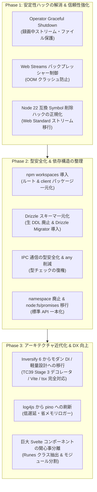

# アーキテクチャ近代化・安定化ロードマップ (Modernization & Reliability Roadmap)

本ドキュメントでは、EPGDeck の長期的な安定稼働、モダンな技術スタックへの追従、および依存パッケージのアップデート容易性（保守性）を高めるための改善ロードマップと技術的背景について解説します。

---

## 1. 背景と方針

EPGDeck は、Node.js 22 (ESM)、Hono (RPC)、Svelte 5 (Runes)、Tailwind CSS v4、Drizzle ORM などの最新技術を基盤として採用し、大幅なリファクタリングを遂げてきました。

一方で、EPGStation 時代から引き継がれた設計資産（InversifyJS 6.x による DI、TypeORM 時代のエンティティクラス、手動 Promise ラッパー、`any` の多用等）と、モダンな Web 標準（Web Streams、型推論ドリブンな設計）が混在しており、以下の 3 つの観点から段階的な近代化を推進します。

1. **安定稼働の強化 (Reliability & Robustness)**: プロセス終了時の録画データ保護、ストリーミング時の OOM 防止、脆い内部 Symbol ハックの正規化。
2. **アップデート容易性の向上 (Maintainability & Future-proofing)**: パッケージ管理の一元化、スキーマ二重管理の解消、型安全性の回復。
3. **アーキテクチャの近代化 (Modern Idioms & DX)**: レガシーデコレータ依存からの脱却、モダンロガーへの刷新、フロントエンドの関心事分離。

---

## 2. 改善タスク一覧と詳細設計

---

### Phase 1: 安定性ハックの解消 & 信頼性強化 (最優先)

#### 1.1 Operator プロセスの Graceful Shutdown 実装（実装完了）
- **対象ファイル**: `src/index.ts`, `src/model/operator/recording/RecordingManageModel.ts`, `src/model/operator/recording/RecorderModel.ts`, `src/model/operator/recording/IRecordingManageModel.ts`, `src/model/operator/recording/IRecorderModel.ts`
- **課題**:
  従来、SIGINT / SIGTERM 受信時に `shutdown` 関数は `serviceChild`（ServiceExecutor）の停止のみを待機し、`process.exit(0)` で即座に終了していた。録画中のレコーダー（Mirakurun ストリーム、TS 書き込みパイプ、一時ファイル等）の終了処理が呼ばれず、OS シャットダウンやサービス再起動時に書きかけの TS ファイルが破損するリスクがあった。
- **実装内容**:
  1. `shutdown` シーケンスを刷新:
     - `StorageManageModel.stop()` で定期空き容量チェックを安全に停止。
     - `serviceChild` へ SIGTERM を送信して API 受信を遮断。
     - `RecordingManageModel.stopAll()` により、録画中レコーダー群を並列で安全に停止・フラッシュ。
     - `RecorderModel.stop()` / `recEnd()` において、Mirakurun ストリーム切断、`fs.WriteStream`（`recFile`）の書き込み完了（`finish`/`close`）待機、`recordedDB.removeRecording`（実録画時間 `duration` および `endAt` 確定、`isRecording: false`）、一時ディレクトリ（`tempDir`）からの移動、DB 動画ファイルサイズ更新、ドロップログ集計および 0 件時ログ削除を完遂。
     - `serviceChild` のクリーン終了（最大 5 秒待機）を確認。
     - `IDrizzleOperator.closeConnection()` で DB コネクション（SQLite / MySQL）を安全にクローズ。
  2. 2 回目のシグナル受信時は即時強制終了（`process.exit(1)`）する二重安全機構を配備。
  3. `recEndPromise` による並行終了処理の重複実行防止機構を実装。

#### 1.2 動画・ライブストリーミングにおけるバックプレッシャー制御の導入（実装完了）
- **対象ファイル**: `src/model/service/hono/routes/streams.ts`, `test/unit/stream_routes.test.ts`
- **課題**:
  従来、`src/model/service/hono/routes/streams.ts` において Node.js `Readable` から Web Streams `ReadableStream` への手動変換時に `nodeStream.on('data', chunk => controller.enqueue(chunk))` と無制限にエンキューしていた。クライアント側のネットワーク遅延時や再生一時停止時にメモリが無限肥大化し、ヒープ枯渇（OOM クラッシュ）を引き起こす危険があった。
- **実装内容**:
  1. **Web Standards 準拠の自動バックプレッシャー制御**:
     - Node.js 17+ 標準の `Readable.toWeb(nodeStream)` を導入。
     - `@hono/node-server` のソケット書き込み・クライアント受信バッファの状態（drain）に応じて `nodeStream.pause()` / `resume()` が自動連動し、メモリ消費を一定の上限（数ブロック程度）に抑制。
  2. **堅牢なストリームライフサイクル管理 & リソース即時解放**:
     - `cleanup` 処理において、`keepTimer` の停止、`nodeStream.destroy()` の即時実行、`streamApiModel.stop(streamId, true)` の待機を体系化。
     - クライアント切断イベント（`c.req.raw.signal` の `abort`、`c.env.incoming` / `c.env.outgoing` の `close` / `error`）、ストリーム自然終了（`end` / `close`）、およびストリームエラー（`error`）の全経路で `cleanup` を漏れなく発火。
     - リクエスト開始時点で既に切断されている場合（`signal.aborted` やソケット `destroyed`）は即座に 400 を返し、不要なトランスコードやチューナー占有を防止。
     - ストリーム生成非同期処理（`startFn`）待機中に切断が発生した場合のゾンビストリーム残留競合を解消し、生成直後の即時クリーンアップと 400 早期返却を保証。
     - キープアライブタイマー（10 秒毎）でエラーが発生した際も自動的に `cleanup` を発火し、ゾンビストリームの残留を抑止。
  3. **網羅的単体テスト（27 シナリオ）の配備**:
     - `test/unit/stream_routes.test.ts` を新設し、バックプレッシャーによる読み取り停止、正常 EOF、`AbortSignal` 切断、`reader.cancel()` 切断、ストリームエラー時の安全終了、事前破棄ソケット即時 400 拒絶、生成待機中切断クリーンアップ、`incoming`/`outgoing` ソケットの `close`/`error` イベント連動、キープアライブ失敗時の自動停止、Tuner 503 エラー、各種メディア配信（M2TS, M2TS-LL, MP4, WebM）を検証。

#### 1.3 Node.js 22 互換用 Symbol 削除ハック (`createAlreadySentResponse`) の正規ストリーム移行
- **対象ファイル**: `src/model/service/hono/HonoApiUtil.ts`
- **経緯・現状**:
  Node.js 22 の undici / Headers キャッシュ機構導入に伴い、`c.env.outgoing` に対して直接 `writeHead` / `pipe` を行った後に Hono の Response を返すと、`ERR_HTTP_HEADERS_SENT` や内部キャッシュ不整合が発生した。そのため、Node.js 22 を動作させるための暫定対応として、`Response` オブジェクトの非公開内部 Symbol（`sym.description === 'cache'`）を手動削除するワークアラウンドが導入されている。
- **課題**:
  ライブラリの非公開内部実装に強く依存しており、`@hono/node-server` や Node.js の今後のマイナーアップデートで突然壊れるリスクがある。
- **改善方針**:
  - `c.env.outgoing` を手動バイパスする方式から、Hono 公式の `stream()` ヘルパーまたは `new Response(Readable.toWeb(stream))` による正規の Web Standard レスポンスモデルへ安全にリファクタリングする。
  - Range リクエスト（206 Partial Content）やクライアント切断時の安全な stream destroy が Web Standard の範囲で正しく動作することを検証・担保する。

---

### Phase 2: 型安全化 & 依存構造の整理 (アップデート容易性の向上)

#### 2.1 npm workspaces によるパッケージ管理の一元化
- **対象ファイル**: `package.json`, `client/package.json`
- **課題**:
  ルートと `client/` で個別に `package.json` を持ち、`npm run all-install`（`--no-save`）で手動インストールしている。また、ESLint 設定がルート（Flat Config `eslint.config.mjs`）とクライアント（レガシー `.eslintrc.cjs`）で分断している。
- **改善方針**:
  1. ルートの `package.json` に `"workspaces": ["client"]` を追加。
  2. ルートでの `npm install` だけで依存関係の重複排除とシンボリックリンクを一元管理。
  3. Dependabot や Renovate による依存パッケージの自動検知・一括更新を可能にする。

#### 2.2 Drizzle ORM スキーマの一元化 & 生 DDL 文字列の撤廃
- **対象ファイル**: `src/db/schema/**/*.ts`, `src/model/db/DrizzleOperator.ts`, `src/model/db/*DB.ts`
- **課題**:
  `src/db/schema/` にスキーマ定義がある一方で、`DrizzleOperator.ts` に 500 行以上の生 DDL 文字列（`CREATE TABLE IF NOT EXISTS`）がハードコードされており、カラム変更時の不整合リスクが高い。また、SQLite と MySQL のユニオン型を吸収できず、DAO 層全体で `(db as any)` のキャストと手動 `toEntity`（boolean 変換）が発生している。
- **改善方針**:
  1. 生 DDL ハードコードを全廃し、`drizzle-orm/migrator` によるスキーマ定義ベースの自動マイグレーションへ統一。
  2. Drizzle の推論型（`$inferSelect` / `$inferInsert`）を活用し、TypeORM 時代の旧エンティティクラスへの手動マッピング層を順次スリム化。

#### 2.3 プロセス間通信（IPC）の型安全化 & コードベース全体の `any` 削減
- **対象ファイル**: `src/model/ipc/**/*.ts`, `eslint.config.mjs`
- **課題**:
  プロダクションコード内に `: any` が 301 箇所、`as any` が 165 箇所存在。特にプロセス間通信（IPC）で引数・返り値が `any` になっており、インターフェース変更時の不整合がコンパイル時に検知できない。
- **改善方針**:
  1. IPC メッセージ定義に Request/Response のジェネリクス型を導入し、モデル呼び出しを型安全化。
  2. 主要 DAO 層・モデル層から順次 `any` を排除し、ESLint の `@typescript-eslint/no-explicit-any` を警告化できる水準を目指す。

#### 2.4 レガシー `namespace` 構文の廃止と `node:fs/promises` への完全移行
- **対象ファイル**: `src/util/FileUtil.ts`, `src/util/ProcessUtil.ts`
- **課題**:
  TypeScript 独自仕様の `namespace` 構文が残存。また `FileUtil.ts` では Node 8 時代の手動 `new Promise` コールバックラップが多数残っている。
- **改善方針**:
  1. 通常の ES モジュール export (`export const ...`) に統一。
  2. 手動ラップを撤廃し、Node.js 22 標準の `node:fs/promises` を直接使用する。

---

### Phase 3: アーキテクチャ近代化 & DX 向上 (長期的な保守性)

#### 3.1 InversifyJS 6.x とレガシーデコレータからの脱却
- **対象ファイル**: `src/model/ModelContainerSetter.ts`, `tsconfig.json`
- **課題**:
  `experimentalDecorators` と `emitDecoratorMetadata` に依存しているため、TypeScript 5+ の標準デコレータ（TC39 Stage 3）への移行や、Vite / esbuild / SWC / tsx などの高速トランスパイラによるサーバー実行が阻害されている。また 1 クラス 1 インターフェースの文字列トークン手動バインドが保守コストになっている。
- **改善方針**:
  - Inversify 最新版（7+ / 8+）への移行、またはクラスそのものをトークンとして解決する型安全な DI、あるいは Hono Context / ファクトリ関数パターンへのスリム化を検討・検証する。

#### 3.2 `log4js` からモダン・高速ロガー（`pino` 等）への刷新
- **対象ファイル**: `src/model/LoggerModel.ts`
- **課題**:
  コンソール出力は自前 ANSI エスケープ、ファイル出力とローテーションのためだけに重厚な `log4js` を組み込んでいる。
- **改善方針**:
  - 低遅延・非同期ストリーム・省メモリな `pino`（+ `pino-roll`）に一本化し、ロギングによるイベントループのブロッキングや依存サイズを削減する。

#### 3.3 フロントエンドの巨大コンポーネント（God Component）の関心事分離
- **対象ファイル**:
  - `client/src/routes/RuleEdit.svelte` (2,149 行)
  - `client/src/routes/RecordedDetail.svelte` (1,310 行)
  - `client/src/routes/Guide.svelte` (1,201 行)
  - `client/src/routes/Recorded.svelte` (1,197 行)
- **課題**:
  1 つの `.svelte` ファイル内に UI 描画、複数モーダル状態、API リクエスト、フォームバリデーションが集約している。
- **改善方針**:
  - モーダルやフォーム部分を別コンポーネントへ分割。
  - ビジネスロジックや状態管理を Svelte 5 の Runes クラス（`*.svelte.ts`）に外出しし、保守性・可読性を向上させる。
