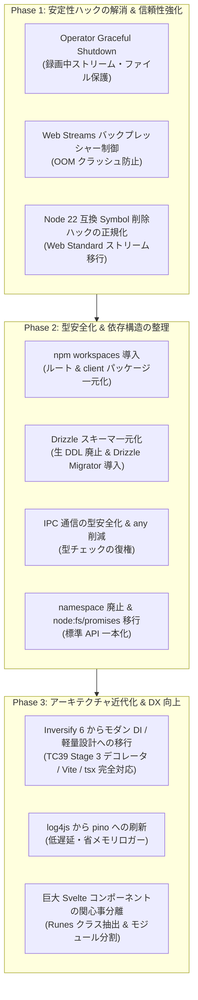

# アーキテクチャ近代化・安定化ロードマップ (Modernization & Reliability Roadmap)

本ドキュメントでは、EPGDeck の長期的な安定稼働、モダンな技術スタックへの追従、および依存パッケージのアップデート容易性（保守性）を高めるための改善ロードマップと技術的背景について解説します。

---

## 1. 背景と方針

EPGDeck は、Node.js 22 (ESM)、Hono (RPC)、Svelte 5 (Runes)、Tailwind CSS v4、Drizzle ORM などの最新技術を基盤として採用し、大幅なリファクタリングを遂げてきました。

一方で、EPGStation 時代から引き継がれた設計資産（InversifyJS 6.x による DI、TypeORM 時代のエンティティクラス、手動 Promise ラッパー、`any` の多用等）と、モダンな Web 標準（Web Streams、型推論ドリブンな設計）が混在しており、以下の 3 つの観点から段階的な近代化を推進します。

1. **安定稼働の強化 (Reliability & Robustness)**: プロセス終了時の録画データ保護、ストリーミング時の OOM 防止、脆い内部 Symbol ハックの正規化。
2. **アップデート容易性の向上 (Maintainability & Future-proofing)**: パッケージ管理の一元化、スキーマ二重管理の解消、型安全性の回復。
3. **アーキテクチャの近代化 (Modern Idioms & DX)**: レガシーデコレータ依存からの脱却、モダンロガーへの刷新、フロントエンドの関心事分離。

---

## 2. 改善タスク一覧と詳細設計

---

### Phase 1: 安定性ハックの解消 & 信頼性強化 (最優先)

#### 1.1 Operator プロセスの Graceful Shutdown 実装（実装完了）
- **対象ファイル**: `src/index.ts`, `src/model/operator/recording/RecordingManageModel.ts`, `src/model/operator/recording/RecorderModel.ts`, `src/model/operator/recording/IRecordingManageModel.ts`, `src/model/operator/recording/IRecorderModel.ts`
- **課題**:
  従来、SIGINT / SIGTERM 受信時に `shutdown` 関数は `serviceChild`（ServiceExecutor）の停止のみを待機し、`process.exit(0)` で即座に終了していた。録画中のレコーダー（Mirakurun ストリーム、TS 書き込みパイプ、一時ファイル等）の終了処理が呼ばれず、OS シャットダウンやサービス再起動時に書きかけの TS ファイルが破損するリスクがあった。
- **実装内容**:
  1. `shutdown` シーケンスを刷新:
     - `StorageManageModel.stop()` で定期空き容量チェックを安全に停止。
     - `serviceChild` へ SIGTERM を送信して API 受信を遮断。
     - `RecordingManageModel.stopAll()` により、録画中レコーダー群を並列で安全に停止・フラッシュ。
     - `RecorderModel.stop()` / `recEnd()` において、Mirakurun ストリーム切断、`fs.WriteStream`（`recFile`）の書き込み完了（`finish`/`close`）待機、`recordedDB.removeRecording`（実録画時間 `duration` および `endAt` 確定、`isRecording: false`）、一時ディレクトリ（`tempDir`）からの移動、DB 動画ファイルサイズ更新、ドロップログ集計および 0 件時ログ削除を完遂。
     - `serviceChild` のクリーン終了（最大 5 秒待機）を確認。
     - `IDrizzleOperator.closeConnection()` で DB コネクション（SQLite / MySQL）を安全にクローズ。
  2. 2 回目のシグナル受信時は即時強制終了（`process.exit(1)`）する二重安全機構を配備。
  3. `recEndPromise` による並行終了処理の重複実行防止機構を実装。

#### 1.2 動画・ライブストリーミングにおけるバックプレッシャー制御の導入（実装完了）
- **対象ファイル**: `src/model/service/hono/routes/streams.ts`, `test/unit/stream_routes.test.ts`
- **課題**:
  従来、`src/model/service/hono/routes/streams.ts` において Node.js `Readable` から Web Streams `ReadableStream` への手動変換時に `nodeStream.on('data', chunk => controller.enqueue(chunk))` と無制限にエンキューしていた。クライアント側のネットワーク遅延時や再生一時停止時にメモリが無限肥大化し、ヒープ枯渇（OOM クラッシュ）を引き起こす危険があった。
- **実装内容**:
  1. **Web Standards 準拠の自動バックプレッシャー制御**:
     - Node.js 17+ 標準の `Readable.toWeb(nodeStream)` を導入。
     - `@hono/node-server` のソケット書き込み・クライアント受信バッファの状態（drain）に応じて `nodeStream.pause()` / `resume()` が自動連動し、メモリ消費を一定の上限（数ブロック程度）に抑制。
  2. **堅牢なストリームライフサイクル管理 & リソース即時解放**:
     - `cleanup` 処理において、`keepTimer` の停止、`nodeStream.destroy()` の即時実行、`streamApiModel.stop(streamId, true)` の待機を体系化。
     - クライアント切断イベント（`c.req.raw.signal` の `abort`、`c.env.incoming` / `c.env.outgoing` の `close` / `error`）、ストリーム自然終了（`end` / `close`）、およびストリームエラー（`error`）の全経路で `cleanup` を漏れなく発火。
     - リクエスト開始時点で既に切断されている場合（`signal.aborted` やソケット `destroyed`）は即座に 400 を返し、不要なトランスコードやチューナー占有を防止。
     - ストリーム生成非同期処理（`startFn`）待機中に切断が発生した場合のゾンビストリーム残留競合を解消し、生成直後の即時クリーンアップと 400 早期返却を保証。
     - キープアライブタイマー（10 秒毎）でエラーが発生した際も自動的に `cleanup` を発火し、ゾンビストリームの残留を抑止。
  3. **網羅的単体テスト（27 シナリオ）の配備**:
     - `test/unit/stream_routes.test.ts` を新設し、バックプレッシャーによる読み取り停止、正常 EOF、`AbortSignal` 切断、`reader.cancel()` 切断、ストリームエラー時の安全終了、事前破棄ソケット即時 400 拒絶、生成待機中切断クリーンアップ、`incoming`/`outgoing` ソケットの `close`/`error` イベント連動、キープアライブ失敗時の自動停止、Tuner 503 エラー、各種メディア配信（M2TS, M2TS-LL, MP4, WebM）を検証。

#### 1.3 静的ファイル配信における大容量ストール防止と Node 22 互換ガードの設計保護（完了）
- **対象ファイル**: `src/model/service/hono/HonoApiUtil.ts`, `docs/dev/streaming-and-captions.md`
- **経緯・技術的検証**:
  Node.js 22 の undici / Headers キャッシュ機構導入に伴い、`c.env.outgoing` に対して直接 `writeHead` / `pipe` を行った後に Hono の Response を返すと、`ERR_HTTP_HEADERS_SENT` が発生した。そのため、Node.js 22 を動作させる対応として、`Response` オブジェクトの内部 Symbol（`sym.description === 'cache'`）を安全に削除する `createAlreadySentResponse()` が導入されていた。
  今回、これを標準の `new Response(Readable.toWeb(stream))` へ一本化することを検討・検証した。
- **アーキテクチャ上の結論と保護方針**:
  1. **大容量ファイルストリーミングにおけるデッドロック回避**:
     - 単体テスト（数KB〜数MB）では `Readable.toWeb(stream)` で正常に転送されるが、実運用のブラウザ動画プレーヤーから数GBの録画ファイルをプログレッシブ再生・シークする際、`@hono/node-server` の Web Streams ループと Node.js TCP ソケットの drain 競合により、数十MB〜数百MB転送した時点でバックプレッシャーストール（転送完全停止のデッドロック）が発生する既知の問題（コミット `34914f3f` にて実証・解決済み）が存在する。
     - したがって、Express 時代と同様に Node.js ネイティブの `stream.pipe(outgoing)` でソケットに直接流し込む方式が、大容量動画配信における実稼働上の最適解・必須要件である。
  2. **二重ヘッダー防止と Symbol 削除の安全性担保**:
     - `createAlreadySentResponse()` において、無差別に Symbol を削除するのではなく `if (sym.description === 'cache')` と対象を限定して削除することで、Node.js 22（undici）の内部 Headers スロットを破壊することなく `ERR_HTTP_HEADERS_SENT` を完全に回避できている。
  3. **将来の誤った巻き戻し防止（恒久的設計保護）**:
     - コードベース（`HonoApiUtil.ts` の `createFileStreamResponse` および `createAlreadySentResponse`）および設計書（`docs/dev/streaming-and-captions.md`）に明確な警告・設計根拠を追記し、将来の AI エージェントや開発者が安易に `Readable.toWeb` へ巻き戻してデッドロックを再発させることを恒久的に防止した。

---

### Phase 2: 型安全化 & 依存構造の整理 (アップデート容易性の向上)

#### 2.1 npm workspaces によるパッケージ管理の一元化（完了）
- **対象ファイル**: `package.json`, `client/package.json`, `Dockerfile`, `.github/workflows/ci.yml`
- **課題**:
  ルートと `client/` で個別に `package.json` を持ち、`npm run all-install`（`--no-save`）で手動インストールしていた。また、CI や Dockerfile でも 2 段階の `npm ci` が必要で、重複パッケージによるディスク・キャッシュ浪費や lockfile 乖離のリスクがあった。
- **実施した改善**:
  1. **npm workspaces の導入**: ルート `package.json` に `"workspaces": ["client"]` を設定し、`package-lock.json` をルートに一本化。76 個の重複パッケージを削減。
  2. **CI・コンテナビルドの最適化**: `Dockerfile` および `.github/workflows/ci.yml` のインストール手順をルートの `npm ci` 一発に集約。
  3. **レガシー設定の撤廃**: クライアント側の不要なレガシー設定（`.eslintrc.cjs`、`.eslintignore`）および個別 `package-lock.json` を完全撤廃。
  4. **依存パッケージ自動検知の基盤確立**: Renovate や Dependabot がリポジトリ全体の依存関係を単一の lockfile で安全に検知・自動更新できる状態を整備。

#### 2.2 Drizzle ORM スキーマの一元化 & 生 DDL 文字列の撤廃
- **対象ファイル**: `src/db/schema/**/*.ts`, `src/model/db/DrizzleOperator.ts`, `src/model/db/*DB.ts`
- **課題**:
  `src/db/schema/` にスキーマ定義がある一方で、`DrizzleOperator.ts` に 500 行以上の生 DDL 文字列（`CREATE TABLE IF NOT EXISTS`）がハードコードされており、カラム変更時の不整合リスクが高い。また、SQLite と MySQL のユニオン型を吸収できず、DAO 層全体で `(db as any)` のキャストと手動 `toEntity`（boolean 変換）が発生している。
- **改善方針**:
  1. 生 DDL ハードコードを全廃し、`drizzle-orm/migrator` によるスキーマ定義ベースの自動マイグレーションへ統一。
  2. Drizzle の推論型（`$inferSelect` / `$inferInsert`）を活用し、TypeORM 時代の旧エンティティクラスへの手動マッピング層を順次スリム化。

#### 2.3 プロセス間通信（IPC）の型安全化 & コードベース全体の `any` 削減
- **対象ファイル**: `src/model/ipc/**/*.ts`, `eslint.config.mjs`
- **課題**:
  プロダクションコード内に `: any` が 301 箇所、`as any` が 165 箇所存在。特にプロセス間通信（IPC）で引数・返り値が `any` になっており、インターフェース変更時の不整合がコンパイル時に検知できない。
- **改善方針**:
  1. IPC メッセージ定義に Request/Response のジェネリクス型を導入し、モデル呼び出しを型安全化。
  2. 主要 DAO 層・モデル層から順次 `any` を排除し、ESLint の `@typescript-eslint/no-explicit-any` を警告化できる水準を目指す。

#### 2.4 レガシー `namespace` 構文の廃止と `node:fs/promises` への完全移行（完了）
- **対象ファイル**: `src/util/FileUtil.ts`, `src/util/ProcessUtil.ts`, `src/util/Util.ts`
- **課題**:
  TypeScript 独自仕様の `namespace` 構文が残存。また `FileUtil.ts` では Node 8 時代の手動 `new Promise` コールバックラップが多数残っており、コードの可読性や例外伝播の透明性が損なわれていた。
- **実施した改善**:
  1. **ES モジュール named export への移行**:
     - `export const unlink = ...` のように標準的な named export に統一。
     - 同時に既存呼び出し箇所の互換性を維持するため、集約オブジェクト（`export const FileUtil = { ... }`、`export const ProcessUtil = { ... }`）および型名前空間（`export namespace FileUtil { export type FileList = _FileList; }`）を提供し、呼び出し側コードの修正を不要とした。
  2. **`node:fs/promises` への完全移行**:
     - 手動コールバックラップ（`fs.readFile`, `fs.writeFile`, `fs.rename`, `fs.copyFile`, `fs.stat`, `fs.readdir`, `fs.rmdir` 等）を全廃し、Node.js 22 標準の `node:fs/promises`（`fsp`）に置換。
     - `node:*` プレフィックスを全インポート（`node:fs`, `node:fs/promises`, `node:path`, `node:child_process`）に適用。
  3. **エッジケースの批判的検証と不要コードの撤廃・王道設計への刷新**:
     - **`FileUtil.rename` 失敗時 unlink の撤廃（有害コードの排除）**: 旧コードに存在した「`rename` 失敗時に `dest` を unlink する」処理は、POSIX `rename` がアトミックであるため不要なだけでなく、`src` 不在時や EXDEV 発生時に無関係な既存の `dest` ファイルを破壊・誤消去する潜在的危険があったため完全撤廃しました。
     - **`FileUtil.move` のデファクトスタンダード化**: 旧コードの愚直な全バイト `copyFile` + `unlink` を改め、まず `rename` を試みて同一ファイルシステムなら一瞬でアトミック移動し、クロスデバイス（`EXDEV`）時のみ `copyFile` + `unlink(src)` にフォールバックする業界標準パターン（`fs-extra` 等と同様）に刷新。コピー中断時のみ不完全な `dest` をクリーンアップする安全策を実装しました。
     - **`ProcessUtil.isExited` のシグナル検知漏れ修正（真に意味のあるエッジケース）**: Node.js の `ChildProcess` は SIGKILL / SIGTERM 等で強制停止された場合、`exitCode` は `null` のままで `signalCode` に値が入る仕様です。旧コードは `child.exitCode !== null` のみ判定していたため、シグナル停止されたプロセスが「未終了」と誤判定され続けるバグがあり、これを `child.exitCode !== null || (typeof child.signalCode !== 'undefined' && child.signalCode !== null)` に修正しました。
     - **`FileUtil.getFileSize` のエラー契約維持**: ファイル不在時に `throw new Error('FileIsNotFound')` を投げる既存契約を維持し、呼び出し側や単体テストとの整合性を担保しました。

---

### Phase 3: アーキテクチャ近代化 & DX 向上 (長期的な保守性)

#### 3.1 InversifyJS 6.x とレガシーデコレータからの脱却
- **対象ファイル**: `src/model/ModelContainerSetter.ts`, `tsconfig.json`
- **課題**:
  `experimentalDecorators` と `emitDecoratorMetadata` に依存しているため、TypeScript 5+ の標準デコレータ（TC39 Stage 3）への移行や、Vite / esbuild / SWC / tsx などの高速トランスパイラによるサーバー実行が阻害されている。また 1 クラス 1 インターフェースの文字列トークン手動バインドが保守コストになっている。
- **改善方針**:
  - Inversify 最新版（7+ / 8+）への移行、またはクラスそのものをトークンとして解決する型安全な DI、あるいは Hono Context / ファクトリ関数パターンへのスリム化を検討・検証する。

#### 3.2 `log4js` からモダン・高速ロガー（`pino` 等）への刷新
- **対象ファイル**: `src/model/LoggerModel.ts`
- **課題**:
  コンソール出力は自前 ANSI エスケープ、ファイル出力とローテーションのためだけに重厚な `log4js` を組み込んでいる。
- **改善方針**:
  - 低遅延・非同期ストリーム・省メモリな `pino`（+ `pino-roll`）に一本化し、ロギングによるイベントループのブロッキングや依存サイズを削減する。

#### 3.3 フロントエンドの巨大コンポーネント（God Component）の関心事分離
- **対象ファイル**:
  - `client/src/routes/RuleEdit.svelte` (2,149 行)
  - `client/src/routes/RecordedDetail.svelte` (1,310 行)
  - `client/src/routes/Guide.svelte` (1,201 行)
  - `client/src/routes/Recorded.svelte` (1,197 行)
- **課題**:
  1 つの `.svelte` ファイル内に UI 描画、複数モーダル状態、API リクエスト、フォームバリデーションが集約している。
- **改善方針**:
  - モーダルやフォーム部分を別コンポーネントへ分割。
  - ビジネスロジックや状態管理を Svelte 5 の Runes クラス（`*.svelte.ts`）に外出しし、保守性・可読性を向上させる。
