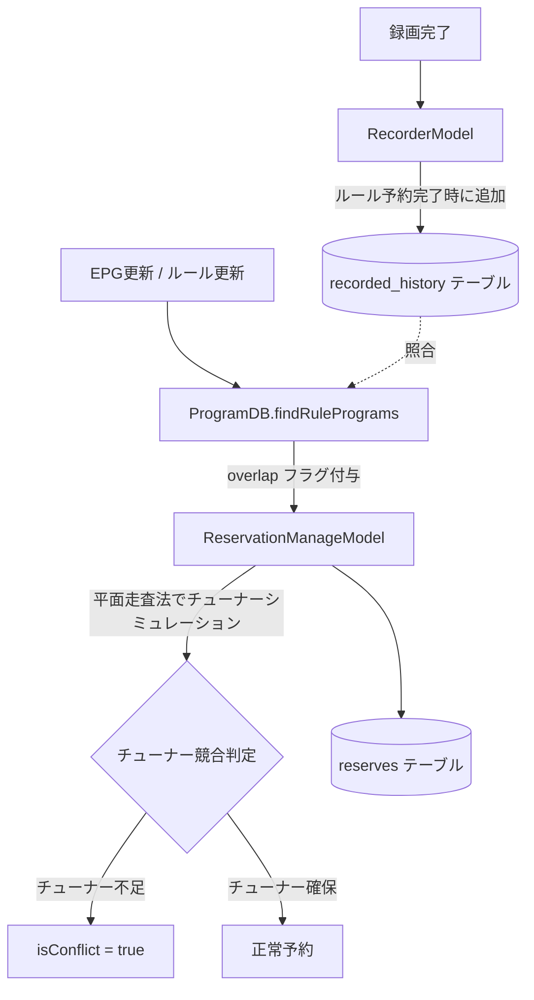

# 録画予約・重複排除・競合解決アルゴリズム仕様書

本ドキュメントでは、EPGDeck における録画予約の生成、過去録画との重複判定（二重録画防止 / `isOverlap`）、およびチューナー不足による時間重複判定（チューナー競合 / `isConflict`）の内部アルゴリズムと判定基準について技術的に解説します。

---

## 目次

1. [概要とモデル構成](#1-概要とモデル構成)
2. [二重録画防止（録画済み重複排除 / isOverlap）](#2-二重録画防止録画済み重複排除--isoverlap)
   - [判定のタイミングと全体フロー](#判定のタイミングと全体フロー)
   - [録画履歴（recorded_history）の保存条件](#録画履歴recorded_historyの保存条件)
   - [重複判定のキーと正規化ロジック（shortName）](#重複判定のキーと正規化ロジックshortname)
   - [重複期間（periodToAvoidDuplicate）のフィルタリング](#重複期間periodtoavoidduplicateのフィルタリング)
   - [重複判定後の動作と手動解除（isIgnoreOverlap）](#重複判定後の動作と手動解除isignoreoverlap)
3. [同一番組に対する重複予約の調停（Program ID 重複排除）](#3-同一番組に対する重複予約の調停program-id-重複排除)
4. [時間帯重複とチューナー競合解決（isConflict）](#4-時間帯重複とチューナー競合解決isconflict)
   - [平面走査法（Sweep-Line Algorithm）によるシミュレーション](#平面走査法sweep-line-algorithmによるシミュレーション)
   - [優先順位（ソートロジック）](#優先順位ソートロジック)
   - [重複スキップ・手動スキップとの相互作用](#重複スキップ手動スキップとの相互作用)
   - [末尾欠け許可（allowEndLack）による競合回避](#末尾欠け許可allowendlackによる競合回避)
5. [時刻指定予約（isTimeSpecification）による予約枠生成](#5-時刻指定予約istimespecificationによる予約枠生成)
   - [秒単位整数によるミリ秒精度計算](#秒単位整数によるミリ秒精度計算)
   - [日跨ぎ枠の算出ロジック](#日跨ぎ枠の算出ロジック)
   - [レガシー時単位ルールの後方互換対応](#レガシー時単位ルールの後方互換対応)
   - [録画完了時の EPG 番組名自動補完と予約名フォールバック](#録画完了時の-epg-番組名自動補完と予約名フォールバック)
6. [関連ソースコード一覧](#6-関連ソースコード一覧)

---

## 1. 概要とモデル構成

EPGDeck における予約管理は、主に以下のコンポーネントによって行われます。



- **`ProgramDB`**: ルール条件（キーワード、局、ジャンル、時間帯等）に一致する番組を抽出する際、過去の録画履歴と照合して二重録画（`overlap`）を判定します。
- **`ReservationManageModel`**: 抽出された候補番組や手動予約を統合し、同一番組の予約衝突調停、および物理チューナー数に基づく時系列シミュレーション（競合判定）を実施して最終的な予約（`Reserve`）レコードを生成・差分更新します。
- **`RecorderModel`**: 予約時刻に従って録画を実行し、正常終了時に録画履歴（`recorded_history`）へ番組名と局を登録します。

---

## 2. 二重録画防止（録画済み重複排除 / isOverlap）

ルール作成時に **「重複録画を回避する（`avoidDuplicate: true`）」** が有効になっている場合、過去に録画した番組の再放送などを自動的にスキップします。

### 判定のタイミングと全体フロー

1. EPG データの定期更新時、またはルールの新規作成・編集時。
2. `ReservationManageModel` から `ProgramDB.findRulePrograms(ruleId, option)` が呼び出される。
3. ルール条件に合致する放映予定番組一覧（`rows`）を取得。
4. `avoidDuplicate === true` かつ該当番組が存在する場合、後述の条件で `recorded_history` テーブルを検索。
5. 過去に録画済みと判定された番組に `overlap = true` フラグを付与して返す。
6. `ReservationManageModel` はこれを受けて `reserve.isOverlap = true` として予約を登録する。

### 録画履歴（`recorded_history`）の保存条件

録画履歴は二重録画防止の要であり、不用意に短期自動削除せず、ユーザーの意図した無期限（`0`）または長期保持を優先します。
録画履歴は以下の条件をすべて満たして録画が完了したときのみ、`RecorderModel.ts` 内で `recorded_history` に INSERT されます。

```typescript
// src/model/operator/recording/RecorderModel.ts
if (
    this.reserve.isTimeSpecified === false && // 時刻指定予約ではない
    this.reserve.isEventRelay === false &&      // イベントリレー番組ではない
    this.isNeedDeleteReservation === true     // 正常に終了した
) {
    // 番組指定予約（ルール予約および手動個別予約）の場合に記録する
    const history = new RecordedHistory();
    history.name = StrUtil.deleteBrackets(recorded.halfWidthName);
    history.channelId = recorded.channelId;
    history.endAt = recorded.endAt;
    await this.recordedHistoryDB.insertOnce(history);
}
```

- **手動の個別番組指定予約の保存**:
  - EPGStation オリジナルでは「ルール予約のみ」が履歴に保存されていましたが、EPGDeck では**手動の個別番組指定予約であっても、ユーザーの「録画済み」の意図を尊重して履歴に保存**します（時刻指定予約およびイベントリレーのみ除外）。
- **録画失敗時のスキップ防止（再放送救済）**:
  - チューナー不足やドロップ障害等で録画が失敗した場合（`isNeedDeleteReservation === false` や異常終了時）は、再放送時に重複スキップされてしまうのを防ぐため、**履歴には保存しません**。
- **録画中の中断保存（`stop`）時の扱い**:
  - 録画中に手動で「中断して保存」した場合は、途中ファイルは保持・エンコードされますが、未完了扱いとして**録画履歴には残しません**（再放送時などに重複録画の判定対象・録画済み扱いにならないよう救済）。

### 予約重複調停（同一番組に対する複数ルール）の原則

同一番組（`programId`）に対して複数のルールが重複してマッチした場合の調停原則：
- 手動予約が最優先され、ルール予約同士は `ruleId` の昇順（先に登録されたルールが優先）で調停されます。
- 重複調停のインデックス化はステータス（スキップ / 通常予約）ごとに独立して管理され、あるルールでスキップ指定されていても、別ルールで優先される場合は救済録画が行われるよう設計されています。

### 重複判定のキーと正規化ロジック（`shortName`）

重複の判定は、以下の複合キーで行われます：

$$\text{判定キー} = (\text{正規化番組名 } shortName) \ \times \ (\text{放送局 } channelId)$$

#### 1. 放送局の一致（`channelId`）
- **同一の放送局（チャンネル）でのみ重複と判定されます。**
- 例えば、地デジ局で録画済みの番組と同一のアニメが BS 局や別系列局で放送される場合、`channelId` が異なるため重複とはみなされず録画されます。

#### 2. 番組名の正規化（`StrUtil.deleteBrackets`）
EPG の番組名は、再放送時や初回放送時に `[新]`, `[字]`, `[再]` などの各種記号が付与されるため、単純な文字列一致では重複を検知できません。そのため、以下の正規化を行って生成された `shortName` 同士を比較します。

1. **全角英数記号の半角化** (`halfWidthName`)。
2. **番組表の囲み文字記号の全除去**:
   - `[HV]`, `[P]`, `[SD]`, `[W]`, `[MV]`, `[手]`, `[字]`, `[双]`, `[デ]`, `[S]`, `[二]`, `[多]`, `[解]`, `[SS]`, `[B]`, `[N]`, `[天]`, `[交]`, `[映]`, `[無]`, `[料]`, `[鍵]`, `[前]`, `[後]`, `[再]`, `[新]`, `[初]`, `[終]`, `[生]`, `[販]`, `[声]`, `[吹]`, `[PPV]`, `[秘]`, `[ほか]` の Unicode 特殊文字（ARIB外字・囲み文字）をすべて削除。
3. **角括弧テキストの除去**:
   - 正規表現 `/\[.+?\]/g` により、角括弧 `[...]` で囲まれた任意の文字列を除去。
4. **前後の空白トリム** (`.trim()`)。

> [!NOTE]
> **サブタイトルや話数の扱い**:
> サブタイトルや話数が `[#01]` や `[第1話]` のように角括弧で囲まれている場合は削除されてシリーズ名のみで比較されます。一方、角括弧なしで `タイトル 第1話「サブタイトル」` のように番組名に含まれている場合は、その文字列全体が `shortName` となるため、同一話数の再放送のみが重複対象となります。

### 重複期間（`periodToAvoidDuplicate`）のフィルタリング

ルール設定で「重複を避ける期間（日数）」が指定されている場合、直近の録画のみを重複判定の対象とします。

- **`periodToAvoidDuplicate > 0` の場合**:
  - 対象範囲: `recorded_history.endAt >= (現在時刻 - 指定日数 * 24時間)` かつ `<= 現在時刻`
  - 例: 30日と設定した場合、過去30日以内に録画した同一番組のみスキップされ、1年後の再放送などは再度録画されます。
- **未設定または `0` の場合**:
  - 対象範囲: `<= 現在時刻`（過去の全録画履歴を無期限に照合）。

### 重複判定後の動作と手動解除（`isIgnoreOverlap`）

- 重複と判定された予約は `reserve.isOverlap = true` となります。
- `isOverlap === true` の予約は、レコーダーによって**録画タイマーの登録から除外**され、録画は行われません（UI上では「重複スキップ」として表示）。
- **重複手動解除**:
  - Web UI（予約詳細モーダル）から「重複手動解除」を実行すると、その予約に `isIgnoreOverlap = true` および `isOverlap = false` がセットされます。
  - 次回の定期ルール更新時も `oldReserve.isIgnoreOverlap === true` が引き継がれ、番組検索結果が重複であっても上書きされず、強制的に録画が実行されます。

---

## 3. 同一番組に対する重複予約の調停（Program ID 重複排除）

1つの番組（同一の `programId`）に対して複数のルールがマッチした場合、またはユーザーの手動予約とルールの予約が被った場合、`ReservationManageModel.createReserves` にて調停が行われます。

1. **予約のソート（優先度順）**:
   - 手動予約（個別予約） vs ルール予約: **手動予約が常に最優先**。
   - ルール予約同士: **`ruleId` の昇順**（先に登録されたルールが優先）。
2. **キー生成と単一化**:
   - `getRuleProgramIdKey()` により番組識別キーを生成。
   - すでにリスト内に同一の識別キーが存在する場合、後続の予約はリストに追加されず除外されます。
   - これにより、同一番組が複数ルールから二重に予約登録されるのを完全に防ぎます。

---

## 4. 時間帯重複とチューナー競合解決（isConflict）

番組の放送時間帯が重複し、サーバーに接続された物理チューナー（Mirakurun / mirakc 経由のチューナー数）を超過した場合の競合解決アルゴリズムです。

### 平面走査法（Sweep-Line Algorithm）によるシミュレーション

`ReservationManageModel.ts` では、幾何学アルゴリズムである **平面走査法** を用いてチューナーの空き状況を時系列でシミュレーションしています。

1. **イベントリストの生成**:
   - すべての予約の「開始時刻（`startAt`）」と「終了時刻（`endAt`）」を個別のイベントとしてリスト化。
2. **時系列ソート**:
   - 時刻順にイベントをソート。同時刻の場合は「終了イベント」を「開始イベント」より優先して処理（チューナーの即時解放を考慮）。
3. **時間軸の走査とチューナー割り当て**:
   - タイムラインを走査しながら、現在進行中の予約リスト（`reserves`）を管理。
   - 開始イベントが来たら `reserves` に追加し、終了イベントが来たら `reserves` から削除。
   - 各時刻において、利用可能な物理チューナー群（`tuners`）を初期化し、`reserves` 内の予約を優先度の高い順からチューナーに割り当て（`tuner.add(reserve)`）。
   - 空きチューナーがなく割り当てに失敗した予約に対し、`isConflict = true`（競合フラグ）を設定。

### 優先順位（ソートロジック）

同一時間帯にチューナーを取り合う場合の優先順位（`sortReserve`）は以下の通りです：

| 優先度 | 予約タイプ | 条件 / ソート順 |
|---|---|---|
| **1位（最高）** | **手動予約（個別番組予約）** | 予約更新日時が古いもの（先に追加された予約）が優先 |
| **2位** | **手動予約（時刻指定予約）** | 個別番組の手動予約より後ろ、ルール予約より前 |
| **3位** | **ルール予約** | **`ruleId` の昇順**（ID番号が若い＝先に作成されたルールが優先） |

### 重複スキップ・手動スキップとの相互作用

チューナー割り当てループにおいて、以下の条件の予約は評価対象からスキップされます：

```typescript
// src/model/operator/reservation/ReservationManageModel.ts
for (const reserve of reserves) {
    if (matches[reserve.idx].isSkip || matches[reserve.idx].isOverlap) {
        continue; // スキップまたは重複の番組はチューナーを消費しない
    }
    ...
}
```

> [!TIP]
> **重要な相互作用**:
> 前述の「重複排除（`isOverlap`）」で重複スキップされた番組は、**チューナーを一切消費しません**。
> そのため、同時間帯に別の重要な番組があってもチューナー競合を起こさず、無駄な競合エラーを回避する仕組みになっています。

### 末尾欠け許可（`allowEndLack`）による競合回避

チューナー割り当て時、番組の録画時間が数分重複している場合（例: 前の番組の終了と次の番組の開始が1分被っている等）:
- 前の番組が `allowEndLack === true`（末尾欠け許可）であれば、前の番組の末尾を切り上げてチューナーを解放し、次の番組の録画を開始します。
- `allowEndLack === false` の場合は末尾を切り上げないため、チューナーが足りなければ次の番組が競合（`isConflict = true`）となります。

---

## 5. 時刻指定予約（isTimeSpecification）による予約枠生成

EPG の番組表データ（番組情報）に依存せず、特定の放送局・曜日・時間帯を定期的に録画する「時間指定予約ルール（`isTimeSpecification: true`）」では、`ReservationManageModel.updateRule` が向こう 8 日間のダミー予約（`reserves` レコード）を直接計算・生成します。

### 秒単位整数によるミリ秒精度計算

浮動小数点数（小数時間）による丸め誤差や表示のズレ（例: 2分予約が1分と表示される等）を完全に防止するため、時間指定予約における時刻データは **00:00:00 からの経過秒数（整数）** で管理されます。

- `start`: 00:00:00 からの開始秒数（`0 <= start < 86400`、例: 19:30:00 は `19 * 3600 + 30 * 60 = 70200`）
- `range`: 録画の長さ（秒数）（`0 < range <= 86400`、例: 2分間は `120`、1時間15分は `4500`）

予約レコード生成時のミリ秒換算式:
```typescript
// 当日 00:00:00 の起点時刻 baseTime（ミリ秒）に対し、秒単位で加算
const startAt = baseTime + 1000 * 60 * 60 * 24 * i + startSec * 1000;
const endAt = baseTime + 1000 * 60 * 60 * 24 * i + (startSec + rangeSec) * 1000;
```

これによって小数の丸め誤差が完全に排除され、短時間の番組枠（2分、3分など）であっても 1 ミリ秒の狂いもなく正確に予約・録画が実行されます。

### 日跨ぎ枠の算出ロジック

夜から翌日早朝にかけて（例: 23:00 〜 01:00）録画を行う日跨ぎ枠の場合、フロントエンド（`RuleEdit.svelte`）で以下のように 24 時間（86,400秒）を折り返して `rangeSec` を算出します:

```typescript
const rangeSec = startSec <= endSec 
    ? endSec - startSec 
    : 24 * 3600 - (startSec - endSec);
```

生成された予約は翌日に跨がる終了時刻（`endAt`）を持ち、後続のチューナー競合判定（平面走査法）にもそのまま正しく適用されます。

### レガシー時単位ルールの後方互換対応

過去に作成された時単位のデータ（`start < 24 && range <= 24` かつ整数）が DB 内に残っている場合、`ReservationManageModel` は自動的にこれを検出し、`start * 3600` / `range * 3600` で秒単位にフォールバック変換して処理します。既存のデータベースへのマイグレーション（ALTER TABLE）を行うことなく、非破壊で完全な互換性を維持しています。

### 録画完了時の EPG 番組名自動補完と予約名フォールバック

時間指定予約は時間枠のみを先行して予約するため、録画実行・完了時（`RecorderModel.createRecorded`）に以下の仕様で番組情報が確定されます：

1. **EPG 番組表の自動補完（最長占有番組の採用）**: 録画期間（`startAt 〜 endAt`）に該当する番組表データが存在する場合、その録画時間内で **最も重複時間が長い番組（最長占有番組）** を特定し、その番組名・あらすじ・詳細・ジャンル等のメタ情報を自動補完して `recorded` レコードに保存します（`ProgramDB.findChannelIdAndTime`）。これにより、2分間などの番組途中録画であっても放送中番組が確実に特定され、ミニ番組と本編を跨ぐ予約であってもメイン本編のタイトルが綺麗に残ります。
2. **予約名フォールバック（不具合解消）**: 深夜休止枠や EPG 未受信などで番組データが取得できない場合（`program === null`）でも、空文字（`""`）で上書きせず、ユーザーが予約時に設定したタイトル（`reserve.name`、例: 「aaa」）を確実に保持します。またファイル名生成（`RecordingUtilModel`）においても同様に予約名を採用し、「番組名なし」や空文字になる現象を完全に防止します。

---

## 6. 関連ソースコード一覧

| ファイルパス | 役割・該当処理 |
|---|---|
| [`src/model/db/ProgramDB.ts`](../../src/model/db/ProgramDB.ts#L531-L569) | `findRulePrograms`: `recorded_history` との照合による `overlap` 判定処理 |
| [`src/util/StrUtil.ts`](../../src/util/StrUtil.ts#L106-L114) | `deleteBrackets`: 囲み文字・角括弧の除去による `shortName` 生成 |
| [`src/model/operator/recording/RecorderModel.ts`](../../src/model/operator/recording/RecorderModel.ts#L678-L698) | 録画完了時の `recorded_history` へのレコード記録 |
| [`src/model/operator/reservation/ReservationManageModel.ts`](../../src/model/operator/reservation/ReservationManageModel.ts#L1539-L1674) | `createReserves`: 平面走査法によるチューナー競合判定（`isConflict`） |
| [`src/model/operator/reservation/ReservationManageModel.ts`](../../src/model/operator/reservation/ReservationManageModel.ts#L1677-L1699) | `sortReserve`: 手動予約・ルールIDに基づく優先度ソート |
| [`src/model/operator/reservation/ReservationManageModel.ts`](../../src/model/operator/reservation/ReservationManageModel.ts#L853-L860) | `updateRule`: 重複フラグの引き継ぎおよび `isIgnoreOverlap`（手動解除）の維持 |

