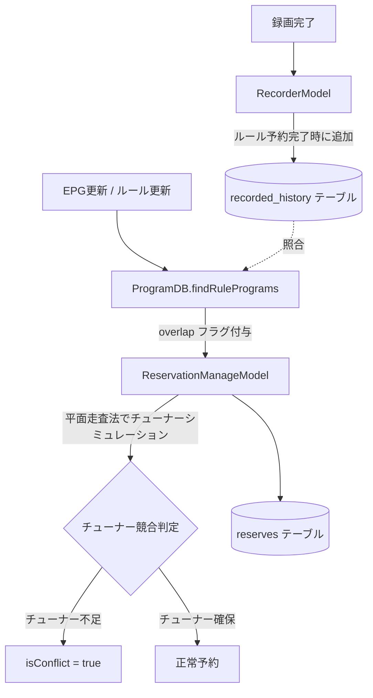

# 録画予約・重複排除・競合解決アルゴリズム仕様書

本ドキュメントでは、EPGDeck における録画予約の生成、過去録画との重複判定（二重録画防止 / `isOverlap`）、およびチューナー不足による時間重複判定（チューナー競合 / `isConflict`）の内部アルゴリズムと判定基準について技術的に解説します。

---

## 目次

1. [概要とモデル構成](#1-概要とモデル構成)
2. [二重録画防止（録画済み重複排除 / isOverlap）](#2-二重録画防止録画済み重複排除-isoverlap)
   - [判定のタイミングと全体フロー](#判定のタイミングと全体フロー)
   - [録画履歴（recorded_history）の保存条件](#録画履歴recorded_historyの保存条件)
   - [重複判定のキーと正規化ロジック（shortName）](#重複判定のキーと正規化ロジックshortname)
   - [重複期間（periodToAvoidDuplicate）のフィルタリング](#重複期間periodtoavoidduplicateのフィルタリング)
   - [重複判定後の動作と手動解除（isIgnoreOverlap）](#重複判定後の動作と手動解除isignoreoverlap)
3. [同一番組に対する重複予約の調停（Program ID 重複排除）](#3-同一番組に対する重複予約の調停program-id-重複排除)
4. [時間帯重複とチューナー競合解決（isConflict）](#4-時間帯重複とチューナー競合解決isconflict)
   - [平面走査法（Sweep-Line Algorithm）によるシミュレーション](#平面走査法sweep-line-algorithmによるシミュレーション)
   - [優先順位（ソートロジック）](#優先順位ソートロジック)
   - [重複スキップ・手動スキップとの相互作用](#重複スキップ手動スキップとの相互作用)
   - [末尾欠け許可（allowEndLack）による競合回避](#末尾欠け許可allowendlackによる競合回避)
5. [時刻指定予約（isTimeSpecification）による予約枠生成](#5-時刻指定予約istimespecificationによる予約枠生成)
   - [秒単位整数によるミリ秒精度計算](#秒単位整数によるミリ秒精度計算)
   - [日跨ぎ枠の算出ロジック](#日跨ぎ枠の算出ロジック)
   - [レガシー時単位ルールの後方互換対応](#レガシー時単位ルールの後方互換対応)
   - [録画完了時の EPG 番組名自動補完と予約名フォールバック](#録画完了時の-epg-番組名自動補完と予約名フォールバック)
6. [放送波（EIT）直接監視による録画中のリアルタイム番組追従・延長](#6-放送波eit直接監視による録画中のリアルタイム番組追従延長)
   - [判定フローと即時更新](#61-判定フローと即時更新)
   - [前番組延長（野球等）に伴う後続番組の開始繰り下げ（Delay）保護と待機制御](#62-前番組延長野球等に伴う後続番組の開始繰り下げdelay保護と待機制御)
   - [番組延長・繰り下げ時のチューナー競合（isConflict）即時再調停](#63-番組延長繰り下げ時のチューナー競合isconflict即時再調停)
7. [関連ソースコード一覧](#7-関連ソースコード一覧)

---

## 1. 概要とモデル構成

EPGDeck における予約管理は、主に以下のコンポーネントによって行われます。


```mermaid
flowchart TD
    EPG[EPG更新 / ルール更新] --> ProgramDB[ProgramDB.findRulePrograms]
    Recorded[録画完了] --> RecorderModel[RecorderModel]
    RecorderModel -->|ルール予約完了時に追加| RecHist[(recorded_history テーブル)]
    RecHist -.->|照合| ProgramDB
    ProgramDB -->|overlap フラグ付与| ResManager[ReservationManageModel]
    ResManager -->|平面走査法でチューナーシミュレーション| ConflictCheck{チューナー競合判定}
    ConflictCheck -->|チューナー不足| Conflict[isConflict = true]
    ConflictCheck -->|チューナー確保| Normal[正常予約]
    ResManager --> DB[(reserves テーブル)]
```

- **`ProgramDB`**: ルール条件（キーワード、局、ジャンル、時間帯等）に一致する番組を抽出する際、過去の録画履歴と照合して二重録画（`overlap`）を判定します。
- **`ReservationManageModel`**: 抽出された候補番組や手動予約を統合し、同一番組の予約衝突調停、および物理チューナー数に基づく時系列シミュレーション（競合判定）を実施して最終的な予約（`Reserve`）レコードを生成・差分更新します。
- **`RecorderModel`**: 予約時刻に従って録画を実行し、正常終了時に録画履歴（`recorded_history`）へ番組名と局を登録します。

---

## 2. 二重録画防止（録画済み重複排除 / isOverlap）

ルール作成時に **「重複録画を回避する（`avoidDuplicate: true`）」** が有効になっている場合、過去に録画した番組の再放送などを自動的にスキップします。

### 判定のタイミングと全体フロー

1. EPG データの定期更新時、またはルールの新規作成・編集時。
2. `ReservationManageModel` から `ProgramDB.findRulePrograms(ruleId, option)` が呼び出される。
3. ルール条件に合致する放映予定番組一覧（`rows`）を取得。
4. `avoidDuplicate === true` かつ該当番組が存在する場合、後述の条件で `recorded_history` テーブルを検索。
5. 過去に録画済みと判定された番組に `overlap = true` フラグを付与して返す。
6. `ReservationManageModel` はこれを受けて `reserve.isOverlap = true` として予約を登録する。

### 録画履歴（`recorded_history`）の保存条件

録画履歴は二重録画防止の要であり、不用意に短期自動削除せず、ユーザーの意図した無期限（`0`）または長期保持を優先します。
録画履歴は以下の条件をすべて満たして録画が完了したときのみ、`RecorderModel.ts` 内で `recorded_history` に INSERT されます。

```typescript
// src/model/operator/recording/RecorderModel.ts
if (
    this.reserve.isTimeSpecified === false && // 時刻指定予約ではない
    this.reserve.isEventRelay === false &&      // イベントリレー番組ではない
    this.isNeedDeleteReservation === true     // 正常に終了した
) {
    // 番組指定予約（ルール予約および手動個別予約）の場合に記録する
    const history = new RecordedHistory();
    history.name = StrUtil.deleteBrackets(recorded.halfWidthName);
    history.channelId = recorded.channelId;
    history.endAt = recorded.endAt;
    await this.recordedHistoryDB.insertOnce(history);
}
```

- **手動の個別番組指定予約の保存**:
  - EPGStation オリジナルでは「ルール予約のみ」が履歴に保存されていましたが、EPGDeck では**手動の個別番組指定予約であっても、ユーザーの「録画済み」の意図を尊重して履歴に保存**します（時刻指定予約およびイベントリレーのみ除外）。
- **録画失敗時のスキップ防止（再放送救済）**:
  - チューナー不足やドロップ障害等で録画が失敗した場合（`isNeedDeleteReservation === false` や異常終了時）は、再放送時に重複スキップされてしまうのを防ぐため、**履歴には保存しません**。
- **録画中の中断保存（`stop`）時の扱い**:
  - 録画中に手動で「中断して保存」した場合は、途中ファイルは保持・エンコードされますが、未完了扱いとして**録画履歴には残しません**（再放送時などに重複録画の判定対象・録画済み扱いにならないよう救済）。

### 予約重複調停（同一番組に対する複数ルール）の原則

同一番組（`programId`）に対して複数のルールが重複してマッチした場合の調停原則：
- 手動予約が最優先され、ルール予約同士は `ruleId` の昇順（先に登録されたルールが優先）で調停されます。
- 重複調停のインデックス化はステータス（スキップ / 通常予約）ごとに独立して管理され、あるルールでスキップ指定されていても、別ルールで優先される場合は救済録画が行われるよう設計されています。

### 重複判定のキーと正規化ロジック（`shortName`）

重複の判定は、以下の複合キーで行われます：

$$\text{判定キー} = (\text{正規化番組名 } shortName) \ \times \ (\text{放送局 } channelId)$$

#### 1. 放送局の一致（`channelId`）
- **同一の放送局（チャンネル）でのみ重複と判定されます。**
- 例えば、地デジ局で録画済みの番組と同一のアニメが BS 局や別系列局で放送される場合、`channelId` が異なるため重複とはみなされず録画されます。

#### 2. 番組名の正規化（`StrUtil.deleteBrackets`）
EPG の番組名は、再放送時や初回放送時に `[新]`, `[字]`, `[再]` などの各種記号が付与されるため、単純な文字列一致では重複を検知できません。そのため、以下の正規化を行って生成された `shortName` 同士を比較します。

1. **全角英数記号の半角化** (`halfWidthName`)。
2. **番組表の囲み文字記号の全除去**:
   - `[HV]`, `[P]`, `[SD]`, `[W]`, `[MV]`, `[手]`, `[字]`, `[双]`, `[デ]`, `[S]`, `[二]`, `[多]`, `[解]`, `[SS]`, `[B]`, `[N]`, `[天]`, `[交]`, `[映]`, `[無]`, `[料]`, `[鍵]`, `[前]`, `[後]`, `[再]`, `[新]`, `[初]`, `[終]`, `[生]`, `[販]`, `[声]`, `[吹]`, `[PPV]`, `[秘]`, `[ほか]` の Unicode 特殊文字（ARIB外字・囲み文字）をすべて削除。
3. **角括弧テキストの除去**:
   - 正規表現 `/\[.+?\]/g` により、角括弧 `[...]` で囲まれた任意の文字列を除去。
4. **前後の空白トリム** (`.trim()`)。

> [!NOTE]
> **サブタイトルや話数の扱い**:
> サブタイトルや話数が `[#01]` や `[第1話]` のように角括弧で囲まれている場合は削除されてシリーズ名のみで比較されます。一方、角括弧なしで `タイトル 第1話「サブタイトル」` のように番組名に含まれている場合は、その文字列全体が `shortName` となるため、同一話数の再放送のみが重複対象となります。

### 重複期間（`periodToAvoidDuplicate`）のフィルタリング

ルール設定で「重複を避ける期間（日数）」が指定されている場合、直近の録画のみを重複判定の対象とします。

- **`periodToAvoidDuplicate > 0` の場合**:
  - 対象範囲: `recorded_history.endAt >= (現在時刻 - 指定日数 * 24時間)` かつ `<= 現在時刻`
  - 例: 30日と設定した場合、過去30日以内に録画した同一番組のみスキップされ、1年後の再放送などは再度録画されます。
- **未設定または `0` の場合**:
  - 対象範囲: `<= 現在時刻`（過去の全録画履歴を無期限に照合）。

### 重複判定後の動作と手動解除（`isIgnoreOverlap`）

- 重複と判定された予約は `reserve.isOverlap = true` となります。
- `isOverlap === true` の予約は、レコーダーによって**録画タイマーの登録から除外**され、録画は行われません（UI上では「重複スキップ」として表示）。
- **重複手動解除**:
  - Web UI（予約詳細モーダル）から「重複手動解除」を実行すると、その予約に `isIgnoreOverlap = true` および `isOverlap = false` がセットされます。
  - 次回の定期ルール更新時も `oldReserve.isIgnoreOverlap === true` が引き継がれ、番組検索結果が重複であっても上書きされず、強制的に録画が実行されます。

### 録画詳細からの重複判定除外・手動削除（災害特番差し替え救済）

災害報道や臨時特番等で正規の放送枠が潰れてしまった場合、その録画番組が存在することで以降の振替放送や再放送が「重複（`isOverlap = true`）」と誤認されて録画スキップされてしまう問題があります。

EPGDeck では、録画詳細画面（`RecordedDetail`）から該当番組を**重複判定の履歴（`recorded_history`）から直接削除・除外**することができます。

- **重複判定から除外 (`DELETE /api/recorded/:recordedId/history`)**:
  - 対象番組の正規化タイトル（`shortName`）、`channelId`、`endAt` に一致するレコードを `recorded_history` から削除。
  - 削除後、バックエンドで直ちに `ReservationManageModel.updateAll()` が自動発火し、該当番組にマッチする未放映の予約枠の重複フラグ（`isOverlap = true`）が自動的に解除（正常予約へ復帰）されます。
- **重複判定への追加 (`POST /api/recorded/:recordedId/history`)**:
  - 誤って除外した場合に備え、録画詳細から再度 `recorded_history` に履歴を登録可能。
  - 直ちに予約が再評価され、二重録画防止が適用されます。
- **ステータス可視化**:
  - `RecordedItem` の `hasDuplicateHistory` プロパティにより、重複判定の対象となっている番組には録画詳細画面上で控えめな「重複判定対象」バッジが表示され、除外時は非表示になることで現在の判定状態を静かに把握可能です。

---

## 3. 同一番組に対する重複予約の調停（Program ID 重複排除）

1つの番組（同一の `programId`）に対して複数のルールがマッチした場合、またはユーザーの手動予約とルールの予約が被った場合、`ReservationManageModel.createReserves` にて調停が行われます。

1. **予約のソート調停（優先順位）**:
   - **手動予約（個別予約） vs ルール予約**: **手動予約が常に最優先**。
   - **放送開始済み予約の絶対保護**:
     すでに放送開始時刻を過ぎている番組枠（`startAt <= now`）において、すでに DB に存在する予約（`id` 採番済み）は、**後から評価された別ルールの新規予約による横取り・削除から最優先で保護**されます（優先度に関わらず既存の放映中予約を維持）。これにより、後続ルールの再評価による録画中断事故を根本遮断します。
   - **ルールの優先度（Priority: 1〜10）制御**:
     未開始番組はルールに設定された `priority`（デフォルト: 5、高い順）を最優先として調停します。
   - **既存予約の優先維持**:
     同一優先度の場合は、すでに DB に存在する予約（`id` 採番済み）を優先し、不必要な予約のすげ替え（`diff.delete` ➔ `diff.insert`）によるファイル分断を防止します。
   - **ルール ID 昇順**:
     新規予約同士の場合は `ruleId` の昇順（先に登録されたルールが優先）で安定調停します。
2. **キー生成と単一化**:
   - `getRuleProgramIdKey()` により番組識別キーを生成。
   - すでにリスト内に同一の識別キーが存在する場合、後続の予約はリストに追加されず除外されます。
   - これにより、同一番組が複数ルールから二重に予約登録されるのを完全に防ぎます。
3. **EPG更新時の番組ID変更耐性（スロット枠引き継ぎ）**:
   - 放送局側の情報更新等により同一スロット（同一ルール・同一チャンネル・同時間帯）の `programId` が変化した場合、`diff.delete` と `diff.insert` に分裂させず、`diff.insert` から該当予約を安全に抽出して `diff.update` に変換し、予約 ID を維持します。
4. **録画実行エンジンの多層フェイルセーフ (`RecordingManageModel`)**:
   - 万が一上流の差分生成で `diff.delete` に録画中の予約が含まれても、`recorder.isRecording === true` のレコーダーに対する強制キャンセルを確実にスキップし、録画ストリームの継続を保証します。
   - すでに同一チャンネル・同時間帯で録画中のレコーダーが存在する場合、新規タイマーセット（`diff.insert`）を抑止して二重録画を防止します。

---

## 4. 時間帯重複とチューナー競合解決（isConflict）

番組の放送時間帯が重複し、サーバーに接続された物理チューナー（Mirakurun / mirakc 経由のチューナー数）を超過した場合の競合解決アルゴリズムです。

### 平面走査法（Sweep-Line Algorithm）によるシミュレーション

`ReservationManageModel.ts` では、幾何学アルゴリズムである **平面走査法** を用いてチューナーの空き状況を時系列でシミュレーションしています。

1. **イベントリストの生成**:
   - すべての予約の「開始時刻（`startAt`）」と「終了時刻（`endAt`）」を個別のイベントとしてリスト化。
2. **時系列ソート**:
   - 時刻順にイベントをソート。同時刻の場合は「終了イベント」を「開始イベント」より優先して処理（チューナーの即時解放を考慮）。
3. **時間軸の走査とチューナー割り当て**:
   - タイムラインを走査しながら、現在進行中の予約リスト（`reserves`）を管理。
   - 開始イベントが来たら `reserves` に追加し、終了イベントが来たら `reserves` から削除。
   - 各時刻において、利用可能な物理チューナー群（`tuners`）を初期化し、`reserves` 内の予約を優先度の高い順からチューナーに割り当て（`tuner.add(reserve)`）。
   - 空きチューナーがなく割り当てに失敗した予約に対し、`isConflict = true`（競合フラグ）を設定。

### 優先順位（ソートロジック）

同一時間帯にチューナーを取り合う場合の優先順位（`sortReserve`）は以下の通りです：

| 優先度 | 予約タイプ | 条件 / ソート順 |
|---|---|---|
| **1位（最高）** | **手動予約（時刻指定予約）** | ユーザーが番組表に依存せずピンポイントに指定した強い録画枠として最優先（同種別内は予約更新日時が古いものが優先） |
| **2位** | **手動予約（個別番組予約）** | 時刻指定手動予約より後ろ、ルール予約より前（同種別内は予約更新日時が古いものが優先） |
| **3位** | **ルール予約** | **ルール優先度（`priority`: 1〜10、高い順）** → 同優先度時は **`ruleId` の昇順**（ID番号が若い＝先に作成されたルールが優先） |

> [!NOTE]
> **ルール優先度（`priority`）制御**:
> EPGDeck では、各ルールに `priority`（1〜10、デフォルト: 5）を設定可能です。
> - **標準（5）**: 新規作成時の初期値。
> - **低優先度（1〜4）**: 深夜アニメや再放送、予備枠など、あえて優先度を低くして他番組との競合時に自発的に譲る運用が可能。
> - **高優先度（6〜10）**: 確実に録画したい特番や本命番組向け。
> チューナー数を超える番組が同時間帯に集中した場合、優先度の高いルールの予約が優先的にチューナーを確保し、優先度の低いルールの予約が競合（`isConflict: true`）として調停されます。
> 同一優先度のルール予約同士は、従来の `ruleId` 昇順（先に作成されたルール優先）で決定論的・安定して調停されます。

### 重複スキップ・手動スキップとの相互作用

チューナー割り当てループにおいて、以下の条件の予約は評価対象からスキップされます：

```typescript
// src/model/operator/reservation/ReservationManageModel.ts
for (const reserve of reserves) {
    if (matches[reserve.idx].isSkip || matches[reserve.idx].isOverlap) {
        continue; // スキップまたは重複の番組はチューナーを消費しない
    }
    ...
}
```

> [!TIP]
> **重要な相互作用**:
> 前述の「重複排除（`isOverlap`）」で重複スキップされた番組は、**チューナーを一切消費しません**。
> そのため、同時間帯に別の重要な番組があってもチューナー競合を起こさず、無駄な競合エラーを回避する仕組みになっています。

### 末尾欠け許可（`allowEndLack`）による競合回避

チューナー割り当て時、番組の録画時間が数分重複している場合（例: 前の番組の終了と次の番組の開始が1分被っている等）:
- 前の番組が `allowEndLack === true`（末尾欠け許可）であれば、前の番組の末尾を切り上げてチューナーを解放し、次の番組の録画を開始します。
- `allowEndLack === false` の場合は末尾を切り上げないため、チューナーが足りなければ次の番組が競合（`isConflict = true`）となります。

---

## 5. 時刻指定予約（isTimeSpecification）による予約枠生成

EPG の番組表データ（番組情報）に依存せず、特定の放送局・曜日・時間帯を定期的に録画する「時間指定予約ルール（`isTimeSpecification: true`）」では、`ReservationManageModel.updateRule` が向こう 8 日間のダミー予約（`reserves` レコード）を直接計算・生成します。

### 秒単位整数によるミリ秒精度計算

浮動小数点数（小数時間）による丸め誤差や表示のズレ（例: 2分予約が1分と表示される等）を完全に防止するため、時間指定予約における時刻データは **00:00:00 からの経過秒数（整数）** で管理されます。

- `start`: 00:00:00 からの開始秒数（`0 <= start < 86400`、例: 19:30:00 は `19 * 3600 + 30 * 60 = 70200`）
- `range`: 録画の長さ（秒数）（`0 < range <= 86400`、例: 2分間は `120`、1時間15分は `4500`）

予約レコード生成時のミリ秒換算式:
```typescript
// 当日 00:00:00 の起点時刻 baseTime（ミリ秒）に対し、秒単位で加算
const startAt = baseTime + 1000 * 60 * 60 * 24 * i + startSec * 1000;
const endAt = baseTime + 1000 * 60 * 60 * 24 * i + (startSec + rangeSec) * 1000;
```

これによって小数の丸め誤差が完全に排除され、短時間の番組枠（2分、3分など）であっても 1 ミリ秒の狂いもなく正確に予約・録画が実行されます。

### 日跨ぎ枠の算出ロジック

夜から翌日早朝にかけて（例: 23:00 〜 01:00）録画を行う日跨ぎ枠の場合、フロントエンド（`RuleEdit.svelte`）で以下のように 24 時間（86,400秒）を折り返して `rangeSec` を算出します:

```typescript
const rangeSec = startSec <= endSec 
    ? endSec - startSec 
    : 24 * 3600 - (startSec - endSec);
```

生成された予約は翌日に跨がる終了時刻（`endAt`）を持ち、後続のチューナー競合判定（平面走査法）にもそのまま正しく適用されます。

### レガシー時単位ルールの後方互換対応

過去に作成された時単位のデータ（`start < 24 && range <= 24` かつ整数）が DB 内に残っている場合、`ReservationManageModel` は自動的にこれを検出し、`start * 3600` / `range * 3600` で秒単位にフォールバック変換して処理します。既存のデータベースへのマイグレーション（ALTER TABLE）を行うことなく、非破壊で完全な互換性を維持しています。

### 録画完了時の EPG 番組名自動補完と予約名フォールバック

時間指定予約は時間枠のみを先行して予約するため、録画実行・完了時（`RecorderModel.createRecorded`）に以下の仕様で番組情報が確定されます：

1. **EPG 番組表の自動補完（最長占有番組の採用）**: 録画期間（`startAt 〜 endAt`）に該当する番組表データが存在する場合、その録画時間内で **最も重複時間が長い番組（最長占有番組）** を特定し、その番組名・あらすじ・詳細・ジャンル等のメタ情報を自動補完して `recorded` レコードに保存します（`ProgramDB.findChannelIdAndTime`）。これにより、2分間などの番組途中録画であっても放送中番組が確実に特定され、ミニ番組と本編を跨ぐ予約であってもメイン本編のタイトルが綺麗に残ります。
2. **予約名フォールバック（不具合解消）**: 深夜休止枠や EPG 未受信などで番組データが取得できない場合（`program === null`）でも、空文字（`""`）で上書きせず、ユーザーが予約時に設定したタイトル（`reserve.name`、例: 「aaa」）を確実に保持します。またファイル名生成（`RecordingUtilModel`）においても同様に予約名を採用し、「番組名なし」や空文字になる現象を完全に防止します。
3. **手動時刻指定予約のフラグ整合性**: 手動で時刻指定予約を作成する場合（`createManualReserveWithSpecifiedTime`）、`isTimeSpecified = true` が付与され、イベントリレー用フラグ（`isEventRelay`）は確実に `false` として保持されます（上流からの混入設定を是正）。

---

## 6. 放送波（EIT）直接監視による録画中のリアルタイム番組追従・延長

録画実行中（`RecorderModel`）における番組延長やイベントリレー（マルチ編成移行等）への対応は、従来の HTTP ポーリングに加えて、受信ストリーム自体から直接パースする **EIT (present/following, PID 0x0012) 直接監視** によってミリ秒単位でリアルタイム制御されます。

### 6.1. 判定フローと即時更新
1. **ストリーム直接購読**: `RecorderModel` は録画開始時に `DropCheckerModel`（`TsProbe`）の `on('eit')` を購読します。
2. **対象イベント照合**: EIT 内の `serviceId` および `eventId`（`programId % 100000`）を予約中の対象番組と照合します。
3. **番組延長（Extension）の検知**:
   - `streamEndAt = startTime + duration` が現在の `reserve.endAt` を超えている場合、即座に番組延長と判定します。
   - `reserve.endAt` を更新し、`reserveDB.updateOnce` および `recordedDB.updateProgramInfo` を実行して DB の `endAt` と `duration` を即時延伸します。
   - チューナー共有判定（`RecordingStreamCreator`）の予約終了時刻も延伸されるため、後続番組によるチューナーの早期強制奪取を防止します。
   - イベントリレー確認タイマー（`eventRelayTimer`）を新たな終了時刻に合わせて再スケジュールします。
4. **番組タイトル・メタ情報のリアルタイム追従**:
   - 放送局側でタイトルに「[延]」「試合終了まで中継」等の付記が行われた場合、`reserve.name` および `recordedDB` のタイトル情報を自動同期します。
5. **イベントリレー（event_group_descriptor Tag 0xD6）の早期検知とTS直結連携**:
   - ARIB STD-B10 `event_group_descriptor`（group_type = 2: relay）が EIT に記載された場合、終了直前タイマーを待たずに即時 `checkEventRelay()` をトリガーします。
   - 移行先チャンネルの `networkId`、`serviceId`、`eventId` を放送波の記述子から直接引き渡すため、Mirakurun 側の REST API（`/api/programs/{id}`）の EPG 更新遅延に一切影響されず、即座に移行先番組の予約・録画準備が発行されます。

### 6.2. 前番組延長（野球等）に伴う後続番組の開始繰り下げ（Delay）保護と待機制御
プロ野球中継や報道特番の延長時、後続の目的番組（アニメ・ドラマ等）が繰り下げ（遅延）になった場合の録画欠損・自爆死を防ぐ多重防護機構：

1. **録画準備時（`prepRecord`）の繰り下げ早期検知とタイマーリスケジュール**:
   - 録画準備時、Mirakurun から最新の番組情報（`getProgram`）を問い合わせます。
   - 前番組延長により開始時刻が未来へ繰り下げられ、準備時間（15秒）以上先である場合、`reserve.startAt` および `reserve.endAt` を DB に即時更新した上でタイマーを再設定（`setTimer`）して待機し直します。これにより、無駄なチューナーの事前占有を防止します。
2. **録画ストリーム開始時（`doRecord`）の放送波・EIT待機制御**:
   - Mirakurun の `getProgramStream` は内部で EIT present（放送波 Section 0）の `eventId` を監視しており、前番組放送中は目的番組の TS パケットを流さず待機する設計となっています。
   - レガシー EPGStation では固定 5 秒でタイムアウトして予約自体を削除していましたが、EPGDeck では番組指定予約において Mirakurun との接続が維持されている間、定期的に番組情報を確認しながら番組の放送開始（Mirakurun ready）を待機します。
   - 待機中に Mirakurun で繰り下げ確定を検知した場合は、ストリームと一時ファイルを速やかに解放し、新開始時刻にタイマーを再設定します。
   - 前番組が終了して目的番組の TS パケットが到着した瞬間に、待機タイマーを即座に解除してクリーンに録画を開始します（Mirakurun が前番組パケットを破棄しているため、冒頭の混入もありません）。

### 6.3. 番組延長・繰り下げ時のチューナー競合（isConflict）即時再調停
番組の延長や繰り下げが発生すると、録画枠の時間帯が変動するため、同一時間帯や後続の他局・他番組との間でチューナー競合状態（物理チューナー数の上限超過）がリアルタイムに変化します。

- **従来の課題**:
  - レガシー EPGStation では、定期的な EPG 更新ジョブ（10分〜数十分に1回）が走るまでチューナー競合状態が再計算されませんでした。そのため、前番組延長でチューナーが逼迫しても後続の優先度の低い番組が `isConflict` にならずチューナー奪い合いを起こしたり、逆に番組枠が後ろにずれて空いた時間帯の番組が `isConflict` のまま録画されないといった不整合が生じていました。
- **EPGDeck の即時再調停機構**:
  - `RecorderModel` は以下のタイミングで `RecordingEvent.emitRecheckConflicts(timeRanges)` を即座に発火します：
    1. **放送波 EIT 監視による番組延長検知時**: 延伸された区間 `[oldEndAt, streamEndAt]`
    2. **録画準備中（`prepRecord`）の繰り下げ検知時**: 旧時間枠 `[oldStartAt, oldEndAt]` および 新時間枠 `[latestStartAt, latestEndAt]`
    3. **ストリーム待機中（`checkStreamTimeout`）の繰り下げ検知時**: 旧時間枠 `[oldStartAt, oldEndAt]` および 新時間枠 `[latestStartAt, latestEndAt]`
  - `EventSetter` を経由して `ReservationManageModel.recheckConflicts(timeRanges)` が呼び出されます。
  - 平面走査法（`createDiff`）を該当時間枠のみにスコープを絞って実行し、優先度（`priority` / `ruleId` / 手動予約）に基づくチューナー割り当てを再評価します。
  - `isConflict` フラグに変化があった予約レコードのみを DB へ即座に反映し、`reserveEvent.emitUpdated(diff)` を送出します。
  - これにより、WebSocket 経由でフロントエンド UI（番組表・予約一覧）に即座に競合アイコンが反映されるとともに、`RecordingManageModel` 側でも最新のチューナー競合状態に基づいた録画開始制御が行われます。

---

## 7. 関連ソースコード一覧

| ファイルパス | 対象シンボル | 役割・該当処理 |
|---|---|---|
| [`src/model/db/ProgramDB.ts`](../../src/model/db/ProgramDB.ts) | `ProgramDB.findRulePrograms` | `recorded_history` との照合による `overlap` 判定処理 |
| [`src/util/StrUtil.ts`](../../src/util/StrUtil.ts) | `StrUtil.deleteBrackets` | 囲み文字・角括弧の除去による `shortName` 生成 |
| [`src/model/operator/recording/RecorderModel.ts`](../../src/model/operator/recording/RecorderModel.ts) | `RecorderModel.onEit` | 放送波 EIT からの番組延長・タイトル・リレーのリアルタイム追従 |
| [`src/model/operator/recording/RecorderModel.ts`](../../src/model/operator/recording/RecorderModel.ts) | `RecorderModel.recEnd` | 録画完了時の `recorded_history` へのレコード記録 |
| [`src/model/operator/recording/DropCheckerModel.ts`](../../src/model/operator/recording/DropCheckerModel.ts) | `DropCheckerModel.on('eit')` | `TsProbe` からの EIT present/following イベントの中継 |
| [`packages/arib-probe/src/section/eit.ts`](../../packages/arib-probe/src/section/eit.ts) | `decodeEitSection` | EIT present/following および event_group_descriptor (0xD6) のデコード |
| [`src/model/operator/reservation/ReservationManageModel.ts`](../../src/model/operator/reservation/ReservationManageModel.ts) | `ReservationManageModel.createReserves` | 平面走査法によるチューナー競合判定（`isConflict`） |
| [`src/model/operator/reservation/ReservationManageModel.ts`](../../src/model/operator/reservation/ReservationManageModel.ts) | `ReservationManageModel.recheckConflicts` | 延長・繰り下げ時の時間枠に対する平面走査法を用いた即時競合再調停 |
| [`src/model/operator/reservation/ReservationManageModel.ts`](../../src/model/operator/reservation/ReservationManageModel.ts) | `ReservationManageModel.sortReserve` | 手動予約・優先度（Priority）・ルールIDに基づく優先度ソート |
| [`src/model/operator/reservation/ReservationManageModel.ts`](../../src/model/operator/reservation/ReservationManageModel.ts) | `ReservationManageModel.updateRule` | 重複フラグの引き継ぎおよび `isIgnoreOverlap`（手動解除）の維持 |
| [`src/model/event/RecordingEvent.ts`](../../src/model/event/RecordingEvent.ts) | `RecordingEvent.emitRecheckConflicts` | 録画実行モデルから予約管理モデルへの競合再チェック通知イベント |

