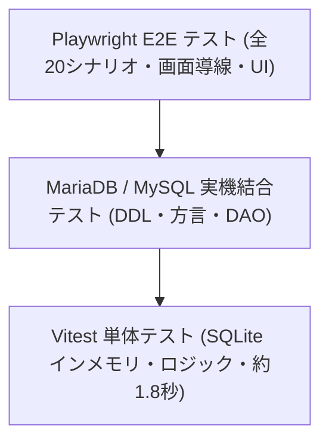

# テスト & CI/CD アーキテクチャ仕様書

本ドキュメントでは、EPGDeck における品質保証戦略、テスト設計パターン（単体テスト、DB実機結合テスト、E2Eテスト）、および GitHub Actions CI/CD パイプラインの最適化アーキテクチャについて解説します。

---

## 1. テスト戦略の全体像

EPGDeck では、実行速度と検証精度のバランスを取るため、3層のテストピラミッドを採用しています。



| テスト層 | 対象範囲 | 実行環境 | 実行時間 | 実行コマンド |
| :--- | :--- | :--- | :--- | :--- |
| **単体テスト** | ビジネスロジック、Hono ルート、Drizzle Helper、設定パース、Client HTTP | Node.js + Vitest (SQLite インメモリ `:memory:`) | 約 1.8 秒 | `npm test` |
| **実機結合テスト** | MySQL / MariaDB 固有の方言、インデックス作成、Auto-Increment ID、主要 DAO CRUD | Node.js + Vitest (Docker コンテナ: ポート 13306) | 約 3 秒 | `npm run test:mysql` |
| **E2E テスト** | 全画面（12画面）、ユーザー導線、フォーム入力、モーダル、リアルタイム更新 | Playwright + Chromium (スタンドアロン E2E サーバー) | 約 8 秒 | `npm run test:e2e` |

---

## 2. Vitest 単体テスト基盤

### 2.1 設計原則
- **超高速性の維持**:
  全単体テスト（190+ テストケース）を 2〜3 秒未満で実行完了することを目標としています。テストを高速に保つことで、開発者がコード保存時やコミット前に躊躇なく実行できる環境（`npm run test:watch`）を実現しています。
- **インメモリ SQLite の活用**:
  データベースアクセスを伴うテストでは、ディスク I/O を発生させない `:memory:` 接続（またはテスト専用の一時 DB）を使用し、テスト間で状態が汚染されない完全独立環境を担保しています。
- **本番・開発環境の完全不可侵（DB 分離原則）**:
  テスト実行時、本番およびローカル開発用 DB（`data/database.db`）や設定ファイル（`config/config.yml`）には**絶対にアクセス・変更を行いません**。
- **Web 標準 API の網羅的検証**:
  `httpClient`（ブラウザ標準 `fetch` ラッパー）、`StrUtil.urlJoin`、`node:util.parseArgs`、組み込み `structuredClone` 等、Node.js / Web 標準 API へ移行した各モジュールの堅牢性を保証するテストを永続配備しています。

### 2.2 クライアント純粋ロジック単体テスト (`test/client/`)
UI コンポーネントに結合させるとテストが重厚化・不安定化しやすい複雑な計算・判定ロジックは、`client/src/lib/utils/` に純粋関数として集約し、Vitest で直接・網羅的に境界値テストを実施します。

- **番組表ロジック (`test/client/guide.test.ts`)**:
  - 朝 4:00 起点の日付境界、深夜帯（0:00〜3:59）の基準日判定（`getBaseDate`）
  - 局名ヘッダー（48px）オフセットを加味した現在時刻線の座標計算
  - スクロール位置計算、タイムライン表示範囲（Unixtime）判定
- **フォーマット処理 (`test/client/format.test.ts`)**:
  - 日時フォーマット、時間差分表記、ファイルサイズ単位変換（MB/GB/TB）
- **HTTP / API クライアント (`test/client/http_client.test.ts`)**:
  - 認証トークン自動付与、クエリパラメータ構築、リードオンリーエラー時の例外ハンドリング

---

## 3. MariaDB / MySQL 実機結合テスト基盤

### 3.1 導入の背景と課題
EPGDeck は SQLite と MySQL / MariaDB のマルチデータベースに対応しています。しかし、SQL 方言（方言別の UPSERT 構文、インデックス生成構文、Auto-Increment の挙動など）の差異は、モックや SQLite 単体テストでは検知できません。

### 3.2 アーキテクチャ
- **非侵入型オプトイン実行**:
  通常の `npm test` では MySQL 結合テストはスキップされ、SQLite による超高速単体テストのみが走ります。`TEST_MYSQL=true` 環境変数が付与された場合のみ実機コンテナへ接続して検証します。
- **ホスト衝突回避ポート (`13306`)**:
  ローカル検証用 `docker-compose.db.yml` では、ホスト標準の MySQL ポート（`3306`）との競合を避けるため、テスト専用ポート `13306` にバインドしています。
- **検証項目**:
  - DDL および `CREATE INDEX IF NOT EXISTS`（MySQL 8.0+ / MariaDB 10.11+）の安全な自動生成
  - `DrizzleHelper` による方言別バルク UPSERT（`ON DUPLICATE KEY UPDATE`）
  - 各種 DAO（ChannelDB, ProgramDB, RecordedDB 等）の CRUD 操作

---

## 4. Playwright E2E テスト基盤

### 4.1 スタンドアロン E2E サーバーアーキテクチャ (`test/e2e/e2e_server.ts`)
CI ランナーや開発環境において、**Mirakurun やチューナーデバイスが存在しない環境でも自律して 100% 稼働する完全隔離 E2E 環境** を構築しています。

- **モックリバインドによる密閉化**:
  InversifyJS DI コンテナを活用し、`IIPCClient` を `MockIPCClient` に、`IMirakurunClientModel` を `MockMirakurunClientModel` に差し替えて起動します。これにより外部サービスへの依存を完全排除しています。
- **完全隔離テストデータベース (`data/test_e2e.db`)**:
  本番用 DB（`data/database.db`）や本番設定ファイル（`config/config.yml`）には一切触れず、テスト専用の SQLite DB および専用ポート（`18889`）で動作します。

### 4.2 ライフサイクルと先行シード方式（レースコンディションの根絶）
Playwright の公式仕様では、**`globalSetup` よりも先に `webServer`（サーバープロセス）が起動** します。
この仕様によるファイルディスクリプタ競合（サーバー起動後に裏で DB ファイルが unlink され、空の DB を参照し続ける問題）を根本防止するため、以下の**先行シードパイプライン（パターン A）** を採用しています：

```typescript
// playwright.config.ts
webServer: {
    command: 'npx tsx test/e2e/seed.ts && npx tsx test/e2e/e2e_server.ts',
    url: process.env.PLAYWRIGHT_BASE_URL || 'http://localhost:18889',
    reuseExistingServer: !process.env.CI,
    timeout: 60000,
}
```

1. **`test/e2e/seed.ts` の先行実行**:
   - 古いテスト DB（`test_e2e.db*`）のクリーンアップ
   - クライアントバンドル（`client/dist`）の存在確認（未ビルド時は自動で `npm --prefix client run build` を実行）
   - 初期シードデータ（NHK総合1、NHK BS 等のチャンネル定義）の投入
   - `client.rawClient.close()` による WAL のフラッシュおよびファイルロック解放
2. **`test/e2e/e2e_server.ts` の起動**:
   - サーバーが立ち上がった瞬間に、すでにシード済みの DB ファイルを正常にオープンし、即座にリクエスト受領可能（Ready）となる。

### 4.3 E2E テストのロケータ設計原則
- **アクセシビリティ要素の優先**:
  `getByRole`、`getByLabel`、`getByPlaceholder` を優先的に使用します。
- **Tailwind クラス依存の排除**:
  CSS クラス（`class="..."`）による取得は、リファクタリングやスタイル調整で極めて壊れやすいため禁止しています。
- **非同期ロード待機**:
  ボタンクリック前に、対象データ（例: `NHK総合1`）が UI 上にレンダリングされていることを `toBeVisible()` で明示的に待機し、ネットワーク揺らぎによるテスト失敗を防止しています。

---

## 5. GitHub Actions CI/CD パイプライン

### 5.1 設計思想: コスト効率と 1 ジョブ統合
クラウド CI（GitHub Actions）の課金体系（分単位切り上げ）および仮想マシン（VM）の起動オーバーヘッド（約20〜30秒）を最小化するため、**「1つの高性能ジョブに全検証を集約する統合パイプライン」** を構築しています。

```
GitHub Actions Runner (ubuntu-latest)
  ├── サービスコンテナ起動 (MariaDB 10.11 :3306 & MySQL 8.0 :3307)
  ├── 依存関係キャッシュ復元
  ├── Lint & フォーマット検証 (Server & Client)
  ├── 型チェック & Svelte コンパイル
  ├── クライアント本番ビルド
  ├── 単体テスト (SQLite)
  ├── DB 実機結合テスト (MariaDB & MySQL)
  ├── Playwright ブラウザキャッシュ復元
  └── Playwright E2E テスト (Chromium / 20シナリオ)
  ───────────────────────────────────────────────────
  ★ 所要時間: 約 2分15秒 〜 2分30秒 でオールパス
```

### 5.2 主な最適化テクニック
1. **サービスコンテナの並行起動**:
   MariaDB 10.11（ポート 3306）および MySQL 8.0（ポート 3307）をジョブ初期化時に並行起動し、ヘルスチェック完了後にテストを実行。
2. **Playwright ブラウザキャッシュ (`actions/cache@v6`)**:
   `~/.cache/ms-playwright` をコミットハッシュベースでキャッシュし、毎回のブラウザダウンロード時間（約30秒）を完全に排除。
3. **無駄な CI の自動スキップ**:
   - `paths-ignore`: ドキュメント（`docs/**`, `*.md`）変更時は CI を起動せず無料枠を温存。
   - `concurrency`: 同一ブランチへの連続プッシュ時、古い進行中ジョブを自動キャンセル。

---

## 6. 静的解析 & 型検査アーキテクチャ (Static Analysis & Type Integrity)

実行時エラー（特に非同期処理の握りつぶしや unhandledRejection）を未然に防ぎ、長期的な保守性を維持するため、以下の静的解析・型検査基盤を配備しています。

### 6.1 Floating Promise（`await` 漏れ）の完全防止
- **`@typescript-eslint/no-floating-promises: error`**:
  `Promise` を返す関数呼び出しにおいて、`await`、`.catch()`、または `void` 演算子による明示的な無視のいずれも行われていないコード（Floating Promise）を ESLint で厳格にエラーとして検出します。
- **方針**:
  - 順序制御や結果待ちが必要な処理: `await` を付与
  - バックグラウンド実行（Fire-and-forget）で例外ログが必要な処理: `.catch(err => { log.error(err); })` を付与
  - 意図的な非同期起動（キュー投入など、例外が内部で捕捉済みの処理）: `void` を明示

### 6.2 テストコードを含めた網羅的型検査 (`tsconfig.test.json`)
- 通常の `tsconfig.json` は本番ビルド（`dist/` への出力）用として `src/` のみを対象としていますが、テストコード（`test/`）の型整合性を担保するため、`noEmit: true` の `tsconfig.test.json` を配備しています。
- これにより、本番成果物にテストファイルを含めることなく、ESLint（Type-aware rules）および `npm run typecheck`（`tsc -p tsconfig.test.json`）でテストコードやモック実装の型エラーを 100% 検知します。

### 6.3 フロントエンド・バックエンド統一フォーマット
- **Prettier 3 + `prettier-plugin-svelte`**:
  サーバー（TypeScript / JSON / YAML）およびクライアント（Svelte 5 / Tailwind CSS / TypeScript）のフォーマットを統一。
- **CI / Git Hooks 連動**:
  CI パイプライン（`npm run check`）および `lint-staged` によるコミット前フックでフォーマット崩れを自動抑止します。
