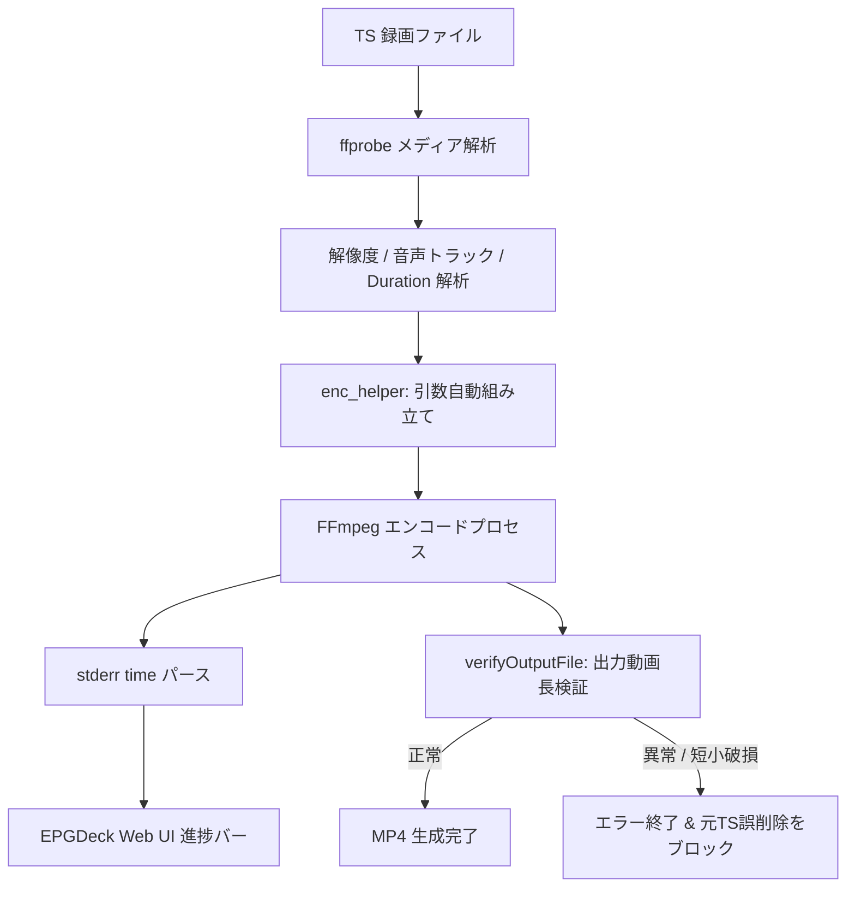

# EPGDeck エンコードシステム仕様書 & 設定マニュアル

EPGDeck のエンコード機能は、録画完了後の TS ファイルを MP4 等に自動変換し、Web UI やモバイル端末から快適に視聴できるようにするためのシステムです。

---

## 1. アーキテクチャと特徴

従来のエンコードスクリプトをモダンに刷新し、共通処理を `config/enc_helper.js` に集約しています。



### 主な特徴・改善点
1. **地デジ 1440×1080 の柔軟な制御 (`fix1440to1920`)**:
   - デフォルト（`false`）では、1440×1080 のまま `-aspect 16:9` メタデータをつけて出力し、**ファイルサイズを約 15〜25% 節約**。
   - `fix1440to1920: true` を指定するか、VAAPI ハードウェアエンコード時は自動で **1920×1080（1:1 正方形ピクセル）** に拡大補正し、あらゆる再生環境での 4:3 潰れを完全に防止します。
2. **多重音声・二重音声の柔軟なハンドリング**:
   - ニュース等の二重音声（デュアルモノ）を、**2トラック（Main / Sub）に分離** または **主音声のみ抽出** を選択可能。
   - スポーツ中継等のマルチ音声ストリームに対し、全トラック保持（`all`）または第1トラックのみ（`first`）を選択可能。主音声と副音声で個別のビットレート指定も可能。
3. **ドロップ破損・短小 MP4 の安全ブロック機能 (`verifyDuration`)**:
   - 出力された MP4 の動画長を `ffprobe` で自動検証。入力 TS に比べて極端に短い動画（ドロップ等による破損ファイル）を検知した場合、エラー終了させて **元 TS ファイルの誤削除を確実にブロック** します。
4. **Web UI 進捗バーとのリアルタイム連動**:
   - エンコード中の進捗率（0%〜100%）を自動計算し、Web UI の録画・エンコード一覧画面に進捗バーをリアルタイム表示します。
5. **FastStart 最適化**:
   - `-movflags faststart` により MP4 のメタデータ（moov atom）を先頭に配置し、ダウンロード完了を待たずに即座にシーク・ストリーミング再生が可能です。

---

## 2. 設定オプションリファレンス (`enc_helper.js`)

各設定ファイル（`config/enc.js` やプリセット）で `runEncode(options)` に渡せるパラメータ一覧です：

| オプション名 | 型 / 選択肢 | デフォルト値 | 説明 |
| :--- | :--- | :--- | :--- |
| **`codec`** | `string` | `'libx264'` | 映像コーデック (`libx264`, `libx265`, `h264_vaapi`, `h264_qsv`, `h264_nvenc` 等) |
| **`preset`** | `string` | `'medium'` | エンコード速度プリセット (`veryfast`, `fast`, `medium`, `p4` 等) |
| **`crf`** | `number \| null` | `23` | 画質係数 (CPU / NVENC / QSV)。ビットレート指定時は `null` |
| **`videoBitrate`** | `string \| null` | `null` | 映像ビットレート（例: `'4500k'`, `'2500k'`） |
| **`scale`** | `string \| null` | `null` | 解像度プリセット (`'1080p'`, `'720p'`, `'540p'`, `'480p'`, `'native'`, `'W:H'`) |
| **`maxHeight`** | `number \| null` | `1080` | 最大縦解像度 (`1080`, `720`, `null` で元解像度維持) |
| **`fix1440to1920`** | `boolean` | `false` (VAAPIは自動で `true`) | 地デジ 1440x1080 を 1920x1080 に拡大補正するかどうか |
| **`dualMono`** | `'split' \| 'main' \| 'sub'` | `'split'` | **二重音声の扱い**: <br>・`'split'`: 主音声・副音声を2トラックに分離<br>・`'main'`: 主音声のみ抽出<br>・`'sub'`: 副音声のみ抽出 |
| **`audioStreamMode`**| `'first' \| 'all'` | `'first'` | **複数音声ストリーム**: 第1トラックのみ (`first`) または全トラック保持 (`all`) |
| **`mainAudioBitrate`** | `string` | `1080p: '192k', 720p: '128k'` | 主音声（第1トラック）のビットレート (`-b:a:0`) |
| **`secondaryAudioBitrate`** | `string` | `'128k'` | 副音声（第2トラック以降）のビットレート (`-b:a:1...`) |
| **`subtitle`** | `boolean` | `false` | **字幕ストリームの扱い**: <br>・`false`: 字幕を除外 (`-sn`)<br>・`true`: MP4 字幕 (`mov_text`) として保持 |
| **`deinterlace`** | `boolean` | `true` | インターレース解除 (`yadif` または `deinterlace_vaapi`) |
| **`verifyDuration`** | `boolean` | `true` | 出力動画長の検証（ドロップ短小ファイルの安全ブロック） |
| **`minDurationRatio`**| `number` | `0.8` (80%) | 許容する最小時間比率（これを下回るとエラー終了し元 TS を保護） |
| **`faststart`** | `boolean` | `true` | Web 最適化 (`-movflags faststart`) |
| **`vaapiDevice`** | `string` | `'/dev/dri/renderD128'` | VAAPI 使用時の GPU デバイスパス |
| **`customArgs`** | `string[]` | `[]` | 任意の追加 FFmpeg 引数 |
| **`modifyArgs`** | `(args: string[]) => string[]` | `null` | 最終的な FFmpeg 引数配列を書き換えるコールバック関数 |

---

## 3. プリセットテンプレート一覧

`config/` ディレクトリ内に用途別のテンプレートが用意されています。

### ① `enc.js` / `enc.js.template`（標準 CPU H.264）
```javascript
const { runEncode } = require('./enc_helper');

runEncode({
    codec: 'libx264',
    preset: 'medium',
    crf: 23,
    maxHeight: 1080,
    dualMono: 'split',
    subtitle: false,
});
```

### ② `enc_1080p.js.template`（高品質 1080p）
```javascript
const { runEncode } = require('./enc_helper');

runEncode({
    codec: 'libx264',
    preset: 'medium',
    crf: 21,
    maxHeight: 1080,
    dualMono: 'split',
    subtitle: false,
});
```

### ③ `enc_720p.js.template`（軽量 720p / 主音声のみ）
```javascript
const { runEncode } = require('./enc_helper');

runEncode({
    codec: 'libx264',
    preset: 'fast',
    crf: 23,
    maxHeight: 720,
    dualMono: 'main', // 主音声のみ抽出
    subtitle: false,
});
```

### ④ `enc_vaapi.js.template`（Linux VAAPI ハードウェア）
```javascript
const { runEncode } = require('./enc_helper');

runEncode({
    codec: 'h264_vaapi',
    vaapiDevice: '/dev/dri/renderD128',
    videoBitrate: '4500k',
    maxHeight: 1080, // 地デジ 1440x1080 を 1920x1080 に GPU 拡大補正
    dualMono: 'split',
    subtitle: false,
});
```

### ⑤ `enc_qsv.js.template`（Intel QuickSync Video）
```javascript
const { runEncode } = require('./enc_helper');

runEncode({
    codec: 'h264_qsv',
    preset: 'medium',
    crf: 23,
    maxHeight: 1080,
    dualMono: 'split',
    subtitle: false,
});
```

### ⑥ `enc_nvenc.js.template`（NVIDIA NVENC）
```javascript
const { runEncode } = require('./enc_helper');

runEncode({
    codec: 'h264_nvenc',
    preset: 'p4',
    crf: 23,
    maxHeight: 1080,
    dualMono: 'split',
    subtitle: false,
});
```

---

## 4. FFmpeg バージョン互換性

| 項目 | FFmpeg 4.x | FFmpeg 5.x / 6.x / 7.x (最新) | EPGDeck での対応 |
| :--- | :--- | :--- | :--- |
| **音声ビットレート** | `-ab 192k` / `-b:a 192k` | `-b:a 192k` | `-b:a` に統一（全バージョンで安全動作） |
| **チャンネル分離** | `channelsplit` | `channelsplit` (Channel Layout API) | `aformat=channel_layouts=mono` により完全互換 |
| **インターレース解除** | `yadif` / `deinterlace_vaapi` | 同左 | 標準フィルターとして全バージョン対応 |
| **進捗パース** | `time=HH:MM:SS.ms` | 同左 | 正規表現で全バージョン共通パース |

---

## 5. 【参考情報】実機検証・ベンチマークレポート & 運用ノウハウ

実機（AMD Ryzen 5 5600G, 6C/12T, Ubuntu 24.04 / Mesa Gallium 25.2.8）における実測検証結果と運用ノウハウです。

### 5.1 実機エンコード実測比較（地デジ 1440x1080 30fps 録画ファイル: 242.8秒 / 481 MB）

| 方式・設定 | 出力解像度 | 音声構成 | 出力サイズ | 変換速度 | 特徴・評価 |
| :--- | :---: | :---: | :---: | :---: | :--- |
| **CPU 1440p (標準)** | 1440×1080 | 2トラック (Main / Sub) | **60 MB** | 6.7x (201 fps) | 🟢 **【推奨】容量最少・最高画質。二重音声完全分離** |
| **CPU 1080p (拡大)** | 1920×1080 | 2トラック (Main / Sub) | **73 MB** | 5.3x (160 fps) | 🟢 1:1 正方形ピクセル。1440p 比で約21%容量増 |
| **CPU 720p (主音声)** | 1280×720 | 1トラック (Main) | **33 MB** | 8.5x (256 fps) | 🟢 超軽量（1080pの半分以下）。外出先・スマホ向け |
| **VAAPI 1080p (GPU)** | 1920×1080 | 2トラック (Main / Sub) | **140 MB** | 5.0x (150 fps) | 🟢 GPU ネイティブパイプラインにより緑線・揺れゼロ |
| **VAAPI 720p (GPU)** | 1280×720 | 1トラック (Main) | **79 MB** | 6.4x (193 fps) | 🟢 低CPU負荷での 720p リサイズ |

### 5.2 CPU 発熱抑制と周波数制限のノウハウ（ベストバランス）

CPU エンコード（`libx264`）は全コア全開で動作するため、真夏や静音サーバーでは CPU 温度が 75〜85℃ 以上に達することがあります。
OS 側の cpufreq 制御で最大周波数を **3.80 GHz** に制限することで、驚異的な発熱カット効果が得られます：

* **4.46 GHz（無制限）**: ピーク温度 **75〜85℃+**（ファン高回転）
* **3.80 GHz 制限 🏆**: ピーク温度 **62.1℃**（**約13〜20℃低下！**）、速度低下わずか 1.3 秒（体感差ゼロ）、完全静音維持。

### 5.3 VAAPI パイプラインにおける緑線・左ズレ・揺れの解消

CPU でデコードしたフレームを GPU に渡す（`hwupload`）ハイブリッド構成では、Mesa ドライバの 1088px アライメントの隙間に「下部緑線」や「左ズレ」が発生します。
`enc_helper.js` では `-hwaccel vaapi -hwaccel_output_format vaapi` により **全工程を GPU VRAM 内で一貫処理** させ、`scale_vaapi=w=1920:h=1080,setsar=1/1` を適用することで、アーティファクトのないクリーンなハードウェアエンコードを実現しています。
