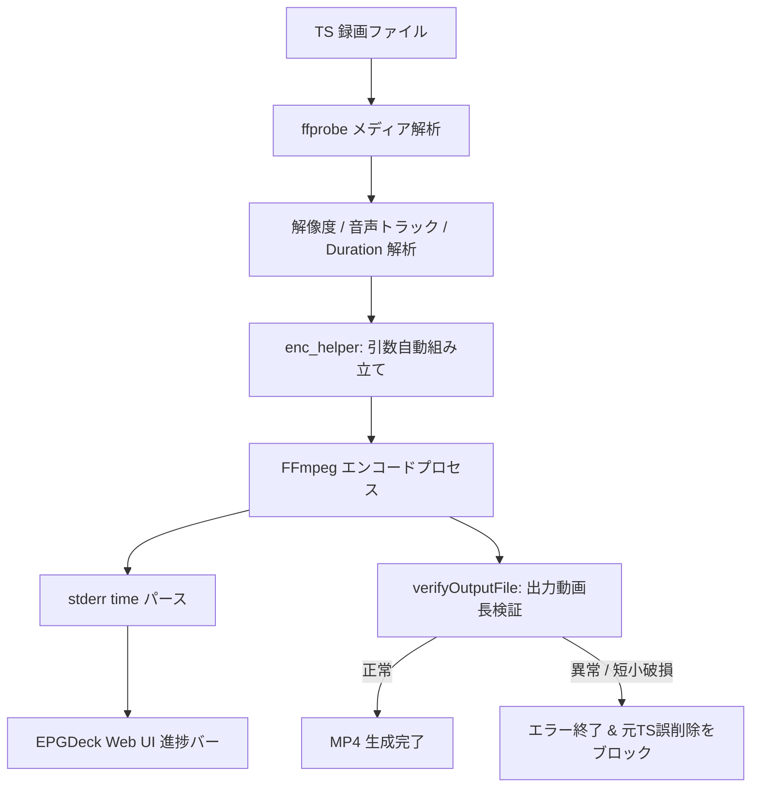

# EPGDeck エンコードシステム仕様書 & 設定マニュアル

EPGDeck のエンコード機能は、録画完了後の TS ファイルを MP4 等に自動変換し、Web UI やモバイル端末から快適に視聴できるようにするためのシステムです。

---

## 1. アーキテクチャと特徴

従来のエンコードスクリプトをモダンに刷新し、共通処理を公式共有パッケージ `@epgdeck/enc-helper`（`packages/enc-helper`）に集約しています（※従来の `config/enc_helper.js` からのインポートも 100% 互換性を維持しています）。


```mermaid
flowchart TD
    TS[TS 録画ファイル] --> ffprobe[ffprobe メディア解析]
    ffprobe --> Analysis[解像度 / 音声トラック / Duration 解析]
    Analysis --> Builder[enc_helper: 引数自動組み立て]
    Builder --> FFmpeg[FFmpeg エンコードプロセス]
    FFmpeg --> Progress[stderr time パース]
    Progress --> UI[EPGDeck Web UI 進捗バー]
    FFmpeg --> Verify[verifyOutputFile: 出力動画長検証]
    Verify -->|正常| Success[MP4 生成完了]
    Verify -->|異常 / 短小破損| Error[エラー終了 & 元TS誤削除をブロック]
```

### 主な特徴・改善点
1. **地デジ 1440×1080 の柔軟なアスペクト比・解像度制御**:
   - **原寸維持時（デフォルト）**: 1440×1080 のまま無駄なリサイズを排して CPU 負荷とファイルサイズを約 15〜25% 節約。さらにビットストリームに `-vf setsar=4/3`、コンテナに `-aspect 16:9` を明記することで、QuickTime やブラウザ等あらゆるプレイヤーでの 4:3 縦長表示バグを確実に防止。
   - **縦解像度縮小時 (`maxHeight: 720` 等)**: 地デジ 1440×1080 等の非正方形 16:9 映像は、横解像度も正規 16:9（正方形ピクセル: `1280x720`, `960x540`, `854x480` 等）へ自動算出・正規化。
   - **1080p 正方形拡大 (`fix1440to1920: true`)**: スケーリングを行わず 1080p のまま 1920×1080 正方形ピクセルへ拡大したい場合に指定（VAAPI ハードウェアエンコード時は GPU スケーラーにより自動有効化）。
2. **多重音声・二重音声の柔軟なハンドリング**:
   - ニュース等の二重音声（デュアルモノ）を、**2トラック（Main / Sub）に分離** または **主音声のみ抽出** を選択可能。
   - スポーツ中継等のマルチ音声ストリームに対し、全トラック保持（`all`）または第1トラックのみ（`first`）を選択可能。主音声と副音声で個別のビットレート指定も可能。
3. **ドロップ破損・短小 MP4 の安全ブロック機能 (`verifyDuration`)**:
   - 出力された MP4 の動画長を `ffprobe` で自動検証。入力 TS に比べて極端に短い動画（ドロップ等による破損ファイル）を検知した場合、エラー終了させて **元 TS ファイルの誤削除を確実にブロック** します。
4. **Web UI 進捗バーとのリアルタイム連動**:
   - エンコード中の進捗率（0%〜100%）を自動計算し、Web UI の録画・エンコード一覧画面に進捗バーをリアルタイム表示します。
5. **FastStart 最適化**:
   - `-movflags faststart` により MP4 のメタデータ（moov atom）を先頭に配置し、ダウンロード完了を待たずに即座にシーク・ストリーミング再生が可能です。

---

## 2. 設定オプションリファレンス (`enc_helper.js`)

各設定ファイル（`config/enc.js` やプリセット）で `runEncode(options)` に渡せるパラメータ一覧です：

| オプション名 | 型 / 選択肢 | デフォルト値 | 説明 |
| :--- | :--- | :--- | :--- |
| **`codec`** | `string` | `'libx264'` | 映像コーデック。<br>・**CPU**: `libx264`, `libx265` (エイリアス: `h264`, `h265`, `x264`, `x265`, `hevc`)<br>・**NVENC**: `h264_nvenc`, `hevc_nvenc` (エイリアス: `h265_nvenc`, `nvenc`)<br>・**QSV**: `h264_qsv`, `hevc_qsv` (エイリアス: `h265_qsv`, `qsv`)<br>・**VAAPI**: `h264_vaapi`, `hevc_vaapi` (エイリアス: `h265_vaapi`, `vaapi`)<br>※`h265` と `hevc` のどちらの表記も自動解決されます |
| **`preset`** | `string` | `'medium'` | エンコード速度プリセット (`veryfast`, `fast`, `medium`, `p4` 等) |
| **`tune`** | `string \| null` | `null` | 映像チューニング (`'animation'`, `'film'`, `'grain'` 等。アニメの輪郭線・動き維持に有用) |
| **`crf`** | `number \| null` | `23` | 画質係数 (CPU / NVENC / QSV)。ビットレート指定時は `null` |
| **`videoBitrate`** | `string \| null` | `null` | 映像ビットレート（例: `'4500k'`, `'2500k'`） |
| **`maxrate`** | `string \| null` | `null` | 最大ビットレート制限（例: `'6000k'`） |
| **`bufsize`** | `string \| null` | `null` | VBV バッファサイズ（例: `'12000k'`） |
| **`scale`** | `string \| null` | `null` | 解像度プリセット (`'1080p'`, `'720p'`, `'540p'`, `'480p'`, `'native'`, `'W:H'`) |
| **`maxHeight`** | `number \| null` | `1080` | 最大縦解像度 (`1080`, `720`, `null` で維持)。縦解像度を縮小する場合、地デジ 1440x1080 等の 16:9 ソースは横解像度も正規 16:9 (720なら 1280x720) に自動調整されます |
| **`fix1440to1920`** | `boolean` | `false` (VAAPIは自動で `true`) | 地デジ 1440x1080 を 1920x1080 に拡大補正するかどうか (スケーリングなし時) |
| **`dualMono`** | `'split' \| 'main' \| 'sub'` | `'split'` | **二重音声の扱い**: <br>・`'split'`: 主音声・副音声を2トラックに分離<br>・`'main'`: 主音声のみ抽出<br>・`'sub'`: 副音声のみ抽出 |
| **`audioStreamMode`**| `'first' \| 'all'` | `'first'` | **複数音声ストリーム**: 第1トラックのみ (`first`) または全トラック保持 (`all`) |
| **`mainAudioBitrate`** | `string` | `1080p: '192k', 720p: '128k'` | 主音声（第1トラック）のビットレート (`-b:a:0`) |
| **`secondaryAudioBitrate`** | `string` | `'128k'` | 副音声（第2トラック以降）のビットレート (`-b:a:1...`) |
| **`subtitle`** | `boolean` | `false` | **字幕ストリームの扱い**: <br>・`false`: 字幕を除外 (`-sn`)<br>・`true`: MP4 字幕 (`mov_text`) として保持 |
| **`deinterlace`** | `boolean` | `true` | インターレース解除 (`yadif` または `deinterlace_vaapi`) |
| **`verifyDuration`** | `boolean` | `true` | 出力動画長の検証（ドロップ短小ファイルの安全ブロック） |
| **`minDurationRatio`**| `number` | `0.8` (80%) | 許容する最小時間比率（これを下回るとエラー終了し元 TS を保護） |
| **`faststart`** | `boolean` | `true` | Web 最適化 (`-movflags faststart`) |
| **`vaapiDevice`** | `string` | `'/dev/dri/renderD128'` | VAAPI 使用時の GPU デバイスパス |
| **`customArgs`** | `string[]` | `[]` | 任意の追加 FFmpeg 引数 |
| **`modifyArgs`** | `(args: string[]) => string[]` | `null` | 最終的な FFmpeg 引数配列を書き換えるコールバック関数 |

## 3. 設定ファイル (`config.yml`) でのプリセット指定

### 3.1 標準スクリプト指定 (`script`)
`config/` ディレクトリ配下に配置したスクリプト名（`script`）を指定する推奨の登録方法です。

```yaml
encode:
  presets:
    - name: H.264-1080p
      script: enc_1080p.js     # config/ 配下のファイル名を指定
      suffix: .mp4
      rate: 4.0
    - name: H.264-720p
      script: enc_720p.js      # config/ 配下のファイル名を指定
      suffix: .mp4
      rate: 2.5
```

### 3.2 独自コマンド・外部シェルスクリプト指定 (`cmd`)
Python スクリプトや外部シェルスクリプト、独自のエンコードバイナリを直接呼び出す場合は、`cmd` プロパティを使用します。
環境変数マクロ（`%NODE%`, `%ROOT%`, `%FFMPEG%`, `%FFPROBE%`）が展開されます。

```yaml
encode:
  presets:
    # 外部シェルスクリプトを呼び出す例
    - name: Custom-Shell
      cmd: '%ROOT%/config/custom_encode.sh'
      suffix: .mp4
      rate: 4.0
    # Python 等の外部スクリプトを呼び出す例
    - name: Python-Transcoder
      cmd: 'python3 %ROOT%/config/transcode.py'
      suffix: .mkv
      rate: 3.5
```

> [!NOTE]
> `cmd` 実行時、子プロセスには `INPUT`（元動画パス）、`OUTPUT`（出力先パス）、`RECORDEDID`（録画ID）、`FFMPEG`、`FFPROBE`、`NAME`（番組名）等の環境変数が自動的に渡されます。

### 3.3 プリセット設定パラメータ一覧

| パラメータ名 | 型 | 必須 | 説明 |
| :--- | :--- | :--- | :--- |
| **`name`** | `string` | **必須** | Web UI 上に表示されるプリセット表示名（例: `H.264-1080p`） |
| **`script`** | `string` | 任意 | `config/` ディレクトリ配下のエンコードスクリプト名（例: `enc_1080p.js`） |
| **`cmd`** | `string` | 任意 | 独自コマンド・外部シェルスクリプトを実行する場合のコマンド文字列 |
| **`suffix`** | `string` | 任意 | 出力ファイルの拡張子（例: `.mp4`, `.mkv`）。省略時は元ファイルの拡張子 |
| **`rate`** | `number` | 任意 | **タイムアウト倍率係数**（デフォルト: `4.0`）。<br>録画時間 × `rate` の時間が経過してもエンコードが終わらない場合にハングアップとみなして強制終了します（例: 60分番組 × `rate: 4.0` = 最大240分待機） |
| **`subtitle`** | `boolean` | 任意 | このプリセットで MP4 内に ARIB 字幕（`mov_text`）を埋め込むかどうか（省略時はグローバル `encode.subtitle` に従う） |

### 3.4 字幕に関するグローバル設定 (`config.yml`)

- **`encode.subtitle`**: 全プリセット共通の字幕保存デフォルト（デフォルト: `false`）。
- **`encode.skipSubtitleForSuperimpose`**: 番組情報に「字幕スーパー」が含まれる場合、映像自体に字幕が焼き込まれているため、ARIB 字幕埋め込み処理（`mov_text`）を自動的にスキップして二重描画やエンコードエラーを防止します（デフォルト: `false`）。

### 3.5 Web UI からの手動エンコード追加と元ファイル選択

録画番組の詳細画面（Web UI）から、任意のプリセットを指定して後から手動でエンコードキューへ追加できます。

- **エンコード元ファイルの選択**:
  - 対象番組に複数の動画ファイル（元 TS、既存のエンコード済み MP4 等）が存在する場合、どの動画ファイルを入力元（`INPUT`）とするかドロップダウンで選択できます。
  - **デフォルトは TS ファイル**（MPEG-2 TS）が自動選択されます。TS が削除済み等で存在しない場合は、先頭の動画ファイルが自動選択されます。
  - 動画ファイル一覧の各行にある「エンコード」ボタンからモーダルを開くことで、該当ファイルを元ファイルに事前選択した状態で即座に追加することも可能です。
- **元ファイルの自動削除オプション**:
  - 「エンコード完了後に元ファイルを自動削除」を有効化した場合、削除対象となるファイル名（例: `sample.ts`）がラベル横に明記され、意図しないファイルの誤削除を防止します。

---

## 4. プリセットテンプレート一覧

`config/` ディレクトリ内に用途別のテンプレートが用意されています。

### ① `enc.js` / `enc.js.template`（標準 CPU H.264）
```javascript
import { runEncode } from '@epgdeck/enc-helper';

runEncode({
    codec: 'libx264',
    preset: 'medium',
    // tune: 'animation', // アニメ向け ('animation' | 'film' | 'grain' 等)
    crf: 23,
    // maxrate: '4000k',  // 最大ビットレート制限 (bufsize は未指定時 maxrate*2 が自動設定)
    maxHeight: 1080,
    dualMono: 'split',
    subtitle: process.env.SUBTITLE === 'true' || false,
});
```

### ② `enc_1080p.js.template`（高品質 1080p）
```javascript
import { runEncode } from '@epgdeck/enc-helper';

runEncode({
    codec: 'libx264',
    preset: 'medium',
    // tune: 'film',      // 実写向け
    crf: 21,
    // maxrate: '5000k',  // 最大ビットレート制限
    maxHeight: 1080,
    dualMono: 'split',
    subtitle: process.env.SUBTITLE === 'true' || false,
});
```

### ③ `enc_720p.js.template`（軽量 720p / 主音声のみ）
```javascript
import { runEncode } from '@epgdeck/enc-helper';

runEncode({
    codec: 'libx264',
    preset: 'fast',
    // tune: 'animation',
    crf: 23,
    // maxrate: '2500k',  // 最大ビットレート制限
    maxHeight: 720,       // 地デジ 1440x1080 は自動で 1280x720 (16:9 正方形) に正規化
    dualMono: 'main',     // 主音声のみ抽出
    subtitle: process.env.SUBTITLE === 'true' || false,
});
```

### ④ `enc_vaapi.js.template`（Linux VAAPI ハードウェア）
```javascript
import { runEncode } from '@epgdeck/enc-helper';

runEncode({
    codec: 'h264_vaapi',
    vaapiDevice: '/dev/dri/renderD128',
    videoBitrate: '4500k',
    // maxrate: '6000k', // VBV 最大ビットレート制限
    maxHeight: 1080,    // 地デジ 1440x1080 を 1920x1080 に GPU 拡大補正
    dualMono: 'split',
    subtitle: process.env.SUBTITLE === 'true' || false,
});
```

### ⑤ `enc_qsv.js.template`（Intel QuickSync Video）
```javascript
import { runEncode } from '@epgdeck/enc-helper';

runEncode({
    codec: 'h264_qsv',
    preset: 'medium',
    crf: 23,
    // maxrate: '5000k',
    maxHeight: 1080,
    dualMono: 'split',
    subtitle: process.env.SUBTITLE === 'true' || false,
});
```

### ⑥ `enc_nvenc.js.template`（NVIDIA NVENC）
```javascript
import { runEncode } from '@epgdeck/enc-helper';

runEncode({
    codec: 'h264_nvenc',
    preset: 'p4',
    crf: 23,
    // maxrate: '5000k',
    maxHeight: 1080,
    dualMono: 'split',
    subtitle: process.env.SUBTITLE === 'true' || false,
});
```

### ⑦ `enc_1080p_x265.js.template`（CPU libx265 / HEVC）
```javascript
import { runEncode } from '@epgdeck/enc-helper';

runEncode({
    codec: 'libx265', // 'h265', 'x265', 'hevc' も指定可能
    preset: 'faster',
    crf: 26,          // H.264 CRF 23 同等。アニメなら 25〜27、実写なら 26〜28 が目安
    // tune: 'animation',
    maxHeight: 1080,
    dualMono: 'split',
    subtitle: process.env.SUBTITLE === 'true' || false,
});
```

### ⑧ `enc_nvenc_hevc.js.template`（NVIDIA NVENC H.265 / HEVC）
```javascript
import { runEncode } from '@epgdeck/enc-helper';

runEncode({
    codec: 'hevc_nvenc', // 'h265_nvenc' も指定可能
    preset: 'p4',
    crf: 26,             // NVENC は自動で -cq 26 に変換
    maxHeight: 1080,
    dualMono: 'split',
    subtitle: process.env.SUBTITLE === 'true' || false,
});
```

### ⑨ `enc_qsv_hevc.js.template`（Intel QSV H.265 / HEVC）
```javascript
import { runEncode } from '@epgdeck/enc-helper';

runEncode({
    codec: 'hevc_qsv',   // 'h265_qsv' も指定可能
    preset: 'medium',
    crf: 26,             // QSV は自動で -global_quality 26 に変換
    maxHeight: 1080,
    dualMono: 'split',
    subtitle: process.env.SUBTITLE === 'true' || false,
});
```

### ⑩ `enc_vaapi_hevc.js.template`（Linux VAAPI H.265 / HEVC コンテンツ適応型）
```javascript
import { runEncode } from '@epgdeck/enc-helper';

runEncode({
    codec: 'hevc_vaapi', // 'h265_vaapi' も指定可能
    vaapiDevice: '/dev/dri/renderD128',
    // コンテンツ適応型ビットレート自動推定 (事前プローブによる動的 VBR 算出)
    quality: 'high', // 'highest' | 'high' | 'standard' | 'economy' または CRF 数値
    // 固定ビットレートで運用したい場合は以下のように指定可能:
    // videoBitrate: '3000k',
    maxHeight: 1080,
    dualMono: 'split',
    subtitle: process.env.SUBTITLE === 'true' || false,
});
```

> [!TIP]
> **コンテンツ適応型プローブ (`quality`)**:
> `quality: 'high'`（または `'standard'`）を指定すると、エンコード開始前に GPU CQP サンプリングを行い、コンテンツの複雑度（インターレース解除済みノイズ、微細ディテール度 `qSlope`）を自動解析します。
> アニメ（約 1.1Mbps）やバラエティ（約 2.0Mbps）は極小容量化し、風景（約 2.8Mbps）や前面展望（約 8.5Mbps キャップ）は破綻しない適正ビットレートを自動配分します。

---

## 4. FFmpeg バージョン・ビルド要件と互換性

### 4.1 FFmpeg バージョン互換性

| 項目 | FFmpeg 4.x | FFmpeg 5.x 以降 | EPGDeck での対応 |
| :--- | :--- | :--- | :--- |
| **音声ビットレート** | `-ab 192k` / `-b:a 192k` | `-b:a 192k` | `-b:a` に統一（全バージョンで安全動作） |
| **チャンネル分離** | `channelsplit` | `channelsplit` (Channel Layout API) | `aformat=channel_layouts=mono` により完全互換 |
| **インターレース解除** | `yadif` / `deinterlace_vaapi` | 同左 | 標準フィルターとして全バージョン対応 |
| **進捗パース** | `time=HH:MM:SS.ms` | 同左 | 正規表現で全バージョン共通パース |

### 4.2 字幕機能 (`subtitle: true`) と `libaribb24` 要件

録画エンコード時に MP4 内へ ARIB 字幕（`mov_text`）を保持したい場合（`subtitle: true`）の動作要件です：

- **標準エンコード (`subtitle: false` [デフォルト])**:
  - **`libaribb24` 非対応の通常 FFmpeg で問題なく動作します**。
  - 字幕ストリームは自動的に除外（`-sn`）されるため、特別なデコーダーは一切不要です。
- **字幕保持有効 (`subtitle: true`)**:
  - ARIB STD-B24 字幕（`arib_caption`）を MP4 規格のテキスト字幕（`mov_text`）にデコード・変換するため、**`--enable-libaribb24` を有効化してビルドされた FFmpeg が必須** となります。
  - **非対応 FFmpeg で実行した場合の挙動**:
    - 入力 TS に字幕データが含まれる番組の場合、FFmpeg が `Decoder (codec arib_caption) not found for input stream` エラーを出力してエンコードが異常終了します。
    - ※ただし、`enc_helper.js` の出力検証機構（`verifyDuration`）により、異常終了時でも元 TS ファイルが削除されることはありません。
  - **対応方法**:
    - `libaribb24` 非対応の FFmpeg をお使いの場合は、プリセットの `subtitle` 設定を `false`（または省略）のまま運用してください。
    - 字幕を MP4 に埋め込みたい場合は、`libaribb24` 対応の FFmpeg をご用意ください。具体的なビルド手順は **[FFmpeg カスタムビルドガイド](ffmpeg-build.md)** を参照してください。

---

## 5. 【参考情報】実機検証・ベンチマークレポート & 運用ノウハウ

実機（AMD Ryzen 5 5600G, 6C/12T, Ubuntu 24.04 / Mesa Gallium 25.2.8）における実測検証結果と運用ノウハウです。

### 5.1 実機エンコード実測比較（地デジ 1440x1080 30fps 録画ファイル: 242.8秒 / 481 MB）

| 方式・設定 | 出力解像度 | 音声構成 | 出力サイズ | 変換速度 | 特徴・評価 |
| :--- | :---: | :---: | :---: | :---: | :--- |
| **CPU 1440p (標準)** | 1440×1080 | 2トラック (Main / Sub) | **60 MB** | 6.7x (201 fps) | 🟢 **【推奨】容量最少・最高画質。二重音声完全分離** |
| **CPU 1080p (拡大)** | 1920×1080 | 2トラック (Main / Sub) | **73 MB** | 5.3x (160 fps) | 🟢 1:1 正方形ピクセル。1440p 比で約21%容量増 |
| **CPU 720p (主音声)** | 1280×720 | 1トラック (Main) | **33 MB** | 8.5x (256 fps) | 🟢 軽量（1080pの半分以下）。外出先・スマホ向け |
| **VAAPI 1080p (GPU)** | 1920×1080 | 2トラック (Main / Sub) | **140 MB** | 5.0x (150 fps) | 🟢 GPU ネイティブパイプラインにより緑線・揺れゼロ |
| **VAAPI 720p (GPU)** | 1280×720 | 1トラック (Main) | **79 MB** | 6.4x (193 fps) | 🟢 低CPU負荷での 720p リサイズ |

### 5.2 CPU 発熱抑制と周波数制限のノウハウ（ベストバランス）

CPU エンコード（`libx264`）は全コアを高負荷で連続稼働させるため、特に小型 PC や静音サーバー環境では CPU 温度が高温に達しやすくなります。

CPU のターボブースト最大周波数付近は消費電力・発熱が急増する領域です。OS 側の cpufreq 制御（`cpupower` や `scaling_max_freq` 等）を用いて、**最大周波数をブースト最大クロックから 10〜15% 程度抑えた値に制限** することで、エンコード速度の低下をわずか数%に抑えつつ、大幅な発熱抑制と静音化が期待できます。

> **検証環境での実測例**（最大ブースト 4.46 GHz の CPU 環境）:
> - **4.46 GHz（上限無制限）**: ピーク温度 75〜85℃+（ファン高回転）
> - **3.80 GHz 制限（約15%抑制）**: ピーク温度 62.1℃（約13〜20℃低下）、処理時間の増加はわずか 1.3 秒（体感差なし）で静音を維持。

### 5.3 VAAPI パイプラインにおける緑線・左ズレ・揺れの解消

CPU でデコードしたフレームを GPU に渡す（`hwupload`）ハイブリッド構成では、Mesa ドライバの 1088px アライメントの隙間に「下部緑線」や「左ズレ」が発生します。
`@epgdeck/enc-helper` では `-hwaccel vaapi -hwaccel_output_format vaapi` により **全工程を GPU VRAM 内で一貫処理** させ、`scale_vaapi=w=1920:h=1080,setsar=1/1` を適用することで、アーティファクトのないクリーンなハードウェアエンコードを実現しています。さらに、HEVC エンコード時にはビットストリームフィルタ `-bsf:v hevc_metadata=height=${res.targetH}` を自動付与し、あらゆる再生環境での正確な Full HD 描画を保証します。

### 5.4 コンテンツ適応型ビットレート自動推定 (`quality` / `adaptiveBitrate`)

#### なぜアダプティブ制御を実装したのか？（VAAPI における CQP の課題と背景）

CPU エンコーダ（`libx264` や `libx265`）には、人間の視覚特性に応じて複雑なシーンではビットレートを盛り、単純なシーンでは削る **CRF（Constant Rate Factor）** という極めて優れたレート制御方式が存在します。
しかし、Linux VAAPI（Intel / AMD GPU）のハードウェアエンコーダ回路には **CRF という概念（アルゴリズム）が存在しません**。

従来のハードウェアエンコードで選べたのは以下の 2 択しかありませんでした：

1. **固定 VBR / CBR（例: `videoBitrate: '4000k'`）のジレンマ**:
   - 一律に 4Mbps などを指定すると、日常の「アニメ」には過剰（容量の無駄）になり、逆に「前面展望」「音楽ライブ」「激しいアクション映画」ではビットレートが致命的に不足して **激しいブロックノイズやモザイク破綻（実測 SSIM 0.88〜0.89）** が発生します。
2. **固定量子化パラメータ（CQP: Constant QP）の罠（ファイルサイズ暴走）**:
   - 「フレーム内の粗さ（QP）を一定に保つ CQP（例: `-qp 30`）なら CRF の代わりになるのでは？」と考えられますが、ハードウェア CQP には **コンテンツの複雑度によってファイルサイズが何倍・何十倍も暴走・乱高下する** という致命的な欠点があります。
   - 実際の実測データでも、同じ `QP 30` でエンコードした場合：
     - **アニメ（コナン）**: 実効 **1,632 kbps**（平坦なため自然と縮む）
     - **バラエティ（ラヴィット）**: 実効 **3,891 kbps**
     - **実写自然風景（シチリア）**: 実効 **4,915 kbps**
     - **前面展望（近鉄奈良線）**: 実効 **12,861 kbps（アニメの約 8 倍！）**
   - このように、CQP を日常の自動録画に使うと、難関番組が録画されるたびにディスク容量が猛烈な勢いで食いつぶされ、容量予測が全く立ちません。さらに、最大ビットレート（`maxrate`）やバッファ（`bufsize`）の上限制御がないため、スマホや低スペック端末で再生する際にデコーダーが負荷スパイクでハングアップする危険性もあります。

#### EPGDeck のアプローチ：2秒事前プローブによる適応型 VBR 自動生成

「**VAAPI の圧倒的な変換速度（5〜6倍速・CPU負荷ほぼゼロ）を享受しながら、CRF のような『コンテンツに応じた自然なビットレート自動配分』と『暴走しない安全な容量制御』を両立させたい**」――この目的のために開発されたのが、`@epgdeck/enc-helper` のコンテンツ適応型ビットレート制御です。

本番エンコード開始前のわずか **約 2 秒間**、ディスク I/O ゼロのメモリ内（`-f null -`）で番組全体を高速サンプリングし、以下の 3 つの高度エンジンでコンテンツを立体的に解析します：

1. **インターレース解除済み広域スキャン (12〜16点)**:
   サンプリング時に `deinterlace_vaapi` を通すことで、コーミングノイズによる複雑度の水増し（誤判定）を排除。映画や特番の後半クライマックスシーンなども見落とさず走査。
2. **分散・変動係数（CV）による動的パーセンタイル**:
   シーンの落差（$CV$）を計算し、均一なアニメ等は中央値寄り（P60）で容量を削り、落差の激しい特番・アクション映画等はピーク寄り（P85）へ安全マージンを自動シフト。
3. **デュアルQP傾き測定（Q-Slope）**:
   最難関シーンを QP 30 と QP 24 で測定。高周波ディテールが詰まった自然風景（シチリア $qSlope = 3.16$）には十分なビットレートを底上げし、テロップの文字エッジで一時的に CQP が高く出ているバラエティ（$qSlope = 2.36$）は過熱を抑制して風景との容量逆転を防止。

#### 実測で証明された具体的な導入効果

実測ベンチマーク（実ファイル 4 素材）において、以下の決定的な効果が立証されました：

1. **難関映像でのブロックノイズ破綻を完全根絶**:
   - 固定 3000k/4500k では SSIM 0.8816 / 0.8997 と激しくモザイク化していた前面展望が、自動で 8,500k（上限キャップ）が配分され **SSIM 0.9484（破綻ゼロ・架線やバラストも鮮明）** へと劇的に改善。
2. **日常アニメ・バラエティの大幅スリム化**:
   - 固定 3000k（約 23MB/分）で無駄に太っていたアニメが、**1,100k（約 9.5MB/分、約 58% の容量削減）** に自動で激縮み。
   - バラエティ番組も過剰配分（25MB/分）から **16.5MB/分（約 35% 削減）** へと自動で鎮火。
3. **CQP のようなファイルサイズ暴走の完全阻止**:
   - CQP では 12.8Mbps まで青天井に膨張していた前面展望も、上限キャップ（`maxBps: 8500k`）によりジャスト 30MB/30s（x265 CRF26 と同等サイズ）で綺麗に頭打ち。ディスク容量の枯渇を確実に防ぐ。
4. **GPU パイプライン一貫による爆速維持**:
   - 事前プローブ自体が GPU CQP で約 2 秒で完了し、本番エンコードも **5〜6 倍速・CPU 負荷ほぼゼロ** を完全に維持。

#### 実ファイルでの自動判定実測例 (1440x1080 地デジ基準)

| 番組コンテンツ | サンプル数 | 総プローブ時間 | Q-Slope | 採用指標 | `quality: 'high'` 自動割当 | `quality: 'highest'` 自動割当 |
| :--- | :---: | :---: | :---: | :---: | :---: | :---: |
| **アニメ**（コナン 30分生TS） | **12 点** | **2.0 秒** | **2.69** | **P85** | **1,100 kbps**（約 0.50 GB/h） | **1,600 kbps**（約 0.72 GB/h） |
| **自然映像**（シチリア島紀行 60分生TS） | **16 点** | **2.3 秒** | **3.16**（高精細） | **P75** | **2,800 kbps**（約 1.26 GB/h） | **4,400 kbps**（約 1.98 GB/h） |
| **バラエティ**（ラヴィット 60分生TS） | **12 点** | **2.1 秒** | **2.36** | **P75** | **2,000 kbps**（約 0.90 GB/h） | **2,800 kbps**（約 1.26 GB/h） |
| **鉄道前面展望**（近鉄奈良線 60分） | **16 点** | **4.4 秒** | **2.26** | **P85** | **8,500 kbps**（約 3.82 GB/h） | **12,000 kbps**（約 5.40 GB/h） |

#### 出力解像度に応じた連続スケーリング

720p（1280x720）や 480p（720x480）へ縮小エンコードする場合、あるいは 1920x1080 へ拡大する場合、出力解像度の総画素数に基づく圧縮効率補正式 `(outPixels / 1555200)^0.75` が自動適用されます：

| 出力解像度 | 画素数比 | scaleFactor | `quality: 'high'` (アニメ) | `quality: 'high'` (前面展望) |
| :--- | :---: | :---: | :---: | :---: |
| **1920x1080** (Full HD) | 1.33 | **1.24** | **約 1,300 kbps** | **約 8,500 kbps** (キャップ) |
| **1440x1080** (地デジ基準) | 1.00 | **1.00** | **約 1,100 kbps** | **約 8,500 kbps** (キャップ) |
| **1280x720** (720p) | 0.59 | **0.67** | **約 750 kbps** | **約 5,700 kbps** |
| **720x480** (480p) | 0.22 | **0.32** | **約 500 kbps** (下限ガード) | **約 2,700 kbps** |

> **設定方法**:
> `enc_vaapi_hevc.js.template` のように `quality: 'high'`（または `'highest'` / `'standard'` / `'economy'` / CRF 数値 20〜27）を指定するだけで自動適用されます。固定値で運用したい場合は `videoBitrate: '4000k'` を指定することで自動プローブをバイパスできます。

---

### 5.5 【客観的評価】VAAPI Adaptive HEVC vs CPU x265 (faster) の特性比較・使い分けガイド

実測ベンチマーク（アニメ・実写風景・バラエティ・前面展望の全4ジャンル、各30秒）に基づく客観的なメリット・デメリットと推奨使い分けです。

#### 1. 客観的特性の比較サマリー（実測データ）

| 比較項目 | VAAPI Adaptive HEVC (`high`) | CPU x265 (`preset faster -crf 26`) | 判定・トレードオフ |
| :--- | :---: | :---: | :--- |
| **変換速度** | **5.0x 〜 5.9x（約5〜6秒）** | **1.3x 〜 3.6x（約10〜23秒）** | 🟢 **VAAPI の圧勝（CPUの 2〜4.5倍高速）** |
| **CPU 負荷・発熱** | **ほぼゼロ（GPU ハードウェア処理）** | **CPU 全コア 100% 稼働（高発熱）** | 🟢 **VAAPI の圧勝（常駐サーバーに最適）** |
| **アニメの圧縮効率** | 4.77 MB (実効 1,333 kbps, SSIM 0.954) | **3.07 MB (実効 858 kbps, SSIM 0.959)** | 🔴 **x265 の勝利（VAAPI は約 +55% 容量増）** |
| **日常バラエティ** | **8.00 MB (実効 2,238 kbps, SSIM 0.893)** | 8.89 MB (実効 2,487 kbps, SSIM 0.906) | 🟢 **VAAPI の勝利（約 10% 省容量かつ 2.4倍高速）** |
| **実写自然風景** | 10.72 MB (実効 2,996 kbps, SSIM 0.956) | **7.20 MB (実効 2,012 kbps, SSIM 0.972)** | 🔴 **x265 の勝利（VAAPI は約 +48% 容量増）** |
| **前面展望（超難関）** | 30.77 MB (実効 8,603 kbps, SSIM 0.948) | **29.66 MB (実効 8,293 kbps, SSIM 0.956)** | 🔴 **x265 の勝利（同等容量で架線・砂利が破綻ゼロ）** |

#### 2. メリット・デメリットの正直な評価

- **VAAPI Adaptive HEVC の強み**:
  - **圧倒的な速度と省電力**: 1時間の番組をわずか 10〜12分でエンコード完了し、CPU はほぼ冷えたまま。日常録画（ドラマ・バラエティ・ニュース）を大量に消化・保存する録画サーバーの日常運用に最も適しています。
  - **日常番組での優秀な圧縮**: バラエティや一般実写番組では、CPU x265 と同等またはそれ以上にコンパクト（x264 CRF23 比で約 50% 削減）に収まります。
- **VAAPI Adaptive HEVC が不向きなシーン（CPU x265 が優位な理由）**:
  - **アニメのベタ塗り平坦領域**:
    GPU の固定関数回路は、放送波特有の微小なノイズを忠実に符号化してしまうため、CPU x265 のように「長周期の静止画参照＋64x64ブロック平坦化」による極限圧縮（30分で 180MB 前後）までは縮まず、**x265 比で約 +55% 容量が大きくなります**。
  - **高速に微細ディテールが流れる超難関映像（鉄道前面展望・高速アクション・砂嵐等）**:
    GPU の動き探索回路（Motion Estimation）はリアルタイム処理用に探索範囲が狭いため、架線やバラスト（砂利）のような超高周波の激しい運動に対して追従限界（頭打ち）が生じます。8.5Mbps 注ぎ込んでも SSIM 0.948 に留まる一方、CPU x265 は 8.3Mbps で SSIM 0.956 と完全な破綻ゼロを達成できます。

#### 3. おすすめの使い分けガイドライン

| 用途・目的 | 推奨方式 | 推奨設定 | 理由 |
| :--- | :--- | :--- | :--- |
| **日常の自動録画全般**<br>（ドラマ・バラエティ・報道・ドキュメンタリー） | **VAAPI HEVC** | `quality: 'high'`<br>(または `'standard'`) | CPU負荷ゼロ・5倍速で爆速消化。x264 より 40〜50% スリム化 |
| **アニメ作品の永久保存** | **CPU x265** | `preset: 'faster'`<br>`crf: 26` | ベタ塗りを極限圧縮（30分 180MB）。VAAPI より 35% 以上省容量 |
| **鉄道前面展望・激しい音楽ライブ** | **CPU x265** | `preset: 'faster'`<br>`crf: 26` (または `24`) | 架線・砂利・紙吹雪・照明の破綻を徹底撲滅 |
| **スマホ視聴専用・省容量重視** | **VAAPI HEVC** | `scale: '720p'`<br>`quality: 'standard'` | 30分 100〜130MB の極小サイズへ 6倍速で高速リサイズ |


