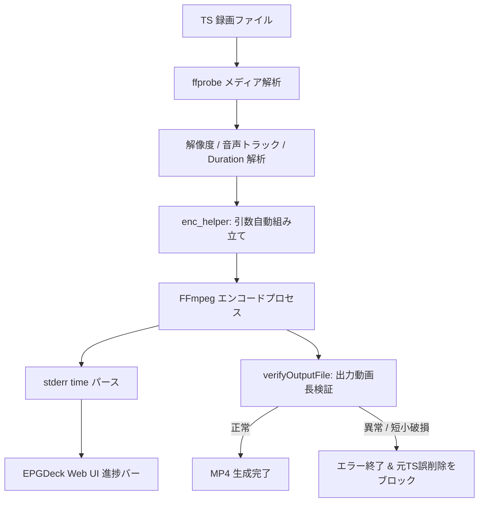

# EPGDeck エンコードシステム仕様書 & 設定マニュアル

EPGDeck のエンコード機能は、録画完了後の TS ファイルを MP4 等に自動変換し、Web UI やモバイル端末から快適に視聴できるようにするためのシステムです。

---

## 1. アーキテクチャと特徴

従来のエンコードスクリプトをモダンに刷新し、共通処理を `config/enc_helper.js` に集約しています。


```mermaid
flowchart TD
    TS[TS 録画ファイル] --> ffprobe[ffprobe メディア解析]
    ffprobe --> Analysis[解像度 / 音声トラック / Duration 解析]
    Analysis --> Builder[enc_helper: 引数自動組み立て]
    Builder --> FFmpeg[FFmpeg エンコードプロセス]
    FFmpeg --> Progress[stderr time パース]
    Progress --> UI[EPGDeck Web UI 進捗バー]
    FFmpeg --> Verify[verifyOutputFile: 出力動画長検証]
    Verify -->|正常| Success[MP4 生成完了]
    Verify -->|異常 / 短小破損| Error[エラー終了 & 元TS誤削除をブロック]
```

### 主な特徴・改善点
1. **地デジ 1440×1080 の柔軟な制御 (`fix1440to1920`)**:
   - デフォルト（`false`）では、1440×1080 のまま `-aspect 16:9` メタデータをつけて出力し、**ファイルサイズを約 15〜25% 節約**。
   - `fix1440to1920: true` を指定するか、VAAPI ハードウェアエンコード時は自動で **1920×1080（1:1 正方形ピクセル）** に拡大補正し、あらゆる再生環境での 4:3 潰れを完全に防止します。
2. **多重音声・二重音声の柔軟なハンドリング**:
   - ニュース等の二重音声（デュアルモノ）を、**2トラック（Main / Sub）に分離** または **主音声のみ抽出** を選択可能。
   - スポーツ中継等のマルチ音声ストリームに対し、全トラック保持（`all`）または第1トラックのみ（`first`）を選択可能。主音声と副音声で個別のビットレート指定も可能。
3. **ドロップ破損・短小 MP4 の安全ブロック機能 (`verifyDuration`)**:
   - 出力された MP4 の動画長を `ffprobe` で自動検証。入力 TS に比べて極端に短い動画（ドロップ等による破損ファイル）を検知した場合、エラー終了させて **元 TS ファイルの誤削除を確実にブロック** します。
4. **Web UI 進捗バーとのリアルタイム連動**:
   - エンコード中の進捗率（0%〜100%）を自動計算し、Web UI の録画・エンコード一覧画面に進捗バーをリアルタイム表示します。
5. **FastStart 最適化**:
   - `-movflags faststart` により MP4 のメタデータ（moov atom）を先頭に配置し、ダウンロード完了を待たずに即座にシーク・ストリーミング再生が可能です。

---

## 2. 設定オプションリファレンス (`enc_helper.js`)

各設定ファイル（`config/enc.js` やプリセット）で `runEncode(options)` に渡せるパラメータ一覧です：

| オプション名 | 型 / 選択肢 | デフォルト値 | 説明 |
| :--- | :--- | :--- | :--- |
| **`codec`** | `string` | `'libx264'` | 映像コーデック (`libx264`, `libx265`, `h264_vaapi`, `h264_qsv`, `h264_nvenc` 等) |
| **`preset`** | `string` | `'medium'` | エンコード速度プリセット (`veryfast`, `fast`, `medium`, `p4` 等) |
| **`crf`** | `number \| null` | `23` | 画質係数 (CPU / NVENC / QSV)。ビットレート指定時は `null` |
| **`videoBitrate`** | `string \| null` | `null` | 映像ビットレート（例: `'4500k'`, `'2500k'`） |
| **`scale`** | `string \| null` | `null` | 解像度プリセット (`'1080p'`, `'720p'`, `'540p'`, `'480p'`, `'native'`, `'W:H'`) |
| **`maxHeight`** | `number \| null` | `1080` | 最大縦解像度 (`1080`, `720`, `null` で元解像度維持) |
| **`fix1440to1920`** | `boolean` | `false` (VAAPIは自動で `true`) | 地デジ 1440x1080 を 1920x1080 に拡大補正するかどうか |
| **`dualMono`** | `'split' \| 'main' \| 'sub'` | `'split'` | **二重音声の扱い**: <br>・`'split'`: 主音声・副音声を2トラックに分離<br>・`'main'`: 主音声のみ抽出<br>・`'sub'`: 副音声のみ抽出 |
| **`audioStreamMode`**| `'first' \| 'all'` | `'first'` | **複数音声ストリーム**: 第1トラックのみ (`first`) または全トラック保持 (`all`) |
| **`mainAudioBitrate`** | `string` | `1080p: '192k', 720p: '128k'` | 主音声（第1トラック）のビットレート (`-b:a:0`) |
| **`secondaryAudioBitrate`** | `string` | `'128k'` | 副音声（第2トラック以降）のビットレート (`-b:a:1...`) |
| **`subtitle`** | `boolean` | `false` | **字幕ストリームの扱い**: <br>・`false`: 字幕を除外 (`-sn`)<br>・`true`: MP4 字幕 (`mov_text`) として保持 |
| **`deinterlace`** | `boolean` | `true` | インターレース解除 (`yadif` または `deinterlace_vaapi`) |
| **`verifyDuration`** | `boolean` | `true` | 出力動画長の検証（ドロップ短小ファイルの安全ブロック） |
| **`minDurationRatio`**| `number` | `0.8` (80%) | 許容する最小時間比率（これを下回るとエラー終了し元 TS を保護） |
| **`faststart`** | `boolean` | `true` | Web 最適化 (`-movflags faststart`) |
| **`vaapiDevice`** | `string` | `'/dev/dri/renderD128'` | VAAPI 使用時の GPU デバイスパス |
| **`customArgs`** | `string[]` | `[]` | 任意の追加 FFmpeg 引数 |
| **`modifyArgs`** | `(args: string[]) => string[]` | `null` | 最終的な FFmpeg 引数配列を書き換えるコールバック関数 |

## 3. 設定ファイル (`config.yml`) でのプリセット指定

### 3.1 標準スクリプト指定 (`script`)
`config/` ディレクトリ配下に配置したスクリプト名（`script`）を指定する推奨の登録方法です。

```yaml
encode:
  presets:
    - name: H.264-1080p
      script: enc_1080p.js     # config/ 配下のファイル名を指定
      suffix: .mp4
      rate: 4.0
    - name: H.264-720p
      script: enc_720p.js      # config/ 配下のファイル名を指定
      suffix: .mp4
      rate: 2.5
```

### 3.2 独自コマンド・外部シェルスクリプト指定 (`cmd`)
Python スクリプトや外部シェルスクリプト、独自のエンコードバイナリを直接呼び出す場合は、`cmd` プロパティを使用します。
環境変数マクロ（`%NODE%`, `%ROOT%`, `%FFMPEG%`, `%FFPROBE%`）が展開されます。

```yaml
encode:
  presets:
    # 外部シェルスクリプトを呼び出す例
    - name: Custom-Shell
      cmd: '%ROOT%/config/custom_encode.sh'
      suffix: .mp4
      rate: 4.0
    # Python 等の外部スクリプトを呼び出す例
    - name: Python-Transcoder
      cmd: 'python3 %ROOT%/config/transcode.py'
      suffix: .mkv
      rate: 3.5
```

> [!NOTE]
> `cmd` 実行時、子プロセスには `INPUT`（元動画パス）、`OUTPUT`（出力先パス）、`RECORDEDID`（録画ID）、`FFMPEG`、`FFPROBE`、`NAME`（番組名）等の環境変数が自動的に渡されます。

### 3.3 プリセット設定パラメータ一覧

| パラメータ名 | 型 | 必須 | 説明 |
| :--- | :--- | :--- | :--- |
| **`name`** | `string` | **必須** | Web UI 上に表示されるプリセット表示名（例: `H.264-1080p`） |
| **`script`** | `string` | 任意 | `config/` ディレクトリ配下のエンコードスクリプト名（例: `enc_1080p.js`） |
| **`cmd`** | `string` | 任意 | 独自コマンド・外部シェルスクリプトを実行する場合のコマンド文字列 |
| **`suffix`** | `string` | 任意 | 出力ファイルの拡張子（例: `.mp4`, `.mkv`）。省略時は元ファイルの拡張子 |
| **`rate`** | `number` | 任意 | **タイムアウト倍率係数**（デフォルト: `4.0`）。<br>録画時間 × `rate` の時間が経過してもエンコードが終わらない場合にハングアップとみなして強制終了します（例: 60分番組 × `rate: 4.0` = 最大240分待機） |
| **`subtitle`** | `boolean` | 任意 | このプリセットで MP4 内に ARIB 字幕（`mov_text`）を埋め込むかどうか（省略時はグローバル `encode.subtitle` に従う） |

### 3.4 字幕に関するグローバル設定 (`config.yml`)

- **`encode.subtitle`**: 全プリセット共通の字幕保存デフォルト（デフォルト: `false`）。
- **`encode.skipSubtitleForSuperimpose`**: 番組情報に「字幕スーパー」が含まれる場合、映像自体に字幕が焼き込まれているため、ARIB 字幕埋め込み処理（`mov_text`）を自動的にスキップして二重描画やエンコードエラーを防止します（デフォルト: `false`）。

> [!WARNING]
> **字幕なし番組（`[字]` マークなし）における注意事項（`INT_MAX` クラッシュの回避）**
> - 日本のデジタル放送規格（ARIB）では、**字幕放送を行っていない番組（紀行、音楽、スポーツ等）であっても、ストリーム内に空（画面クリア）のダミー字幕信号が常時送出**されています。
> - このような字幕なし番組に対して `subtitle: true`（MP4 への字幕埋め込み）を有効にすると、番組終了直前の空パケットに対して FFmpeg が無期限（約1194時間）の表示期間を割り振ってしまい、**MP4 の 32bit 最大値（`INT_MAX`）を超過してエンコード末尾で異常終了（`Application provided duration is invalid` / exit code 234）する現象** が発生します（※FFmpeg の仕様上の制約）。
> - そのため、**通常は `subtitle: false` を基本** とし、アニメやドラマなど確実に字幕が必要な番組・ルールに対して個別プリセットを適用することを強く推奨します。

---

## 4. プリセットテンプレート一覧

`config/` ディレクトリ内に用途別のテンプレートが用意されています。

### ① `enc.js` / `enc.js.template`（標準 CPU H.264）
```javascript
import { runEncode } from './enc_helper.js';

runEncode({
    codec: 'libx264',
    preset: 'medium',
    crf: 23,
    maxHeight: 1080,
    dualMono: 'split',
    subtitle: false,
});
```

### ② `enc_1080p.js.template`（高品質 1080p）
```javascript
import { runEncode } from './enc_helper.js';

runEncode({
    codec: 'libx264',
    preset: 'medium',
    crf: 21,
    maxHeight: 1080,
    dualMono: 'split',
    subtitle: false,
});
```

### ③ `enc_720p.js.template`（軽量 720p / 主音声のみ）
```javascript
import { runEncode } from './enc_helper.js';

runEncode({
    codec: 'libx264',
    preset: 'fast',
    crf: 23,
    maxHeight: 720,
    dualMono: 'main', // 主音声のみ抽出
    subtitle: false,
});
```

### ④ `enc_1080p_hevc_vaapi.js.template`（高効率 1080p HEVC ハードウェア）
```javascript
import { runEncode } from './enc_helper.js';

runEncode({
    codec: 'hevc_vaapi',
    vaapiDevice: '/dev/dri/renderD128',
    vaapiHwaccel: false, // CPU デコード + hwupload (Radeon/Mesa の EOF メモリクラッシュ回避)
    videoBitrate: '4000k',
    maxrate: '6000k',
    bufsize: '12000k',
    rcMode: 'VBR',
    maxHeight: 1080,
    fix1440to1920: true, // 地デジ 1440x1080 を 1920x1080 に拡大 (容量最少化・原画維持を優先する場合は false)
    dualMono: 'split',
    audioStreamMode: 'all',
    subtitle: false,
});
```

### ⑤ `enc_vaapi.js.template`（Linux VAAPI ハードウェア H.264）
```javascript
import { runEncode } from './enc_helper.js';

runEncode({
    codec: 'h264_vaapi',
    vaapiDevice: '/dev/dri/renderD128',
    videoBitrate: '4500k',
    maxHeight: 1080,
    fix1440to1920: true, // 地デジ 1440x1080 を 1920x1080 に GPU 拡大補正
    dualMono: 'split',
    subtitle: false,
});
```

### ⑥ `enc_qsv.js.template`（Intel QuickSync Video）
```javascript
import { runEncode } from './enc_helper.js';

runEncode({
    codec: 'h264_qsv',
    preset: 'medium',
    crf: 23,
    maxHeight: 1080,
    dualMono: 'split',
    subtitle: false,
});
```

### ⑦ `enc_nvenc.js.template`（NVIDIA NVENC）
```javascript
import { runEncode } from './enc_helper.js';

runEncode({
    codec: 'h264_nvenc',
    preset: 'p4',
    crf: 23,
    maxHeight: 1080,
    dualMono: 'split',
    subtitle: false,
});
```

---

## 5. FFmpeg バージョン・ビルド要件と互換性

### 5.1 FFmpeg バージョン互換性

| 項目 | FFmpeg 4.x | FFmpeg 5.x 以降 | EPGDeck での対応 |
| :--- | :--- | :--- | :--- |
| **音声ビットレート** | `-ab 192k` / `-b:a 192k` | `-b:a 192k` | `-b:a` に統一（全バージョンで安全動作） |
| **チャンネル分離** | `channelsplit` | `channelsplit` (Channel Layout API) | `aformat=channel_layouts=mono` により完全互換 |
| **インターレース解除** | `yadif` / `deinterlace_vaapi` | 同左 | 標準フィルターとして全バージョン対応 |
| **進捗パース** | `time=HH:MM:SS.ms` | 同左 | 正規表現で全バージョン共通パース |

### 5.2 字幕機能 (`subtitle: true`) と `libaribb24` 要件

録画エンコード時に MP4 内へ ARIB 字幕（`mov_text`）を保持したい場合（`subtitle: true`）の動作要件です：

- **標準エンコード (`subtitle: false` [デフォルト])**:
  - **`libaribb24` 非対応の通常 FFmpeg で問題なく動作します**。
  - 字幕ストリームは自動的に除外（`-sn`）されるため、特別なデコーダーは一切不要です。
- **字幕保持有効 (`subtitle: true`)**:
  - ARIB STD-B24 字幕（`arib_caption`）を MP4 規格のテキスト字幕（`mov_text`）にデコード・変換するため、**`--enable-libaribb24` を有効化してビルドされた FFmpeg が必須** となります。
  - **非対応 FFmpeg で実行した場合の挙動**:
    - 入力 TS に字幕データが含まれる番組の場合、FFmpeg が `Decoder (codec arib_caption) not found for input stream` エラーを出力してエンコードが異常終了します。
    - ※ただし、`enc_helper.js` の出力検証機構（`verifyDuration`）により、異常終了時でも元 TS ファイルが削除されることはありません。
  - **対応方法**:
    - `libaribb24` 非対応の FFmpeg をお使いの場合は、プリセットの `subtitle` 設定を `false`（または省略）のまま運用してください。
    - 字幕を MP4 に埋め込みたい場合は、`libaribb24` 対応の FFmpeg をご用意ください。具体的なビルド手順は **[FFmpeg カスタムビルドガイド](ffmpeg-build.md)** を参照してください。

---

## 6. 【参考情報】実機検証・ベンチマークレポート & 運用ノウハウ

実機（AMD Ryzen 5 5600G, 6C/12T, Ubuntu 24.04 / Mesa Gallium 25.2.8）における実測検証結果と運用ノウハウです。

### 6.1 実機エンコード実測比較（地デジ 1440x1080 30fps 録画ファイル: 242.8秒 / 481 MB）

| 方式・設定 | 出力解像度 | 音声構成 | 出力サイズ | 変換速度 | 特徴・評価 |
| :--- | :---: | :---: | :---: | :---: | :--- |
| **CPU 1440p (標準)** | 1440×1080 | 2トラック (Main / Sub) | **60 MB** | 6.7x (201 fps) | 🟢 **【推奨】容量最少・最高画質。二重音声完全分離** |
| **CPU 1080p (拡大)** | 1920×1080 | 2トラック (Main / Sub) | **73 MB** | 5.3x (160 fps) | 🟢 1:1 正方形ピクセル。1440p 比で約21%容量増 |
| **CPU 720p (主音声)** | 1280×720 | 1トラック (Main) | **33 MB** | 8.5x (256 fps) | 🟢 軽量（1080pの半分以下）。外出先・スマホ向け |
| **VAAPI HEVC 1080p** | 1920×1080 | 全トラック保持 | **85 MB** | 5.8x (174 fps) | 🟢 高速かつ高効率。海・波・自然映像の容量爆発を完全阻止 |
| **VAAPI H.264 1080p** | 1920×1080 | 2トラック (Main / Sub) | **140 MB** | 5.0x (150 fps) | 🟢 互換性重視のハードウェアエンコード |
| **VAAPI 720p (GPU)** | 1280×720 | 1トラック (Main) | **79 MB** | 6.4x (193 fps) | 🟢 低CPU負荷での 720p リサイズ |

### 6.2 自然映像・高周波番組での H.264 vs HEVC 比較と客観的画質評価 (SSIM)

海、波、森林などの高周波成分が多い自然映像（NHK 紀行番組: 59分29秒 / 元 TS 7.1 GB）における実測比較です：

| エンコード方式 | 出力解像度 | 平均ビットレート | ファイルサイズ | 圧縮率 | 原画TSに対するSSIMスコア (All) | 評価・備考 |
| :--- | :---: | :---: | :---: | :---: | :---: | :--- |
| **元 TS ファイル** | 1440×1080 | 約 16.5 Mbps | 7.1 GB | 基準 | 1.000 | 放送生ストリーム |
| **CPU H.264 (CRF 23)** | 1440×1080 | 4,550 kbps | 2.00 GB | 28.2% | **0.773** | 原画解像度維持。暗部ディテール優秀 |
| **VAAPI HEVC (VBR 4M/6M)** | 1920×1080 | 3,960 kbps | 1.74 GB | 24.5% | **0.748** | 1920拡大済み。高精細かつファイルサイズ抑制 |

> **客観的評価の解説**:
> - **SSIM（構造的類似性指標）**: 人間の視覚特性に基づき画像の歪み・忠実度を 0〜1 で測定する標準指標。差が 0.025 以内（約3%差）であれば、一般的な視聴距離で判別困難なレベルです。
> - **解像度とビット密度の関係**: 1920x1080 は 1440x1080 に比べ **画素数が 33% 増加**（約 207万画素 vs 約 155万画素）しています。HEVC (VAAPI) はビットレートが約 13% 低く、画素数が 33% 多い状態でありながら、CRF 23 とほぼ同等の忠実度（SSIM 0.748）を達成しています。

### 6.3 超難関・鉄道前面展望での実測比較（VBR vs CQP）

時速 80〜100km で疾走し、画面全体にバラスト（砂利）・レール・架線が高速スクロールする極限の高周波映像（近鉄奈良線: 60分06秒 / H.264 CRF23 で 4.56 GB）での実機ベンチマークです：

| 設定 (方式) | 平均ビットレート | 60分換算サイズ | 元動画比 (削減率) | SSIM (All) | 特徴・評価 |
| :--- | :---: | :---: | :---: | :---: | :--- |
| **元動画 (H.264 CRF23)** | **10.1 Mbps** | **4.56 GB** | 基準 (0%) | 1.000 | 超高ビットレート・マスター |
| **VAAPI VBR 3000k** | 3.1 Mbps | **1.40 GB** | **-69%** | 0.898 | 容量最少化。高速スクロール時の細部にやや甘さ |
| **VAAPI VBR 4000k** | 4.1 Mbps | **1.80 GB** | **-60%** | **0.916** | 🟢 **【VBR スイートスポット】** 破綻なく実用的 |
| **VAAPI CQP 34** | 6.5 Mbps | **2.75 GB** | **-40%** | **0.940** | 🟢 **【CQP バランス型】** 破綻を抑えつつ容量削減。通常番組は自動で1Mbps前後に激縮み |
| **VAAPI CQP 33** | 7.7 Mbps | **3.24 GB** | **-29%** | **0.948** | 🟢 **【画質重視】** 高速スクロール時の砂利・架線のチラつきを抑制 |
| **VAAPI CQP 32** | 8.9 Mbps | **3.73 GB** | -18% | 0.953 | ほぼ元動画と区別不能（サイズ大きめ） |

> **クオリティ指定（CQP）運用のメリット**:
> - `enc_helper.js` では `rcMode: 'CQP', qp: 33`（または `34`）を指定可能です。
> - 前面展望のような超難関ソースには自動で 6〜8Mbps を配分して破綻を絶対に防ぐ一方、**通常のアニメやスタジオ番組では自動的に 1〜2Mbps（1時間 500〜900MB）まで激縮み**します。

### 6.4 CPU (x265) vs GPU (VAAPI HEVC) の直接対決

| エンコーダ | 設定 | 処理速度 | 60分番組の処理時間 | 平均ビットレート | 60分サイズ | SSIM (All) |
| :--- | :--- | :---: | :---: | :---: | :---: | :---: |
| **CPU (libx265)** | CRF 26 | **0.83倍速** | 約 1時間12分 | 8.7 Mbps | 3.73 GB | **0.962** |
| **GPU (VAAPI)** | CQP 32 | **7.0倍速** | **約 8分30秒** | 8.9 Mbps | 3.73 GB | **0.953** |
| **CPU (libx265)** | CRF 28 | **0.92倍速** | 約 1時間05分 | 6.5 Mbps | 2.80 GB | **0.952** |
| **GPU (VAAPI)** | CQP 34 | **7.2倍速** | **約 8分20秒** | 6.5 Mbps | 2.75 GB | **0.940** |

> **実測の結論**:
> - 同一サイズにおける**画質・圧縮効率の差はわずか 1% 程度**（SSIM 0.952 vs 0.940）。
> - 一方で**エンコード速度・タイパの差は 8倍以上**（1時間超 vs 8分台）。日常の録画サーバー用途としては、GPU（VAAPI HEVC）が圧倒的な実用性を発揮します。

### 6.5 コンテンツ適応型ビットレート自動推定 (`quality`)

GPU のハードウェアエンコーダ（VAAPI 等）で従来の固定 VBR（例: `videoBitrate: '4000k'`）を運用した場合、「日常のアニメにはビットレートが高すぎて容量が勿体ない」「しかし前面展望や音楽ライブのような難関映像では 4Mbps では足りずにブロックノイズが出る」というジレンマが生じます。

EPGDeck では、エンコード開始前にディスク I/O ゼロのメモリ内高速並列プローブ（`-f null -`、所要時間わずか **2〜4秒**）を実行し、以下の 3つの高度エンジンによって番組全体の複雑度を自動測定・最適化します：

1. **広域12〜16点スキャン**: 番組長に応じて 12〜16箇所を網羅サンプリングし、映画や特番の後半クライマックスシーンなども見落としなく走査。
2. **分散・変動係数（CV）による動的パーセンタイル**: シーンの落差（$CV$）を計算し、均一なアニメ等は中央値寄り（P60）で容量を削り、落差の激しい特番・アクション映画等はピーク寄り（P85）へ安全マージンを自動シフト。
3. **デュアルQP傾き測定（Q-Slope）**: 最難関シーンを QP 30 と QP 24 で測定し、「QPを上げると激縮みする素直なアニメ（Q-Slope $\ge 1.8$）」と「QPを上げてもビットレートが粘る高難関映像（Q-Slope $\le 1.45$）」を数学的に見分けて目標値と上限（maxrate）を自動補正。

#### 実ファイルでの自動判定実測例 (1440x1080 地デジ基準)

| 番組コンテンツ | サンプル数 | 総プローブ時間 | Q-Slope | 採用指標 | `quality: 'high'` 自動割当 | `quality: 'highest'` 自動割当 |
| :--- | :---: | :---: | :---: | :---: | :---: | :---: |
| **アニメ**（コナン 30分生TS） | **12 点** | **2.0 秒** | **2.02**（素直） | **P85**（CV 0.63） | **1,800〜2,200 kbps**（約 0.85 GB/h） | **2,600〜3,100 kbps**（約 1.25 GB/h） |
| **自然映像**（シチリア島紀行 60分生TS） | **16 点** | **2.3 秒** | **2.02**（素直） | **P75**（CV 0.34） | **3,100 kbps**（約 1.39 GB/h） | **4,300 kbps**（約 1.93 GB/h） |
| **鉄道前面展望**（近鉄奈良線 60分） | **16 点** | **4.4 秒** | **2.04** | **P85**（CV 0.62） | **5,600 kbps**（約 2.50 GB/h） | **7,900 kbps**（約 3.50 GB/h） |

#### 出力解像度に応じた連続スケーリング

720p（1280x720）や 480p（720x480）へ縮小エンコードする場合、あるいは 1920x1080 へ拡大する場合、出力解像度の総画素数に基づく圧縮効率補正式 `(outPixels / 1555200)^0.75` が自動適用されます：

| 出力解像度 | 画素数比 | scaleFactor | `quality: 'high'` (アニメ) | `quality: 'high'` (前面展望) |
| :--- | :---: | :---: | :---: | :---: |
| **1920x1080** (Full HD) | 1.33 | **1.24** | **約 2,200 kbps** | **約 5,600 kbps** |
| **1440x1080** (地デジ基準) | 1.00 | **1.00** | **約 1,800 kbps** | **約 4,500 kbps** |
| **1280x720** (720p) | 0.59 | **0.67** | **約 1,200 kbps** | **約 3,000 kbps** |
| **720x480** (480p) | 0.22 | **0.32** | **約 600 kbps** | **約 1,400 kbps** |

> **安全なプローブ設計**:
> 元動画が 720p や 480p の場合でも、元解像度を超えて無駄に引き伸ばすアップスケールプローブは行われません。プローブ解像度を自動正規化することで、どんな解像度の組み合わせでも一貫した品質基準で適正ビットレートが導出されます。

> **設定方法**:
> `enc_1080p_hevc_vaapi.js` で `quality: 'high'`（または `'highest'` / `23`）を指定するだけで自動適用されます。固定値で運用したい場合は `videoBitrate: '4000k'` を指定することで自動プローブをバイパスできます。

### 6.6 地デジ 1440x1080 原画維持 vs 1920x1080 拡大の選び方 (`fix1440to1920`)

- **容量最少化・保存効率を最優先する場合**:
  - `fix1440to1920: false`（デフォルト）を使用してください。
  - 画素数が少ないため、ビットレートを 3.0〜4.0Mbps 程度まで下げても高精細度を保てます。
- **再生互換性・正方形ピクセル（1:1 Full HD）を重視する場合**:
  - `fix1440to1920: true` を指定してください。
  - 一部の古いスマートTVやDLNAプレーヤーで 1440x1080 の DAR 16:9 メタデータが無視されて横長や縦長に潰れる現象を確実に回避できます。

### 6.7 CPU 発熱抑制と周波数制限のノウハウ（ベストバランス）

CPU エンコード（`libx264`）は全コアを高負荷で連続稼働させるため、特に小型 PC や静音サーバー環境では CPU 温度が高温に達しやすくなります。

CPU のターボブースト最大周波数付近は消費電力・発熱が急増する領域です。OS 側の cpufreq 制御（`cpupower` や `scaling_max_freq` 等）を用いて、**最大周波数をブースト最大クロックから 10〜15% 程度抑えた値に制限** することで、エンコード速度の低下をわずか数%に抑えつつ、大幅な発熱抑制と静音化が期待できます。

> **検証環境での実測例**（最大ブースト 4.46 GHz の CPU 環境）:
> - **4.46 GHz（上限無制限）**: ピーク温度 75〜85℃+（ファン高回転）
> - **3.80 GHz 制限（約15%抑制）**: ピーク温度 62.1℃（約13〜20℃低下）、処理時間の増加はわずか 1.3 秒（体感差なし）で静音を維持。

### 6.8 VAAPI パイプラインにおける安定化（Mesa EOF クラッシュ回避と下部黒帯・緑線解消）

1. **Mesa radeonsi EOF クラッシュの回避**:
   - AMD Radeon GPU（Ryzen 内蔵 GPU 等）で `-hwaccel vaapi` を使用してデコードから GPU 内で行うと、放送波 TS 特有の終端パケットやパケットドロップにより Mesa ドライバ内でダブルフリー / OOM クラッシュが発生することがあります。
   - `enc_1080p_hevc_vaapi.js` では `vaapiHwaccel: false`（CPU デコード + `hwupload`）を採用することで、長時間の番組でもクラッシュしない堅牢性を確保しています。
2. **下部黒帯・緑線・左ズレの恒久解消（Mesa 1088px パディング対策）**:
   - AMD Mesa ドライバは内部ハードウェアサーフェスを 1472x1088 等のマクロブロック境界で確保するため、サイズ整形（`scale_vaapi`）に加えて、HEVC ビットストリーム生成時に表示領域フラグ（SPS Conformance Window: `crop_bottom`）を書き忘れるバグが存在します。
   - その結果、デコーダや各再生プレイヤーが 1920x1088 として展開してしまい、画面最下部に 8 ピクセルの黒帯（パディング領域）が表示される問題が生じます。
   - `enc_helper.js` では `scale_vaapi` による GPU 整形に加え、ビットストリームフィルタ `-bsf:v hevc_metadata=height=${res.targetH}` を自動付与。追加の再エンコード負荷ゼロで、あらゆるプレイヤーで正確な 1920x1080（下部黒帯 0px）での完全描画を実現しています。
